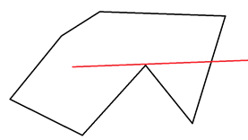
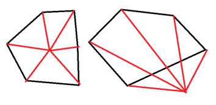

## 计算几何

### 浮点数比较

浮点数表示的原理暂且不提。

判断是否就是给定一个 $\epsilon$，然后比较两浮点数之差的绝对值是否小于这个 $\epsilon$，如果是那么认为两数取等。

一般来说 $\epsilon$ 比精度要求多取两位。

如果不相等就可以直接大小比较。

```cpp
double eps = numeric_limits<double>::epsilon(); // in <limits>
bool feq(double a, double b) {
	return fabs(a - b) < eps ? 1 : 0;
}
```

### 向量叉积

若 $\textbf{A} = (x_1, y_1), \textbf{B} = (x_2, y_2)$，$\textbf{A, B}$ 的叉积为一个向量 $\textbf{C}$。

其中 $|\textbf{C}| = x_1y_2 - x_2y_1$，且 $(\textbf{A, B, C})$ 构成右手系（右手食指为 $\textbf{A}$，中指为 $\textbf{B}$，大拇指为 $\textbf{C}$）

+ 一个特性：叉积是有顺序的，$\textbf{A} \times \textbf{B} = -(\textbf{B} \times \textbf{A})$。
+ 叉积还可以判断两个向量的位置关系：
    + 如果 $\textbf{A} \times \textbf{B} > 0$，那么由 $\textbf{A}$ 逆时针旋转到 $\textbf{B}$ 的方向只需要转一个优角。
    + 如果 $\textbf{A} \times \textbf{B} < 0$，那么需要转过一个劣角
    + 如果 $\textbf{A} \times \textbf{B} = 0$，那么两向量一定共线但是方向不能确定是否相同。

怎么理解？以 $\textbf{A}$ 为坐标原点，观察 $\textbf{B}$ 的落点就能看出来了。

### 点是否在线段上

已知两个端点 $P, Q$，有一点 $A$。

可以先判断 $\vec{AP}, \vec{AQ}$ 是否共线，如果不共线那么 $A$ 必定不在 $P, Q$ 上

如果共线，还可能在线段外，此时判断一下 $\vec{AP}, \vec{AQ}$ 是否异向就可以。

### 点是否在三角形上（内）

如果多边形只是三角形的话方法会简单一些。

任意取出两个顶点计算其和点构成的三角形面积，三个三角形面积之和若等于三角形就说明点在三角形内（上）。

由于在二维平面上，叉积的意义表示两向量构成平行四边形的面积，所以也可以用来计算三角形的面积即：

$S_{\Delta APQ} = \dfrac{1}{2}\times |\vec{AP} \times \vec{AQ}|$

要判断是否在边上只需要套用上面的方法。

### 线段相交

由于接下来的很多问题都需要判断是否相交所以先在这里提及。

在算法竞赛的计算几何里，由于浮点数的误差存在，所以一般不会考虑使用类似平面解析几何那样的计算法。

不妨先粗略的判定两条线段 $AB,CD$ 是否有相交的可能，“隔得太远”显然是不可能相交的。

我们分别以这两条线段为对角线构建两个矩形，如果没有重合区域那么显然是不相交的，此为 **快速排斥实验**

只需要判断由 $CD$ 生成的矩形是否存在一个顶点在 $AB$ 生成的矩形内部（上）即可。

当然通过了快速排斥实验不代表它们一定相交，万一没有相互穿过只是差不多贴近了呢？

此时可以直接判断 $C,D$ 两点是否在线段 $AB$ 的两边，这个利用叉积很容易做到，此为 **跨立实验**

### 求线段交点

秉持能不要解析几何就不要解析几何的原则，有一个这样的方法：


假定我们需要求 $OC, AB$ 的交点 $P$ 坐标，其实主要就是要知道 $P$ 在 $OC$ 或者 $AB$ 上的位置比例。

一个想法是直接做垂线 $AD, BE$，然后可以知道 $\Delta APD \sim \Delta BPE$。

那么 $\dfrac{AP}{BP} = \dfrac{AD}{BE}$，$AD, BE$ 又分别是两个三角形的高。

于是可以知道 $\dfrac{AP}{BP} = \dfrac{S_{\Delta AOC}}{S_{\Delta BOC}}$。

显然这个比值可以转化为水平和竖直方向的坐标：$\dfrac{AP}{BP} = \dfrac{x_A - x_P}{x_P - x_B} = \dfrac{y_A - y_P}{y_P - y_B}$。

分别解方程即可得到（$L, R$ 分为两三角形面积）：

$$
\begin{cases}
x_P = \dfrac{Lx_B + Rx_A}{L + R}\\
y_P = \dfrac{Ly_B + Ry_A}{L + R}
\end{cases}
$$

$L, R$ 计算方法已经介绍了，不多赘述。

### 点是否在多边形内（PIP 问题）

以下默认为平面多边形，在多边形上不加说明考虑进入在多边形内的情况。

+ 简单多边形：没有边自交的多边形


左边两个就是简单多边形，右边两个一般在 PIP 中不考虑，因为这类多边形的内部定义需要单独讨论。

#### Ray casting 

对于简单多边形，有一个 Jordan curve 定理告诉我们，当我们从一点发出一条射线与多边形相交时，每相交一次就改变一次内外关系。

所以我们只需要判断相交次数的奇偶性就可以了，不过还有一些细节：

首先就是射线，由于我们用射线判断相交并不是那么方便，我们可以取一个数据范围之外的点 $F$，取线段 $PF$ 来进行判断

理所应当的，还需要判断点是否在多边形的边上，这里就是 $O(n)$ 的复杂度瓶颈了。

另外可能这条射线会和多边形的点相交，在处理时会比较棘手，例如：



所以我们在选取 $PF$ 时可以随机选取多做几次（反正这里不是复杂度瓶颈），或者是取一些比较特殊的无理数。

#### 计算角度和（也可以叫回转数法）

不妨从点在三角形内的那个方法推广。

注意到对于任意多边形，如果点在内部，则点和相邻两顶点构成的所有三角形必定完全覆盖整个多边形。

那么我们只需要计算 $\forall i, \angle <\vec{X_iP}, \vec{X_{i+1}P}>$ 的和是否为 $2\pi$。

在外部的话，按照顺序依次加和的结果一定是 $0$（需要按顺序求 到角），所以实现一般判断是否非零即可。

如图：


