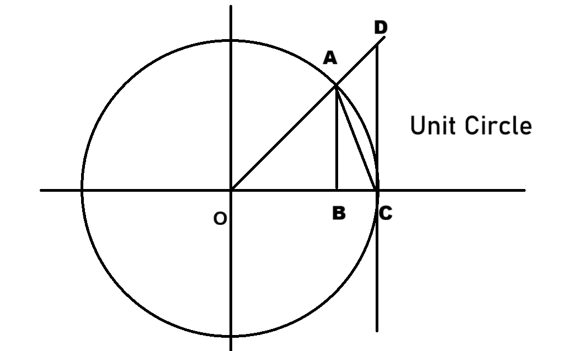

## 数学分析笔记 - zxf - Chapter 2

本章主要讨论函数极限和连续函数。

### 函数极限

考虑 $x$ 趋近于某一点 $x_0$ 时 $f(x)$ 趋近于什么。

一个观察是，想要知道这个值，只需要观察 $x_0$ **附近**（距离足够近）的一些点。

#### 定义 2.1 Epsilon-Delta 定义

记 $O(x_0, \delta) = (x_0 - \delta, x_0 + \delta)$。

> 假设函数 $f(x)$ 在 $x_0$ 的去心邻域 $O(x_0, \rho) / \{x_0\} = \{x:0 < |x - x_0| < \rho\}$ 上有定义。
>
> 如果 $\exists \delta \in \mathbb{R}, \delta \le \rho$ 使得：
>
> $\forall \epsilon > 0, \exists \delta = \delta(\epsilon) > 0, \text{ s.t. when } 0 < |x - x_0| < \delta: |f(x) - A| < \epsilon$。
>
> 那么则称 $f(x)$ 在 $x_0$ 点的极限存在，记为 $\lim\limits_{x \to x_0} f(x) = A$。

理解就是，当 $x$ 和 $x_0$ 靠的足够近的时候，$f(x)$ 和 $A$ 可以做到距离任意近。

注意：$\delta$ 应该 $\le \rho$ ，或者把 $\rho$ 换成 $\delta$ 然后交换第一二行的两句话。

#### 例题 2.1

> 1) $\lim\limits_{x \to 2} x^2 = 4$。
>
> 2) $\lim\limits_{x \to 1} \dfrac{x(x^2 - 1)}{x - 1} = 2$。
>
> 用定义证明这两个极限。

1)：

只需要证明：$\forall \epsilon, \exists \delta > 0, \text{ s.t. } 0 < |x - 2| < \delta: |x^2 - 4| < \epsilon$。

$|x^2 - 4| = |x - 2| |x + 2| < \delta |x + 2|$。

现在就是希望 $|x + 2| < M(\text{const})$。

类似于数列极限证明，我们固定 $\epsilon$，如果能找到这样的 $M$。

那么取 $\delta = \dfrac{\epsilon}{M}$ 即可做到 $\delta |x + 2| < \epsilon \Rightarrow |x^2 - 4| < \epsilon$。

由于只需要关心 $x_0$ 附近的一些 $x$。

那不妨只考虑 $|x - 2| < 1$ 的 $x$。

那么 $|x + 2| < 5$，取 $M = 5 \Rightarrow \delta = \dfrac{\epsilon}{5}$ 即可。

证明：

取 $\rho = 1$，显然 $f(x)$ 在 $O(2, 1)$ 上有定义。

此时有 $|x + 2| < 5 \Rightarrow |x - 2||x + 2| = |x^2 - 4| < 5|x- 2|$ 且 $\delta \le 1$。

$\forall \epsilon > 0$，取 $\delta = \min\{1, \dfrac{\epsilon}{5}\} \Rightarrow \delta|x - 2| < 5\delta < \epsilon$。

即：$\forall \epsilon > 0, \exists \delta = \min\{1, \dfrac{\epsilon}{5}\} \text{ s.t. when } 0 < |x - 2| < \delta: |x^2 - 4| < \epsilon$。

注记：同数列极限，这里说明 $\epsilon \in (0, 1)$ 也可以，然后就不用在极限里写 $\min$，不过本质相同。

2)：

要证明：$\forall \epsilon > 0, \exists \delta > 0, \text{ s.t. when } 0 < |x - 1| < \delta: |\dfrac{x(x^2 - 1)}{x - 1} - 2| < \epsilon$

也就是证 $|\dfrac{x(x^2 - 1)}{x - 1} - 2| = |x^2 + x - 2| = |x - 1||x + 2| < \epsilon$。

所以我希望 $|x + 2|$ 是一个常数，这里和上面就一样了。

证明：取 $\rho = \dfrac{1}{2}$。

$|\dfrac{x(x^2 - 1)}{x - 1}| = |x + 2||x - 1|, (x\not=1)$。

由于 $|x - 1| < \dfrac{1}{2} \Rightarrow \dfrac{1}{2} < x < \dfrac{3}{2} \Rightarrow |x + 2| < 3.5 < 4$。（只是为了方便）

$\forall \epsilon > 0, \text{let } \delta = \min\{\dfrac{1}{2}, \dfrac{\epsilon}{4}\} \Rightarrow$

$\forall \epsilon > 0, \exists \delta = \min\{\dfrac{1}{2}, \dfrac{\epsilon}{4}\} \text{ s.t. when } 0 < |x - 1| < \dfrac{1}{2}: |\dfrac{x(x^2 - 1)}{x - 1} - 2| < \epsilon$

#### 命题 2.1 唯一性

> 如果 $f(x)$ 在 $x_0$ 的极限存在，那么这个极限一定是唯一的

证明：和数列的证明完全一致。

#### 命题 2.2 保序性

> 如果 $\lim\limits_{x\to x_0} f(x) = A, \lim\limits_{x\to x_0} g(x) = B$。
>
> $f(x) > g(x), x \in O(x_0, \rho) / \{x_0\} \Rightarrow A > B$。

#### 命题 2.3 局部保号性

> $\lim\limits_{x \to x_0}f(x) = A \not= \infty$。
>
> $\lim\limits_{x \to x_0}g(x) = B \not= \infty$。
>
> 若 $A > B$，则：
>
> $\exists\delta > 0, \text{ s.t. when } 0 < |x - x_0| < \delta: f(x) > g(x)$。

证明：

+ $\forall \epsilon > 0, \lim\limits_{x \to x_0} f(x) = A \Rightarrow \exists \delta_1 > 0, \text{ s.t. when }0 < |x - x_0| < \delta_1: |f(x) - A| < \epsilon \Rightarrow f(x) > A - \epsilon$。

+ $\forall \epsilon > 0, \lim\limits_{x \to x_0} g(x) = B \Rightarrow \exists \delta_2 > 0, \text{ s.t. when }0 < |x - x_0| < \delta_2: |g(x) - B| < \epsilon \Rightarrow g(x) < B + \epsilon$。

取 $\epsilon = \dfrac{A - B}{2}, 当 \delta = \min\{\delta_1, \delta_2\}$ 时会有 $f(x) > \dfrac{A + B}{2} > g(x)$。

于是 $f(x) > g(x)$。

#### 命题 2.4 保号性推论：

> $\lim\limits_{x\to x_0} f(x) = A > 0 \Rightarrow \exists \delta > 0, \text{ s.t. when } 0 < |x - x_0| < \delta: f(x) > \dfrac{A}{2}$。

当 $g(x)$ 为常值函数，用命题 2.3 即可。

#### 命题 2.5 局部有界性

局部是因为要在 $x_0$ 附近。

> 若 $\lim\limits_{x \to x_0}f(x) = A$ 存在。
>
> 那么 $f(x)$ 在 $x_0$ 附近有界。
>
> 也就是：$\exists M > 0, \delta > 0, \text{ s.t. when } 0 < |x - x_0| < \delta: f(x) < M$ 

证明：$\forall \epsilon > 0, \exists \delta > 0, \text{ s.t. when} 0 < |x - x_0| < \delta: |f(x) - A| < \epsilon$。

于是 $|f(x)| = |f(x) - A + A| \le |f(x) - A| + |A| < \epsilon + |A|$。

特别的取 $\epsilon = 1\Rightarrow |f(x)| \le 1 + |A| = M$（此时也确定 $\delta$ 的值）

#### 命题 2.6 两边夹法则

> 如果 $h(x) \le f(x) \le g(x)$：
>
> $\lim\limits_{x \to x_0}h(x) = \lim\limits_{x \to x_0}g(x) = L \not=\infty \iff \lim\limits_{x \to x_0}f(x) = L$。

证明也是类似数列的。

#### 定理 2.1 重要极限 sinx/x

> $\lim\limits_{x \to 0} \dfrac{\sin x}{x} = 1$。

理解（并不是很严格）：

画单位圆，取一半，建系：

$S_{AOB} < S_{\mathop{AOC}\limits^\frown} < S_{DOC}$。

$\dfrac{1}{2}\sin x < \dfrac{1}{2}x < \dfrac{1}{2}\tan x \Rightarrow \cos x < \dfrac{\sin x}{x} < 1 |x| \in (0, \dfrac{\pi}{2})$。

于是 $\sin x < x < \tan x, (x \in (0, \dfrac{\pi}{2}))$。

$1 - 2\sin^2(\dfrac{x}{2}) < \dfrac{\sin x}{x} < 1$，由于 $|\sin(\dfrac{x}{2})| < |\dfrac{x}{2}|, |x| \in (0, \dfrac{\pi}{2})$。

所以 $\lim\limits_{x \to 0} |\sin(\dfrac{x}{2})| \le 0 \Rightarrow \lim\limits_{x \to 0} \sin^2(\dfrac{x}{2}) = 0 \Rightarrow \lim\limits_{x \to 0}(1 - \sin^2(\dfrac{x}{2})) = 1 - 0 = 1$

由两边夹法则：$\lim\limits_{x \to 0} \dfrac{\sin x}{x} = 1$

但有一个问题：这个东西能够推 $(\sin x)^\prime = \cos x$（直接用定义求导数就能发现需要知道 $\dfrac{\sin\Delta x}{\Delta x}$ 的极限），而这是微积分的基础，圆的面积公式是通过积分做到的（割圆术），我们上面用了一个扇形的面积公式，这就循环论证了。

所以稍微会有点问题，要不然就只能承认某一个东西是公理，或者尝试用别的方法，一个比较直接的想法是用 $\sin$ 的级数定义，但我现在还不会。

#### 命题 2.7 函数极限的四则运算

> 假设 $\lim\limits_{x \to x_0} f(x) = A, \lim\limits_{x \to x_0} g(x) = B; A, B \in \mathbb{R}$。
>
> 1) $\forall \alpha, \beta \in \mathbb{R} \Rightarrow \lim\limits_{x \to x_0} (\alpha f(x) + \beta g(x)) = \alpha A + \beta B$。
>
> 2) $\lim\limits_{x\to x_0}[f(x) g(x)] = A\cdot B$。
>
> 3) $g(x) \text{ has no zero point and } B \not = 0 \Rightarrow \lim\limits_{x \to x_0} [\dfrac{f(x)}{g(x)}] = \dfrac{A}{B}$。

证明和数列的证明差不多。

#### 例题 2.2
 
> $\alpha \in \mathbb{R}:\lim\limits_{x \to 0} \dfrac{\sin(\alpha x)}{x} = \alpha$。

证明：

当 $\alpha \not= 0$ 时，设 $\alpha x = t$。

且 $x \to 0 \iff t \to 0$。

故原式等价于：$\lim\limits_{t \to 0} \dfrac{\sin t}{\dfrac{t}{\alpha}} = \alpha \lim\limits_{t\to 0} \dfrac{\sin t}{t} = \alpha$ 。

#### 定理 2.1 Heine 定理

> 假设 $x_0 \in \mathbb{R}, \lim\limits_{x\to x_0} f(x) = A \not= \infty \iff \forall \{x_n\} \text{ s.t. } x_n \to x_0 (n \to \infty) \text{ and } x_n \not= x_0, \text{we would have } f(x_n) \to A (n\to \infty)$。

也称作函数极限和数列极限的关系。

意思就是，对于所有极限为 $x_0$ 的数列 $\{x_n\}$，有 $f(x_n) \to A$ 是 $\lim\limits_{x\to x_0} f(x) = A$ 的充要条件（这里和上面数学语言是反过来说的，不过无所谓）

证明：

$\Rightarrow$ 是简单的：设 $\lim\limits_{x \to x_0} f(x) = A$。

取数列 $\{x_n\} \text{ s.t. } \lim\limits_{n \to \infty} x_n = x_0 \text{ and } x_n \not= x_0$。

（不取等主要是由于不能保证 $f(x_0)$ 有定义）。

$\lim\limits_{x\to x_0} f(x) = A \iff \forall \epsilon > 0, \exists \delta > 0, \text{ s.t. when } 0 < |x - x_0| < \delta, |f(x) - A| < \epsilon$。

$\lim\limits_{n \to \infty} x_n = x_0$，对上述 $\delta > 0, \exists N, \text{ s.t. } \forall n > N, |x_n - x_0| < \delta$。

由上两行，$\forall \epsilon > 0, \exists N, \text{ s.t. } \forall n > N, |f(x_n) - A| < \epsilon$。

下证 $\Leftarrow$：

也就是对于任意一个 $\{x_n\} \to x_0(n\to \infty)$，被 $f$ 作用之后收敛于 $A$ 能推出 $f(x) \to A (x\to x_0)$。

由于是从特殊到一般所以考虑反证。

假设 $x\to x_0, f(x) \not\to A$（$f(x)$ 不趋近于 $A$）。

此命题等价于 $\exists \epsilon_0 > 0, \forall \delta > 0, \exists x \text{ s.t. } 0 < |x - x_0| < \delta: |f(x) - A| \ge \epsilon_0$。

+ 取 $\delta = 1$，则存在 $x_1 \text{ s.t. } 0 < |x_1 - x_0| < 1: |f(x_1) - A| \ge \epsilon_0$
+ 取 $\delta = \dfrac{1}{2}$，则存在 $x_2 \text{ s.t. } 0 < |x_2 - x_0| < \dfrac{1}{2}: |f(x_2) - A| \ge \epsilon_0$
+ $\cdots\cdots$
+ 取 $\delta = \dfrac{1}{n}$，则存在 $x_n \text{ s.t. } 0 < |x_n - x_0| < \dfrac{1}{n}: |f(x_n) - A| \ge \epsilon_0$

此时构造了数列 $\{x_n\} \text{ s.t. } x_n \not= x_0 \text{ and } \lim\limits_{n\to \infty} x_n = x_0$。

但是 $|f(x_n) - A| \ge \epsilon_0, \forall n$，这就说明 $\{f(x_n)\}$ 不可能收敛于 $A$，这与已知条件矛盾。

#### 例题 2.3 用 Heine 定理证明极限不存在

> 证明：$x\to 0, \cos(\dfrac{1}{x})$ 的极限不存在。

取数列 $\{x_n\} = \dfrac{1}{2n\pi}$。

显然其收敛于 $0$。$\cos(\dfrac{1}{x_n}) = \cos(2n\pi) = 0$。

若其极限存在，根据 Heine 定理，$A = 0$。

再取一个数列 $\{y_n\} = \dfrac{1}{(2n + 1)\pi}$，其极限还是 $0$。

然而 $\cos(\dfrac{1}{y_n}) = -1$。矛盾了，所以它一定不收敛。

### 函数的单侧极限

#### 定义 2.2 单侧极限

> 假设 $x_0 \in \mathbb{R}, \rho > 0, (x_0 - \rho, x_0) \subset D_f$。
>
> 如果 $\exists A \in \mathbb{R} \text{ s.t. } \forall \epsilon > 0, \exists \delta > 0 \text{ when } -\delta < x - x_0 < 0: |f(x) - A| < \epsilon$。
>
> 则称 $A$ 为 $f(x)$ 在 $x_0$ 点的左极限，记作 $\lim\limits_{x\to x_0^-} f(x) = A$。
> 
> 假设 $x_0 \in \mathbb{R}, \rho > 0, (x_0, x_0 + \rho) \subset D_f$。
>
> 如果 $\exists B \in \mathbb{R} \text{ s.t. } \forall \epsilon > 0, \exists \delta > 0 \text{ when } 0 < x - x_0 < \delta: |f(x) - B| < \epsilon$。
>
> 则称 $B$ 为 $f(x)$ 在 $x_0$ 点的右极限，记作 $\lim\limits_{x\to x_0^+} f(x) = B$。
>
> 推论：$\lim\limits_{x\to x_0} f(x) = C$ 存在，当且仅当 $f(x)$ 在 $x_0$ 处的左右极限存在且均等于 $C$。

#### 例题 2.4

> 函数 $f(x) = \begin{cases} \dfrac{\sin(2x)}{x},&(x > 0) \\ 1 - x,&(x < 0)\end{cases}$。

$\lim\limits_{x \to 0^+} f(x)= \lim\limits_{x \to 0^+} \dfrac{\sin(2x)}{x} = 2$。

$\lim\limits_{x \to 0^-} f(x)= \lim\limits_{x \to 0^-} (1 - x) = 1$。

所以 $\lim\limits_{x \to 0} f(x)$ 不存在（$x \to 0$ 意味着可以任意从左边或者右边趋近）。

#### 定义 2.3 无穷远点处的极限

> $\lim\limits_{x\to +\infty} f(x) = A \in \mathbb{R}$ 的定义：
>
> $\forall \epsilon > 0, \exists X > 0 \text{ s.t. when } x > X: |f(x) - A| < \epsilon$。
>
> $\lim\limits_{x\to -\infty} f(x) = B \in \mathbb{R}$ 的定义：
>
> $\forall \epsilon > 0, \exists X > 0 \text{ s.t. when } x < -X: |f(x) - B| < \epsilon$。
>
> tips: $\lim\limits_{x\to +\infty} f(x) = +\infty$ （尽管这样写不严谨）的意义：$\forall G > 0, \exists X \text{ s.t. when } x > X: f(x) > G$（正负号排列组合一下也很好写）。
>
> 也有当 $x \to +\infty$ 极限为一个数的那种，类似于 $\forall \epsilon > 0, \exists X \text{ s.t. when } x > X: |f(x) - A| < \epsilon$。

总之，如果要描述自变量充分大就模仿数列极限里 $n > N$。

如果要描述极限充分大就是模仿无穷大量定义，正负号注意一下就可以。

#### 例题 2.5

> $f(x) = e^{\frac{1}{x}}, (x \not = 0)$。
>
> 讨论 $\lim\limits_{x\to 0^+} f(x), \lim\limits_{x\to 0^-} f(x), \lim\limits_{x\to +\infty}f(x), \lim\limits_{x \to -\infty}f(x)$。

换元，令 $t = \dfrac{1}{x}$：

+ 当 $x \to 0^+ \iff t \to +\infty$。
+ 当 $x \to 0^- \iff t \to -\infty$。
+ 当 $x \to +\infty \iff t \to 0^+$。
+ 当 $x \to -\infty \iff t \to 0^-$。

1. $\lim\limits_{x \to 0^+} e^{\frac{1}{x}} = \lim\limits_{t \to +\infty} e^t = +\infty$。
2. $\lim\limits_{x \to 0^-} e^{\frac{1}{x}} = \lim\limits_{t \to -\infty} e^t = 0$。
3. $\lim\limits_{x \to +\infty} e^{\frac{1}{x}} = \lim\limits_{t \to 0^+} e^t = 1$
3. $\lim\limits_{x \to -\infty} e^{\frac{1}{x}} = \lim\limits_{t \to 0^-} e^t = 1$

#### 定理 2.2 e

> $\lim\limits_{x \to \infty}(1+\dfrac{1}{x})^x = e$。
>
> $\lim\limits_{x \to \infty}(1 - \dfrac{1}{x})^x = \dfrac{1}{e}$

证明：

先考虑证明：$\lim\limits_{x \to +\infty}(1 + \dfrac{1}{x})^x = e$。

由于 $[x] \le x \le [x] + 1$，于是可以转换为数列的情况。

想要使用 Heine 定理，但是我们没有办法列出所有的 $\{x_n\} \to \infty$。

所以放缩：

$\dfrac{1}{[x]} \ge \dfrac{1}{x} \ge \dfrac{1}{[x] + 1}$。

换句话说：

$\Rightarrow(1 + \dfrac{1}{[x] + 1}) \le (1 + \dfrac{1}{x}) \le (1 + \dfrac{1}{[x]})$

$\Rightarrow(1 + \dfrac{1}{[x] + 1})^x \le (1 + \dfrac{1}{x})^x \le (1 + \dfrac{1}{[x]})^x$

$\Rightarrow(1 + \dfrac{1}{[x] + 1})^x \le (1 + \dfrac{1}{x})^x \le (1 + \dfrac{1}{[x]})^x \le (1 + \dfrac{1}{x})^{[x] + 1}$

$\Rightarrow(1 + \dfrac{1}{[x] + 1})^{[x]} \le (1 + \dfrac{1}{[x] + 1})^x \le (1 + \dfrac{1}{x})^x \le (1 + \dfrac{1}{[x]})^x \le (1 + \dfrac{1}{x})^{[x] + 1}$

也就是

$\Rightarrow(1 + \dfrac{1}{[x] + 1})^{[x]} \le (1 + \dfrac{1}{x})^x \le (1 + \dfrac{1}{x})^{[x] + 1}$

令 $n = [x] \ge 1 \Rightarrow x \to +\infty \iff n \to \infty$。

$\lim\limits_{n \to \infty}(1 + \dfrac{1}{n + 1})^n = e \le (1 + \dfrac{1}{x})^x \le \lim\limits_{n \to \infty}(1 + \dfrac{1}{n})^{n + 1} = e$

换句话说 $\lim\limits_{x \to +\infty} (1 + \dfrac{1}{x})^x = e$。

然后证明 $\lim\limits_{x \to -\infty}(1 + \dfrac{1}{x})^x = e$。

令 $y = -x \Rightarrow y \to +\infty \text{ and } \lim\limits_{y \to \infty}(1 - \dfrac{1}{y})^{-y}$

由于 $(1 - \dfrac{1}{y})^{-y} = (\dfrac{y - 1}{y})^{-y} = (\dfrac{y}{y - 1})^y = (1 + \dfrac{1}{y - 1})^y$。

后者换个元提出一项，其极限就是 $e$ 所以就证完了。

□

tips1： $\lim\limits_{x \to 0}(1+x)^{\frac{1}{x}} = e$。

换元，左右两边极限都证明一下就行。

tips2：$\lim\limits_{x \to 0}(1 + ax)^{\frac{1}{x}}, a\in \mathbb{R} / \{0\} = \lim\limits_{t \to 0}(1 + t)^{\frac{a}{t}}, (t = ax)$

$= e^a$。

这一步需要用到函数 $f(x) = x^a$ 在 $(0, +\infty)$ 上的连续性，才能够把 $a$ 穿过极限拿出来。

意思就是 $\lim\limits_{x \to x_0}f(x) = f(\lim\limits_{x \to x_0} x)$

#### 定理 2.3 函数极限的 Cauchy 收敛原理

> 函数极限 $\lim\limits_{x \to x_0} f(x)$ 存在且有限 $(x_0 \in \mathbb{R})$ 的充分必要条件是：
> 
> 1) $\forall \epsilon > 0, \exists \delta, \text{ s.t. when }0 < |x_1 - x_0| < \delta, 0 < |x_2 - x_0| < \delta: |f(x_1) - f(x_2)| < \epsilon$。
>
> 函数极限 $\lim\limits_{x \to +\infty} f(x)$ 存在且有限 $(x_0 \in \mathbb{R})$ 的充分必要条件是：
>
> 2) $\forall \epsilon > 0, \exists X > 0 \text{ s.t. } \forall x_1, x_2 > X, |f(x_1) - f(x_2)| < \epsilon$

证明 1)：

证明 $\Rightarrow$：设 $\lim\limits_{x \to x_0} f(x) = A \not= \infty$。

有：$\forall \epsilon > 0, \exists \delta > 0, \text{ s.t. when } 0 < |x - x_0| < \delta: |f(x) - A| < \dfrac{\epsilon}{2}$

对于任意的 $x_1,x_2$，满足 $\begin{cases}0 < |x_1 - x_0| < \delta \\ 0 < |x_2 - x_0| < \delta \end{cases}$ 有 $\begin{cases}|f(x_1) - A| < \dfrac{\epsilon}{2} \\ |f(x_2) - A| < \dfrac{\epsilon}{2}\end{cases}$

插入一项：

$|f(x_1) - f(x_2)| \le |f(x_1) - A| + |f(x_2) - A| < \epsilon$

证明 $\Leftarrow$：用 Heine 定理

任取数列 $\{x_n\} \text{ s.t. } x_n \to x_0 (n \to \infty) \text{ and } x_n \not= x_0 (\forall n)$。

下证 $f(x_n)$ 是收敛的即可。

只需要证明 $\{f(x_n)\}$ 是 Cauchy 列：$\forall \epsilon > 0, \exists N \text{ s.t. when } n, m > N, |f(x_m) - f(x_n)| < \epsilon$

由假设：$\forall \epsilon > 0, \exists \delta \text{ s.t. when } 0 < |x - x_0| < \delta, 0 < |y - x_0| < \delta : |f(x) - f(y)| < \epsilon$。

而根据 $x_n \to x_0$ 可以知道对于 $\delta, \exists N, \text{ s.t. } \forall n > N, |x_n - x_0| < \delta$。

也就是说 $n, m > N$ 时 $x_n, x_m$ 都满足假设条件。

所以 $\{f(x_n)\}$ 是 Cauchy 列，其收敛，假设其收敛于 $B$（不一定等于 $A$）

再取 $\{y_n\} \not= \{x_n\}, \text{ s.t. } y_n \to x_0 (n \to \infty)$。

重复上面的操作，$\{f(y_n)\}$ 收敛，记 $f(y_n) \to C$。

下证 $B = C$。

由于 $\{x_n\} \to x_0 \text{ and } \{y_n\} \to x_0 (n \to \infty)$。

$\exists N, \text{ s.t. when } n > N: 0 < |x_n - x_0| < \delta, 0 < |y_n - x_0| < \delta$。

$\Rightarrow |f(x_n) - f(y_n)| < \epsilon$

由于 $\lim\limits_{n \to \infty} |x_n| = |\lim\limits_{n \to \infty} x_n|$（连续性）

两边取极限所以 $|B - C| \le \epsilon$。

换句话说 $|B - C|$ 可以做到任意小，$B = C$。

由于所有收敛于 $x_0$ 的数列都收敛于同一点即 $f(x_n) \to A (n \to \infty)$

由 Heine 定理，$\lim\limits_{x \to x_0}f(x) = A$。

□

### 连续函数

#### 定义 2.3 连续性

> 假设 $f$ 在 $x_0$ 的某个邻域 $O(x_0, \rho)$ 上有定义。
>
> 称 $f$ 在 $x_0$ 点连续，如果 $\lim\limits_{x \to x_0} f(x)$ 存在且等于 $f(x_0)$。

如果用 $\epsilon-\delta$ 定义的话 $|x - x_0| < \delta$ 即可，因为可以等于零。

左右连续是可以同理定义的。

> 假设 $f$ 在 $x_0$ 的某个邻域 $(x_0 - \delta, x_0]$ 上有定义。
>
> 称 $f$ 在 $x_0$ 点左连续，如果 $\lim\limits_{x \to x_0^-} f(x)$ 存在且等于 $f(x_0)$。
>
> 假设 $f$ 在 $x_0$ 的某个邻域 $[x_0, x_0 + \delta)$ 上有定义。
>
> 称 $f$ 在 $x_0$ 点右连续，如果 $\lim\limits_{x \to x_0^+} f(x)$ 存在且等于 $f(x_0)$。

注记：如果 $f(x)$ 在 $x_0$ 点连续，**当且仅当** $f(x)$ 在 $x_0$ 点既是左连续的又是右连续的。

注记：称 $f(x)$ 在 $I$ 上连续，如果 $\forall x_0 \in I, f$ 在 $x_0$ 点连续（如果是闭区间左右的话就只需要满足单侧极限）。

#### 例题 2.6 初等函数的连续性

> $f(x) = x$ 在 $(-\infty, +\infty)$ 上连续。

证明：要证明 $f(x) = x$ 在 $(-\infty, +\infty)$ 上连续，只需要证明，$f(x)$ 在任意一点 $x_0 \in \mathbb{R}$ 处是连续的。

也就是证明 $\forall \epsilon > 0, \exists \delta=\delta(\epsilon, x_0), \text{ s.t. when } |x - x_0| < \delta : |f(x) - f(x_0)| = |x - x_0| < \epsilon$

取 $\delta = \epsilon$ 即可。

> $g(x) = x^2$ 在 $(-\infty, +\infty)$ 上连续。

即证明 $\forall \epsilon > 0, \exists \delta = \delta(\epsilon, x_0) \text{ s.t. when } |x - x_0| < \delta: |g(x) - g(x_0)| = |x^2 - x_0^2| = |x - x_0||x + x_0| < \epsilon$

不妨只考虑 $x_0$ 的邻域 $(x_0 - 1, x_0 + 1)(\rho = 1)$。

所以 $|x + x_0| < 2x_0 + 1$，令 $\delta = \min\{\dfrac{\epsilon}{2x_0 + 1}, 1\}$ 即可。

> $f(x) = \dfrac{1}{x}$ 在 $(0, +\infty)$ 上连续。

只需要证明：$\forall \epsilon > 0, \exists \delta = \delta(\epsilon, x_0), \text{ s.t. when } |x - x_0| < \delta : |f(x) - f(x_0)| = |\dfrac{1}{x} - \dfrac{1}{x_0}| < \epsilon$

由于 $|\dfrac{1}{x} - \dfrac{1}{x_0}| = |\dfrac{x_0 - x}{xx_0}| = |\dfrac{x - x_0}{xx_0}|$。

然后 $|\dfrac{1}{xx_0}|$ 怎么弄成常数 $\le M$？用刚才那个 $\rho = 1$ 可能会让 $x < 0$，再取小一点还是不行。

取 $\rho = \epsilon$？$\Rightarrow x \in (x_0 - \epsilon, x_0 + \epsilon)$。

所以 $\dfrac{1}{xx_0} \le \dfrac{1}{x_0^2 - \epsilon x_0}$。

令 $\delta = \epsilon(x_0^2 - \epsilon x_0) = \epsilon x_0^2 - \epsilon^2x_0$ 吗？还是不行，这么做是想表示任意小，但问题是 $\epsilon$ 任意，也可能让 $x_0 - \epsilon < 0$。

换个思路，考虑满足 $|x - x_0| < \dfrac{x_0}{2}$ 的 $x$。

此时有：$\dfrac{x_0}{2} < x < \dfrac{3x_0}{2}$。

所以 $\dfrac{1}{xx_0} \le \dfrac{2}{x_0^2}$，于是取 $\delta = \dfrac{\epsilon x_0^2}{2}$ 即可。

> $f(x) = \sqrt x$ 在 $(0, +\infty)$ 上成立。

Method1：

要证 $\forall \epsilon > 0, \exists \delta = \delta(\epsilon, x_0), \text{ s.t. when } |x - x_0| < \delta : |f(x) - f(x_0)| = |\sqrt x - \sqrt{x_0}| < \epsilon$。

$|\sqrt x - \sqrt{x_0}| = |\dfrac{x - x_0}{\sqrt x + \sqrt {x_0}}|$。

换句话说希望 $|\dfrac{1}{\sqrt x + \sqrt{x_0}}|$ 为一个常数。

这里分开的且 $\sqrt x \ge 0$，那不直接扔掉就行了：$|\dfrac{1}{\sqrt x + \sqrt{x_0}}| < |\dfrac{1}{\sqrt{x_0}}|$。

取 $\delta = \epsilon \sqrt{x_0} > 0$ 即可。

Method2：

由 $a \ge b \ge 0 \Rightarrow \sqrt[n] a - \sqrt[n] b \le \sqrt[n]{a - b}$

有不等式：$|\sqrt x - \sqrt{x_0}| \le \sqrt{|x - x_0|}$。

取 $\delta = \epsilon^2$。

那么 $|\sqrt x - \sqrt{x_0}| \le \sqrt{|x - x_0|} \le \sqrt{\delta} < \sqrt{\epsilon^2} = \epsilon$。

> $f(x) = \sqrt x$ 在 $[0, 1]$ 上连续

由于已经证明了 $(0, +\infty) \Rightarrow (0, 1]$ 上连续。

只需要证明 $f(x)$ 在 $0$ 点右连续。

即 $\forall \epsilon > 0, \exists \delta \text{ s.t. when } 0 < x - 0 < \delta : |f(x) - f(0)| < \epsilon$。

也就是 $|\sqrt x| < \epsilon$。取 $\delta = \epsilon^2$ 即可。

> $f(x) = \sin x, g(x) = \cos x$ 在 $\mathbb{R}$ 上连续。

证明对于 $\forall x_0 \in \mathbb{R}$ 有：

$\forall \epsilon > 0, \exists \delta \text{ s.t. when } 0 < |x - x_0| < \delta : |f(x) - f(x_0)| = |\sin x - \sin x_0|< \epsilon$。

$|\sin x - \sin x_0| = |2\sin\dfrac{x - x_0}{2}\cos\dfrac{x + x_0}{2}|$

$\le 2|\sin \dfrac{x - x_0}{2}| \le 2 |\dfrac{x - x_0}{2}| = |x - x_0|$ 于是取 $\delta = \epsilon$。

（$|\sin t| \le |t|, t \in \mathbb{R}$）。

**注记**：以上几个例子都是从连续性定义出发，实质也就是证明某一个点的极限，思路自然也是通过找常数上界（利用 $\delta = \delta(\epsilon, x_0)$ 的性质）放缩来证明不等式成立。

之后会有关于连续函数四则运算还有反函数连续性的东西。

于是初等函数就只差指数函数和对数函数。

然而，有一个问题，$a^x$ 怎么定义？

#### 定义 2.4 指数函数

先定义指数函数 $f(x) = a^x, a > 0 \land a \not= 1$，其中 $x \in \mathbb{R}$。

**已知**：

1) $a \ge 0, m, n \in \mathbb{N}+, a^{\frac{m}{n}} \equiv (a^{(\frac{1}{n})^m}), \text{ where } \sqrt[n] a$ 是 $a$ 的 $n$ 次算术平方根。

2) $a > 0, a^{-1} \equiv \dfrac{1}{a}, a^{-\frac{m}{n}} = \dfrac{1}{a^{\frac{m}{n}}}$。

3) $a \not= 0, a^0 = 1$.

于是：$a > 0$ 时，$a$ 的任意有理次方幂 $a^q, (q \in \mathbb{Q})$ 都有定义。

**命题**

> $\forall a > 0, p, q \in \mathbb{Q} \Rightarrow$
> 
> 1) $a > 1, p > q \Rightarrow a^p > a^q$。
>
> 2) $0 < a < 1, p > q \Rightarrow a^p < a^q$。
>
> 3) 引理：$a > 1, p, q \in \mathbb{Q}, |p - q| < 1 \Rightarrow |a^p - a^q| \le a^q(a - 1)|p - q|$。
>
> 4) 引理：$a > 1, \{q_n\} \subset \mathbb{Q}$ 为 Cauchy 列；即 $\forall \epsilon > 0, \exists N \text{ s.t. when } n, m > N : |q_n - q_m| < \epsilon$，则 $\{a^{q_n}\}$ 也是 Cauchy 列。（由引理 3 + 收敛数列有界即可证明，不过在取常数那一步需要注意一下取的一个 $a^t$ 的 $t$ 需要是实数。）

所以可以：

**定义：指数函数**

> 设 $a > 1, x\in \mathbb{R}$，定义 $a^x \equiv \lim\limits_{n\to\infty}a^{q_n}, \text{ where } \lim\limits_{n\to \infty}\{q_n\} = x, q_n \in \mathbb{R}$。
>
> 设 $a \in (0, 1)，a^x \equiv \dfrac{1}{(\dfrac{1}{a})^x}$
>
> 注：上述定义中，$\{q_n\}$ 的选择是任意的（因为 $|a^{q_n} - a^{p_n}| \le C|p_n - q_n|$（引理三的不等式），同时取极限可以知道 $0 \le \lim\limits_{n\to \infty}|a^{q_n} - a^{p_n}| \le 0$，由于这两个**极限都存在**所以应当是相等的。）

#### 命题 2.8 指数函数的运算法则

> 假设 $a > 0, x, y \in \mathbb{R}$
> 
> 1) $a^x \cdot a^y = a^{x + y}$。
>
> 2) $a > 1, x > y \Rightarrow a^x > a^y$。
>
> 3) $a \in (0, 1), x > y, \Rightarrow a^x < a^y$。

证明：1)

取 $\{p_n\} \subset \mathbb{Q}, \{q_n\} \subset \mathbb{Q}, \text{ s.t. } p_n \to x, q_n \to y$。

那么 $a^x = \lim\limits_{n \to \infty} a^{p_n}; a^y = \lim\limits_{n \to \infty}a^{q_n}$

由此：$a^x \cdot a^y = \lim\limits_{n \to \infty}(a^{p_n} \cdot a^{q_n}) = \lim\limits_{n \to \infty}(a^{p_n + q_n})$（这步是因为只定义了有理数的幂运算）

又因为 $(p_n + q_n) \to (x + y)$。

取 $r_n = p_n + q_n \Rightarrow a^x\cdot a^y =  \lim\limits_{n\to \infty} a^{r_n} = a^{x + y}$。

证明：2)

取 $\{p_n\} \subset \mathbb{Q}, \{q_n\} \subset \mathbb{Q}, \text{ s.t. } p_n \to x, q_n \to y$。

那么 $a^x = \lim\limits_{n \to \infty} a^{p_n}; a^y = \lim\limits_{n \to \infty}a^{q_n}$

由于 $x > y \Rightarrow \exists N \text{ s.t. when } n > N, p_n > q_n \Rightarrow a^{p_n} > a^{p_n}$（保号性）

两边取极限，注意这个时候可能等。

$\lim\limits_{n \to \infty} a^{p_n} \ge \lim\limits_{n \to \infty} a^{q_n}$。

现在来排除相等的情况，反证。

在 $x, y$ 之间取两个有理数 $r, s$ 其中 $y < s < r < x$。（稠密性）

所以 $a_x \ge a_r \ge a_s \ge a_y$。

由于 $r, s$ 是有理数所以 $a_r > a_s$，于是就排除了相等的情况。

#### 例题 2.7 指数函数的连续性

> 指数函数 $f(x) = a^x$ 是连续的。

证明：（只考虑 $a > 1$）

即证：$\forall x_0 \in D_f = \mathbb{R}, \forall \epsilon > 0, \exists \delta \text{ s.t. when } 0 < |x - x_0| < \delta : |f(x) - f(x_0)| = |a^x - a^{x_0}| < \epsilon$

由于 $|a^x - a^{x_0}| = |a^{x_0}||a^{x - x_0} - 1| \le |a^{x_0}|(a - 1)|x - x_0|$（由于定义了指数函数所以这个不等式对实数也成立了）

取 $\delta = \dfrac{\epsilon}{|a^{x_0}|(a - 1)}$ 就行（？）

好像不是这么证明的，想想有什么问题。下面是标准解答：

就是要证明 $\lim\limits_{x \to x_0} (a^{x - x_0} - 1) = 0$

令 $t = x - x_0 \iff \text{ prove: } \lim\limits_{t \to 0} a^t = 1$

先证明 $\lim\limits_{t \to 0^+} a^t= 1$，由于 $1 = a^0 < a^t \le a^{\frac{1}{[t^{-1}]}}$。

令 $n \equiv \dfrac{1}{[t^{-1}]} \ge 1 \Rightarrow a^{\frac{1}{n}} = \sqrt[n]a$。

当 $t \to 0^+$ 时，$n \to \infty$，两边同时取极限：$1 \le \lim\limits_{t \to 0^+} a^t \le \lim\limits_{n\to +\infty}\sqrt[n]a$。

所以 $\lim\limits_{t \to 0^+} a^t = 1$。

再证 $\lim\limits_{t \to 0^-} a^t = 1$，令 $s \equiv -t \Rightarrow s \to 0^+ \Rightarrow \lim\limits_{s \to 0^+} a^s = 1$，这是证明过了的。

所以 $\lim\limits_{t \to 0^-} a^t = \lim\limits_{s \to 0^+} a^{-s} = \lim\limits_{s \to 0^+} \left(\dfrac{1}{a^s}\right) = 1$。

（这里需要承认连续函数极限的四则运算，下面会写）

综上 $f(x) = a^x (a > 1)$ 是连续的。

#### 定义 2.5 对数函数

> 设由于 $f(x)=a^x,(a > 0, a\not=1)$ 严格单调。
>
> 定义 $f^{-1}(x) = \log_ax$。
>
> 由指数函数的运算法则：有 $\begin{cases}a > 1, \log_a t \text{ up} \\ a \in (0, 1), \log_a t \text{ down} \\ \log_a(st) = \log_as + \log_at\end{cases}$

#### 命题 2.9 连续函数的四则运算

> 设 $f, g$ 在区间 $I$ 上连续。
>
> 1) $\forall \alpha, \beta \in \mathbb{R}, \alpha f + \beta g$ 在 $I$ 上连续
> 2) $(f\cdot g)(x)\equiv f(x)\cdot g(x)$ 在 $I$ 上连续
>
> 3) $g$ 在 $I$ 上没有零点，$(\dfrac{f}{g})(x) \equiv \dfrac{f(x)}{g(x)}$ 在 $I$ 上连续。

证明还是类似函数极限四则运算。（下来写一下线性变换这个）

#### 定理 2.4 反函数的连续性

> 若 $y = f(x)$ 在 $x \in [a, b]$ 上严格单调，且为连续的。
>
> 记 $f(a) = \alpha, f(b) = \beta$（此处认为递增）
>
> 则 $y \in [\alpha, \beta]$ 上存在反函数 $x = g(y)$ 且也为严格单调且连续。

tips：反函数单调性和原函数一致

证明：不妨设 $y = f(x)$ 严格递增且连续，下证 $x = g(y)$ 也是连续的。

即证，任取 $y_0 \in D_g; \forall \epsilon > 0, \exists \delta \text{ s.t. when } 0 < |y - y_0| < \delta: |g(y) - g(y_0)| < \epsilon$。

记 $x_0 = g(y_0) \iff y_0 = f(x_0)$。

由假设：$\forall x_0 \in D_f, \forall \delta > 0, \exists \eta \text{ s.t. when } 0 < |x - x_0| < \eta: |f(x) - f(x_0)| < \delta$。

带入 $f(x_0) = y_0$：

$\forall y_0 \in D_g, \forall \delta > 0, \exists \eta \text{ s.t. when } 0 < |g(y) - g(y_0)| < \eta: |y - y_0| < \delta$。

这也不对，好像没法反推回去。

考虑到：

$|g(y) - g(y_0)| < \epsilon \iff |x - x_0| < \epsilon \iff x_0 - \epsilon < x < x_0 + \epsilon$

$\iff f(x_0 - \epsilon) < f(x_0) < f(x_0 + \epsilon)$。

换句话说只需要 $f$ 单调递增。

但我们还需要 $0 < |y - y_0| < \delta$ 的条件。

继续：

$\iff f(x_0 - \epsilon) - f(x_0) < f(x) - f(x_0) < f(x_0 + \epsilon) + f(x_0)$

$\iff f(x_0 - \epsilon) - f(x_0) < y - y_0 < f(x_0 + \epsilon) + f(x_0) \cdots (@)$。

取 $\delta = \min\{f(x_0 + \epsilon) - f(x_0), f(x_0 - \epsilon) - f(x_0)\}$

这样，当 $|y - y_0| < \delta$ 时，会有 $f(x_0 - \epsilon) - f(x_0) < y - y_0 < f(x_0 + \epsilon) + f(x_0)$。

换句话说 $|y - y_0| < \delta \Rightarrow (@) \iff |g(y) - g(y_0)|$。

所以证完了。

#### 定理 2.5 复合函数的连续性

> 设 $u = g(x)$ 在 $x_0$ 是连续的，令 $u_0 = g(x_0)$。
>
> 设 $f(u)$ 在 $g(x_0)$ 点是连续的。 
>
> 则 $f o g \equiv f(g(x))$ 在 $x_0$ 点连续。

证明：

由题：$\forall \epsilon > 0, \exists \delta \text{ s.t. when } 0 < |x - x_0| < \delta : |g(x) - g(x_0)| = |u - u_0| < \epsilon$

又有 $\forall \eta > 0, \exists \sigma \text{ s.t. when } 0 < |u - u_0| < \sigma : |f(u) - f(u_0)| = |f(g(x)) - f(g(x_0))| < \eta$

证明还是考虑类似上面的把 $f, g$ 拿进去作用一下之后互推：

那也就是 $0 < |x - x_0| < \delta \Rightarrow |g(x) - g(x_0)| < \epsilon \iff |u - u_0| < \epsilon \Rightarrow 0 < |u - u_0| < \epsilon \Rightarrow |f(u) - f(u_0)| < \eta \iff |f(g(x)) - f(g(x_0))| < \eta$。

那么，$\forall \eta > 0, \exists \delta \text{ s.t. when } 0 < |x - x_0| < \delta: |f(g(x)) - f(g(x_0))| < \eta$。

#### 定义 2.6 幂函数

> $\forall \alpha \in \mathbb{R}, \forall x > 0$
>
> 定义 $x^\alpha$ 为 $x^\alpha \equiv e^{\ln x^\alpha} \equiv e^{\alpha \ln x}$。

由复合函数连续性，其为连续的。

注意这里 $\equiv$，我们并不假定 $x^\alpha$ 就一定是实数，只是按照这样的形式定义，虽然最后确实是实数。

#### 定理 2.6 基本初等函数的连续性

> 基本初等函数：
>
> 1) 常值函数 $f(x) = c$。
>
> 2) 三角函数 $f(x) = \sin x, \cos x, \tan x, \cdots$。
>
> 3) 反三角函数 $f(x) = \arcsin x, \arccos x, \arctan x, \cdots$。
>
> 4) 指数函数 $f(x) = a^x$。
>
> 5) 对数函数 $f(x) = \log_a x$
>
> 6) 幂函数 $f(x) = x^a$。
>
> 在定义域内均为连续的。

这六个都已经在上面证明过。

#### 定义 2.7 不连续点的分类

注意（极限存在默认不为无穷！）

> 1) 如果 $f$ 在 $x_0 \in \mathbb{R}$ 的左右极限都存在但不相等，那么 $x_0$ 为 $f$ 的第一类不连续点。
>
> 2) 如果 $f$ 在 $x_0 \in \mathbb{R}$ 的左右极限至少有一个不存在，那么 $x_0$ 为 $f$ 的第二类不连续点（无穷间断点）。
>
> 3) 如果 $f$ 在 $x_0 \in \mathbb{R}$ 的左右极限相等但不等于 $f(x_0)$，那么 $x_0$ 为 $f$ 的第三类不连续点（可去间断点）。

给几个例子：

1) $f(x) = \text{sgn}(x)$，$x = 0$ 处的左右极限存在不相等，所以是第一类。
2) $f(x) = \dfrac{1}{x}, g(x) = e^{\frac{1}{x}}$，$0$ 显然为 $x$ 的第二类不连续点。但 $g$ 的图像并不好画，直接分析：$\lim\limits_{x \to 0^+} e^{\frac{1}{x}} = +\infty, \lim\limits_{x \to 0^-} e^{\frac{1}{x}} = 0$，$0$ 也是 $g$ 的第二类不连续点。
3) $f(x) = \begin{cases}\dfrac{\sin x}{x}, &x \not= 0 \\ 0, &x = 0 \end{cases}$，$0$ 处的左右极限都是 $1 \not= f(0) = 0$，所以 $0$ 是 $f$ 的第三类不连续点。

#### 定理 2.7 Riemann 函数的连续性

> 设 Riemann 函数 $\zeta(x) = \begin{cases}\dfrac{1}{p} ,&x=\dfrac{q}{p}\\ 1, &x=0 \\0 , &x\in \mathbb{R / Q}\end{cases}$，
>
> 其中 $p \in \mathbb{N}+, q \in \mathbb{Z}/\{0\}, \gcd(p, q) = 1$
>
> 则 $\zeta(x)$ 在所有无理点连续，有理点间断。

证明：$\forall x_0 \in \mathbb{Q}$，下证 $\zeta$ 在 $x_0$ 处不连续，而 $\zeta(x_0) \not= 0$。

只需要证明 $\lim\limits_{x \to x_0} \zeta(x) \to 0$，但它的表达式很难写。那只能考虑反证。

假设 $\zeta(x)$ 在 $x_0$ 是连续的，由于无理数在实数轴上稠密，所以 $\exists \{x_n\} \subset \mathbb{R/Q} \text{ s.t. } x_n \to x_0 (n \to \infty)$。

两边极限一下：$\lim\limits_{n \to \infty}\zeta(x_n) = 0$。

由连续性：$\zeta(\lim\limits_{n \to \infty} x_n) = 0 = \zeta(x_0) \not= 0$，这是矛盾的，所以 $\zeta(x)$ 在有理点都是间断的。

下证 $\zeta$ 在 $\forall x_0 \in \mathbb{R/Q}$ 处是连续的。

先证明 $\zeta$ 在 $x_0 \in [0, 1] \cap \mathbb{R/Q}$ 处是连续的。

任取 $\epsilon > 0$，声明：使得 $\zeta (x) \ge \epsilon$ 的 $x \in [0, 1]$ 只有有限个，下面说明：

也就是：

+ $x = 0, \zeta(x) = 1 \ge \epsilon$ 的 $x$ 只有有限个
+ $x = \dfrac{q}{p}, \zeta(x) = \dfrac{1}{p} \ge \epsilon \iff 1 \le p \le \epsilon^{-1}$，这样的 $x$ 只有有限个。
+ $x \not\in \mathbb{Q}, \zeta(x) = 0$，这样的 $x$ 不存在。

设 $x = \dfrac{q}{p} \in [0, 1] \text{ s.t. } \zeta(x) \ge \epsilon \Rightarrow \dfrac{1}{p}\ge \epsilon \Rightarrow 0 < q < p \le\dfrac{1}{\epsilon}$

所以，满足 $\zeta(x) \ge \epsilon$ 的 $x$ 只有有限个（对于给定的 $\epsilon$）。

所以声明成立，由此，可以选择充分小的 $\delta > 0\text{ s.t. } (x_0 - \delta, x_0 + \delta)$ 中不含有使得 $\zeta(x) \ge \epsilon$ 的那些 $x$（因为这些 $x$ 是有限的）。

这就等价于 $\forall x: |x - x_0| < \delta \Rightarrow 0 \le \zeta(x) \le \epsilon \iff 0 \le \zeta(x) - \zeta(x_0) \le \epsilon$。

这就是 $x_0$ 处连续的条件，所以 $[0, 1]$ 上的都成立。

声明： $\zeta$ 是周期为 $1$ 的函数，下面说明：

+ 若 $x \in \mathbb{R/Q}, \zeta(x) = 0 \Rightarrow x+1 \in \mathbb{R/Q} \Rightarrow \zeta(x + 1) = 0$。
+ 若 $x = \dfrac{q}{p}, \zeta(x) = \dfrac{1}{p} \Rightarrow x + 1 = \dfrac{q + p}{p}$，由于 $\gcd(p, q) = 1 \Rightarrow \gcd(q + p, p) = 1$ 所以 $\zeta(x + 1) = \dfrac{1}{p}$。
+ 若 $x = 0, \zeta(0) = 1 = \zeta(0 + 1)$。

由此，$\zeta$ 在所有无理点都是连续的。

**Fun question**：能否找到在无理点间断，有理点连续的函数？

#### 命题 2.10

> 开区间 $(a, b)$ 上的单调函数的不连续点一定是第一类不连续点。
>
> 其中 $a \not= -\infty; b \not= +\infty$。

不妨假设单调递增。

考虑集合：$S = \{f(x): a < x < x_0\}$，其中 $x_0$ 为一任取的 $(a, b)$ 上 $f$ 的一个不连续点。

$S \not=\emptyset$，且 $\forall y \in S, y < f(x_0)$。

$S$ 有上界（由于单调），由确界原理，$S$ 一定有上确界 $\alpha$。

所以 $f(x) \le \alpha, \forall x \in (a, x_0)$。

$\forall \epsilon > 0, \exists y \in (a, x_0) \text{ s.t. } \alpha - \epsilon < f(y)$。

令 $\delta = x_0 - y$，当 $-\delta < x - x_0 < 0$ 时，$y < x < x_0$。

为什么要这样取？是为了利用单调性：

$f(y) - \alpha < f(x) - \alpha \le 0$，由于 $a - \epsilon < f(y)$。

$\Rightarrow |f(x) - \alpha| < \epsilon$。

上面这一些，等价于 $|f(x) - \alpha| < \epsilon, -\delta < x - x_0 < 0 \Rightarrow \lim\limits_{x \to x_0^-} f(x) = \alpha$。

同理，可以证明右极限也存在。

这就排除了第二类的可能性。

现在来排除第三类的可能性，画图可以知道它会违背单调的条件，下面来严谨说明：

若 $\lim\limits_{x \to x_0^-} f(x)= \lim\limits_{x \to x_0^+}f(x) \not=f(x_0)$。

若 $f(x_0) \not= \lim\limits_{x\to x_0} f(x)$，那么一定存在逆序对 $(x, y)$，和单调性矛盾。

综上，只应为第一类不连续点。

### 无穷大量、无穷小量的阶

#### 定义 2.8 无穷小量

> 如果 $x \to x_0$, $f(x) = 0$，则称当 $x \to x_0$ 时 $f(x)$ 为无穷小量（$x_0$ 可以取 $x_0^+, x_0^-,\infty$）。

#### 定义 2.9 无穷小量的比较

> 设 $x \to x_0$ 时，$u(x), v(x)$ 均为无穷小量，为比较其接近 $0$ 的速度：
>
> 1) 如果 $\lim\limits_{x \to x_0} \dfrac{u(x)}{v(x)} = 0$，则称 $u(x)$ 是关于 $v(x)$ 的高阶无穷小量，记为 $u(x) = o(v(x)), x \to x_0$。
> 
> 比如 $x^3 = o(x)$。
>
> 2) 若存在常数 $A > 0$ 使得在 $x_0$ 的某个去心邻域内有：$|\dfrac{u(x)}{v(x)}| \le A, 0 < |x - x_0| < \delta$，则称当 $x \to x_0$ 时，$\dfrac{u(x)}{v(x)}$ 有界，记作 $u(x) = O(v(x))$；如果还存在常量 $a > 0$ 使得在 $x_0$ 的某个去心邻域内有：$a \le |\dfrac{u(x)}{v(x)}| \le A, 0 < |x - x_0| < \delta$，则称 $x \to x_0$ 时，$u(x)$ 与 $v(x)$ 是同阶无穷小量；特别的，$\lim\limits_{x \to x_0}\dfrac{u(x)}{v(x)} = C \not=0$，则 $u(x), v(x)$ 为同阶无穷小量。
>
> 3) 若 $\lim\limits_{x \to x_0} \dfrac{u(x)}{v(x)} = 1$，则 $u(x), v(x)$ 为等价无穷小量，记为 $u(x) \approx v(x), x \to x_0$（用 $\sim$ 也可以）

#### 命题 2.11 等价无穷小量代换

> 当 $x \to 0$ 时，有
> 
> 1) $1 - \cos x \approx \dfrac{1}{2}x^2$
>
> 2) $\sin x \approx x$
>
> 3) $e^x - 1\approx x$
>
> 4) $\alpha \in \mathbb{R}, (1 + x)^{\alpha} - 1\approx \alpha x$。
>
> 5) $\ln(1 + x) \approx x$

（其实就是 Taylor 展开的前几项）

证明 3：

由 $\lim\limits_{x\to 0} (1 + \dfrac{1}{x})^x = e$。

由于 $\ln t$ 是连续的（极限和这个函数可以换顺序）

$\lim\limits_{x \to 0} [x\ln(1 + \dfrac{1}{x})] = 1 \Rightarrow \lim\limits_{x \to 0} \dfrac{\ln(1 + x)}{x} = 1$。

令 $y = e^x - 1, (y\to 0 \text{ when }x \to 0)$，所以 $\lim\limits_{x \to 0} \dfrac{e^x - 1}{x} = \lim\limits_{y \to 0} \dfrac{y}{\ln(1 + y)}$。

于是 $\lim\limits_{x \to 0} \dfrac{e^x - 1}{x} = 1$。

证明 4：用一下幂函数定义方式来做个代换。（还没证）

> 注记：这个地方的加减不能乱换到 $\apporx$ 左右！！

#### 定义 2.10 无穷大量

> 如果 $x \to x_0$ 时，$f(x) \to \infty$。
>
> 则称 $x \to x_0$ 时，$f(x)$ 为无穷大量。

#### 定义 2.11 无穷大量的比较

可以仿照无穷小量的比较来定义。

#### 命题 2.12 如何使用等价无穷小量代换

> 假设 $u(x), v(x), w(x)$ 在 $x_0$ 的去心邻域内有定义，并且 $v(x), w(x)$ 是等价无穷小量 $(x \to x_0)$。
>
> 1) $\lim\limits_{x \to x_0} u(x)w(x) = A = \lim\limits_{x \to x_0} u(x) v(x), (A\not= \infty)$
>
> 2) $\lim\limits_{x \to x_0} \dfrac{u(x)}{v(x)} = A = \lim\limits_{x \to x_0} \dfrac{u(x)}{w(x)}, (A\not= \infty)$。

对于 1)：

$\lim\limits_{x \to x_0} [u(x)w(x) \cdot \dfrac{v(x)}{w(x)}] = A \cdot 1 = A$。

> 注记(**非常重要！！！！**)：$u(x) + v(x)$ 的话**不一定**是对的。
>
> $\lim\limits_{x \to 0} \dfrac{x - \sin x}{x^3}$ 如果直接代换 $\sin x$ 会得到 $0$，实际答案用洛必达法则应该是 $\dfrac{1}{6}$。
>
> 本质的原因是这里代换的时候是忽略了 $\sin x$ Taylor 展开式后面的一些项，由于减法的存在，我们忽略了这些后面的项对于 $x$ 的影响。

### 一致连续函数

#### 定义 2.12 一致连续

> 假设 $f$ 为定义在区间 $I$ 上的函数。
>
> 如果 $\forall \epsilon > 0, \exists \delta=\delta(\epsilon) \text{ s.t. } \forall x,y\in I, |x - y| \le \delta : |f(x) - f(y)| < \epsilon$。
>
> 则称 $f$ 在 $I$ 上一致连续。
>
> 其中 $\delta$ 只和 $\epsilon$ 有关，和 $I$ 中的点无关。
>
> 这个一致指的是 $\delta$ 一致。

例子：$f(x) = x$ 在 $\mathbb{R}$ 上一致连续，$g(x) = \sqrt x$ 在 $(0, +\infty)$ 上一致连续，$h(x) = \sin x$ 在 $\mathbb{R}$ 上一致连续。

任取 $x_1, x_2 \in (0, +\infty)$。

那么 $|g(x_1) - g(x_2)| = |\sqrt{x_1} - \sqrt{x_2}| \le \sqrt{|x_1 - x_2|}$。

取 $\delta = \epsilon^2$，则有 $\forall \epsilon, \text{ s.t. when } 0 < |x_1 - x_2| < \epsilon^2 : |g(x_1) - g(x_2)| \le \sqrt{\epsilon^2} = \epsilon$。

所以 $\sqrt x$ 在 $(0, +\infty)$ 上一致连续。

#### 理解 连续性和一致连续性

1. 穿过极限：$\lim\limits_{x \to x_0} f(g(x)) = f(\lim\limits_{x \to x_0} g(x))$ 需要满足 $f(x)$ 在 $\lim\limits_{x \to x_0} g(x) = A$ 点连续（当然内层极限需要存在）。这相当于保证了当 $g(x) \to A$ 的时候 $f(g(x))$ 的值不会突变而是等于 $A$ 进而保障等式成立。而一致连续性则更近一步，如果 $g(x)$ 在 $D$ 上的值域为 $D_g$，且 $f(x)$ 在 $D_g$ 上一致连续，那么 $\forall x_n \to x_0, \lim\limits_{n \to \infty}f(g(x_n)) = f(\lim\limits_{n \to \infty} g(x_n))$ 也就是保证了全局的均匀，不论在哪里交换都不会出现突变。

2. 一致连续：实际上是在区间上取了一个通用的 $\delta$，不受任何 $x$ 的制约，控制了这个区间上的函数变化率;几何意义就是不存在某一段曲线无限趋近于垂直，这个 $\delta$ 可以很大但只要存在就行。比如 $\dfrac{1}{x}$ 在 $(0, +\infty)$ 上不一致连续，主要问题就出在 $0$ 附近，所以我们其实任取一个 $\epsilon > 0, \dfrac{1}{x}$ 在 $[\epsilon, +\infty)$ 上都可以是一致连续的。

3. 误差全局可控：在整个区间上，用邻近点计算某一点的函数值，只要自变量差不超过 $\delta$，那 $\epsilon$ 就是确定的。

#### 定理 2.8 判别一致连续的法则

> 假设 $f$ 在区间 $I$ 上有定义，那么 $f$ 在 $I$ 上一致连续的充分必要条件是：
>
> $\forall \text{sequence on I } \{x_n\}, \{y_n\}$，只要 $\lim\limits_{n\to \infty}(x_n - y_n) = 0$，就有 $\lim\limits_{n \to \infty}[f(x_n) - f(y_n)] = 0$。

证明 $\Rightarrow$：

设 $f$ 在 $I$ 上一致连续，也就是 $\forall \epsilon >0, \exists \delta = \delta(\epsilon) \text{ s.t. when } |x - y| < \delta, |f(x) - f(y)| < \epsilon \cdots (@)$。

对于 $I$ 中的数列 $\{x_n\}, \{y_n\}$，$\lim\limits_{n\to\infty}(x_n - y_n) = 0$，也就是对上述的 $\delta > 0, \exists N, \text{ s.t. when } n > N, |x_n - y_n| < \delta$。

由 $(@)$ 可以知道：$|f(x_n) - f(y_n)| < \epsilon$。

也就是 $\forall \epsilon > 0, \exists N \text{ s.t. } \forall n > N, |f(x_n) - f(y_n)| < \epsilon \iff \lim\limits_{n \to \infty}[f(x_n) - f(y_n)]$。 

反过来，证明 $\Leftarrow$。

假设 $(x_n - y_n) \to 0$，有 $[f(x_n) - f(y_n)] \to 0$。

下证 $f$ 在 $I$ 上一致连续，考虑反证法（因为这个是抽象的，不好找）

假设不一致连续，即假设 $\exists \epsilon_0 > 0, \forall \delta > 0, \exists x, y \in I : \text{even }|x - y| < \delta, \text{ but } |f(x) - f(y)| \ge \epsilon_0$。

+ 对于 $\delta = 1, \exists x_1, y_1 \in I, |x_1 - y_1| < 1, |f(x_1) - f(y_1)| \ge \epsilon_0$。

+ 对于 $\delta = 2, \exists x_2, y_2 \in I, |x_2 - y_2| < \dfrac{1}{2}, |f(x_2) - f(y_2)| \ge \epsilon_0$。
+ $\cdots$
+ 对于 $\delta = n, \exists x_n, y_n \in I, |x_n - y_n| < \dfrac{1}{n}, |f(x_n) - f(y_n)| \ge \epsilon_0$。
+ $\cdots$。

于是我们构造了两个点列 $\{x_n\}, \{y_n\} \subset I$。

由于 $\forall n,0 \le |x_n - y_n| < \dfrac{1}{n}$。

根据两边夹法则，$|x_n - y_n| \to 0$，但根据假设，矛盾，所以 $f$ 在 $I$ 上是一直连续的

#### 定义 2.13 不一致连续
>
> $f(x)$ 在区间 $I$ 上不一致连续，当且仅当存在某个 $\epsilon_0 > 0$，对于任意的 $\delta > 0$ 都可以找到两个点 $x, y\in I$ （一般和 $\delta$ 有关），虽然 $|x - y| < \delta$ 但 $|f(x) - f(y)| \ge \epsilon_0$。

例子：$f(x) = \dfrac{1}{x}, g(x) = \ln x, h(x) = x^2$ 在 $(0, +\infty)$ 上不一致连续

考虑用上面的判定法则。

对于 $\dfrac{1}{x}$，只需要找到两个数列相减趋于 $0$ 但是被 $\dfrac{1}{x}$ 作用之后相减就不趋于 $0$ 了。

考虑取 $\dfrac{1}{n}, \dfrac{2}{n}$。

可以发现 $|\dfrac{1}{\dfrac{1}{n}} - \dfrac{1}{\dfrac{2}{n}}| \to \infty$

$\ln x$ 也是取这两个。

对于 $x^2$ 的话，取 $n, n + \dfrac{1}{n}$ 或者 $\sqrt{n}, \sqrt{n + 1}$。

一个很有意思的点是不一致连续的点往往出现在函数增速非常大的地方。

比如 $\dfrac{1}{x}$ 在 $[\delta, +\infty)$ 上一致连续，其中 $\delta$ 为任意大于零的常数。

证明：$\forall x_1, x_2 \in [\eta, +\infty), |f(x_1) - f(x_2)| = |\dfrac{x_2 - x_1}{x_1x_2}| \le \dfrac{|x_1 - x_2|}{\eta^2}$。

$\forall \epsilon > 0, \text{let } \delta = \eta^2\epsilon, \text{ s.t. when } |x_1 - x_2| < \delta : |f(x_1) - f(x_2)| \le \dfrac{|x_1 - x_2|}{\eta^2} < \dfrac{\delta}{\eta^2} = \epsilon$

再来个例子，比如 $e^x$，取 $x_n = \ln(n), y_n = \ln(n + 1)$。

#### 定理 2.9 Cantor 定理

> 闭区间上的连续函数一定是一致连续的。

考虑利用上面不一致连续的判定条件来反证：

证明：

假设 $f(x)$ 在 $[a, b]$ 连续但不一致连续：

即：$\exists \epsilon_0 > 0, \forall \delta > 0, \exists x, y \in[a, b] \text{ s.t. when } |x - y| < \delta : |f(x) - f(y)| \ge \epsilon_0$。

不妨取 $\delta = 1 \Rightarrow \exists \epsilon_0 > 0, \exists x_1, y_1 \in [a, b], \text{ s.t. when } |x_1 - y_1| \le 1 : |f(x_1) - f(y_1)| \ge \epsilon_0$。

再取 $\delta = \dfrac{1}{2} \Rightarrow \exists \epsilon_0 > 0, \exists x_2, y_2 \in [a, b], \text{ s.t. when } |x_2 - y_2| \le \dfrac{1}{2} : |f(x_2) - f(y_2)| \ge \epsilon_0$。

……

取 $\delta = \dfrac{1}{n} \Rightarrow \exists \epsilon_0 > 0, \exists x_n, y_n \in [a, b], \text{ s.t. when } |x_n - y_n| \le \dfrac{1}{n} : |f(x_n) - f(y_n)| \ge \epsilon_0$。

且保证 $x_1 \le x_2 \le x_3 \le \dots; y_1 \le y_2 \le y_3 \le \dots$

于是我们构造了两个有界数列 $\{x_n\}, \{y_n\}$。

由 Weierstrass 定理：存在收敛子列：$\{x_{n_k}\} \subset \{x_n\}; \{y_{n_k}\} \subset \{y_n\}$。

分别记为 $\{p_n\}, \{q_n\}$，极限分别记作 $P, Q \in [a, b]$。

显然 $\lim\limits_{n \to \infty} (p_n - q_n) = 0$。

$\lim\limits_{n \to \infty} p_n = \lim\limits_{n \to \infty}(q_n - (q_n - p_n)) = \lim\limits_{n \to \infty} q_n - 0$

所以 $P = Q \equiv \xi$

那么根据连续性 $f(p_n) - f(q_n) = f(\xi) - f(\xi) = 0$。

换句话说不存在 $\epsilon_0$。矛盾，证毕。

#### 定理 2.10 Cantor 定理的扩展 1

> 有限开区间上的连续函数是一致连续的 $\iff$ 该连续函数在开区间左右端点的右左极限均存在。

#### 定理 2.11 Cantor 定理的扩展 2

> 若 $f(x)$ 在 $[a, +\infty)$ 上连续，且 $\lim\limits_{x \to +\infty} f(x)$ 存在，则 $f(x)$ 在 $[a, +\infty)$ 上一致连续 
>
> 拓展：若 $f(x)$ 在 $[a, +\infty)$ 上连续，且 $\lim\limits_{x \to +\infty}[f(x) - g(x)] = 0$，则若 $g(x)$ 在 $[a, +\infty)$ 上一致连续，$f(x)$ 也在 $[a, +\infty)$ 上一致连续。

#### 例题 2.8 

> 证明 $f(x) = \dfrac{x^2 + 1}{x^2 + 4} \sin(\dfrac{1}{x})$ 在 $(0, 1)$ 上不一致连续，在 $[1, +\infty)$ 上一致连续。

#### 定理 2.12

> 若 $f(x)$ 在 $\mathbb{R}$ 上一致连续，则 $\exists a, b \in \mathbb{R+} \text{ s.t. }$
>
> $|f(x)| \le a|x| + b$。
>
> 注：$\ln x(x > 0), e^x, x^k (k > 1)$ 都不可能一致连续。

证明：

存在 $\delta > 0 \text{ s.t. when } |x - y| < \delta : |f(x) - f(y)| < 1$。

设 $M > 0 \text{ s.t. } |f(x)| \le M, \forall x \in [-\delta, +\delta], x\in \mathbb{R} \Rightarrow \exists n \in \mathbb{Z} \text{ and } t \in [-\delta, +\delta] \text{ s.t. } x = n \delta + t$。 

$f(x)$ 总是可以写成 $f(n \delta + t) - f[(n - 1)\delta + t] + f[(n - 1)\delta + t] - f[(n - 2)\delta + t] + f[(n - 2)\delta + t], \cdots - f(\delta + t) + f(\delta + t) - f(t) + f(t)$。

加绝对值：

$|f(x)| \le |f(n \delta + t) - f[(n - 1)\delta + t]| + |f[(n - 1)\delta + t] - f[(n - 2)\delta + t]| + |f[(n - 2)\delta + t], \cdots - f(\delta + t)| + |f(\delta + t) - f(t)| + |f(t)| \le |n| \cdot 1 + M$。

也就是 $|f(x)| \le |n| + M = |\dfrac{x - t}{\delta}| + M \le \dfrac{|x|}{\delta} + \dfrac{|t|}{\delta} + M \le \dfrac{1}{\delta}|x| + \dfrac{\delta}{\delta} + M = \dfrac{|x|}{\delta} + (M + 1), \forall x \in \mathbb{R}$。

取 $a = \dfrac{1}{\delta}, b = M + 1$ 即可。

#### 定理 2.13

> 设 $f$ 在有限区间 $I$ 上有定义，则 $f$ 在 $I$ 上一致连续的充分必要条件是：
>
> $f$ 将 Cauchy 列映射为了另一个 Cauchy 列。
>
> 即：$\{x_n\} \subset I$ 为 Cauchy 列 $\Rightarrow \{f(x_n)\}$ 也是 Cauchy 列。

证明 $\Leftarrow$：设：$\{x_n\} \subset I$ 为 Cauchy 列，收敛。并且 $\{f(x_n)\}$ 也是 Cauchy 列；下证 $f$ 在 $I$ 上一致连续。

反证法。

假设 $f$ 在 $I$ 上不一致连续。

根据条件，$\exists \epsilon_0 > 0, \forall \delta > 0, \exists x, y \text{ s.t. when} |x - y| < \delta \text{ but } |f(x) - f(y)| \ge \epsilon$

依次取 $\delta = \dfrac{1}{n}$，那么 $\exists \{x_n\}, \{y_n\} \subset I \text{ s.t. } \begin{cases}|x_n - y_n| < \dfrac{1}{n} \\ |f(x_n) - f(y_n)| \ge \epsilon_0 \end{cases}$。

由于 $I$ 是有限区间，所以 $\{x_n\}, \{y_n\}$ 均为有界数列，根据 Weierstrass 定理，其分别存在收敛子列 $\{x_{n_k}\}, \{y_{m_l}\}$。

不妨假设分别收敛于 $A, B$。

代上面的两个条件：$|x_n - y_n| < \dfrac{1}{n}$。

两边分别取极限，由于绝对值连续：$|A - B| \le 0$。

所以 $A = B$。

设数列：$\{z_n\} = x_{n_1}, y_{n_1}, x_{n_2}, y_{n_2}, \dots$。

所以 $\{z_n\} \to A$。也就是 $\{z_n\}$ 为 Cauchy 列。

这与 $|f(x_n) - f(y_n)| \ge \epsilon_0$ 的条件矛盾。

因为 $|f(z_n) - f(z_m)|$ 在选取 $m, n$ 后，总是可以写成 $|f(x_{n_k}) - f(y_{n_k})| \ge \epsilon_0$，而 Cauchy 列需要满足 $|f(z_n) - f(z_m)| \le \epsilon_0$。

$\Rightarrow$ :

设 $\{x_n\} \subset I$ 为 Cauchy 列，$f$ 一致连续。

需要证明 $\{f(x_n)\}$ 为 Cauchy 列。

由于 $f$ 一致连续：$\forall \epsilon > 0, \exists \delta = \delta(\epsilon) \text{ s.t. when } x, y \in I, |x - y|< \delta : |f(x) - f(y)| < \epsilon$。

由于 $\{x_n\}$ 为 Cauchy 列，对于上面的 $\delta$，$\exists N \text{ s.t. } \forall m, n > N, |x_m - x_n| < \delta$

这两个条件可以得到：$|f(x_m) - f(x_n)| < \epsilon$。

说明 $f(x_n)$ 是 Cauchy 列。

□

> **例子**：假设 $f(x)$ 在 $[1, +\infty)$ 上连续且满足：
>
> $\lim\limits_{x \to +\infty}[f(x) - (ax + b)] = 0; a,b\in\mathbb{R}$。
>
> 说明 $f(x)$ 在 $[1, +\infty)$ 上连续。

证明：

$\lim\limits_{x \to +\infty}[f(x) - (ax + b)] \iff \forall \epsilon > 0, \exists M > 0, \text{ s.t. when } x \ge M : |f(x) - (ax + b)| < \epsilon$

任取 $x_1, x_2 \in [1, +\infty)$。

$f(x_1) - f(x_2) = [f(x_1) - (ax_1 + b)] - [f(x_2) - (ax_2 + b)] + [(ax_1 + b) - (ax_2 + b)]$

$= [f(x_1) - (ax_1 + b)] - [f(x_2) - (ax_2 + b)] + a(x_1 - x_2)$

记 $F(x) = f(x) - (ax + b)$。

$= F(x_1) - F(x_2) + a(x_1 - x_2) \le |F(x_1) - F(x_2)| + |a||x_1 + x_2| \le |F(x_1)| + |F(x_2)| + |a||x_1 - x_2|$。

我们希望它小于 $\epsilon$，然后说明 $\delta$ 只和 $\epsilon$ 有关。

Step1：先证明 $f$ 在 $[M, +\infty)$ 上一致连续，对上述的 $\epsilon > 0$，取 $\delta = \dfrac{\epsilon}{a}$。

那么当 $x_1, x_2 \in [M, +\infty) \land |x_1 - x_2| < \delta$ 时，$|f(x_1) - f(x_2)| \le |F(x_1)| + |F(x_2)| + |a||x_1 - x_2| \le |F(x_1)| + |F(x_2)| + \epsilon \le \epsilon + \epsilon + \epsilon = 3\epsilon$

所以 $f$ 在 $[M, +\infty)$ 上一致连续。

根据 Cantor 定理，$f(x)$ 在 $[1, M + 1]$ 上一致连续（在下面）。

所以 $f$ 在 $[1, +\infty)$ 上一致连续。

### 闭区间上连续函数的性质

#### 定理 2.14 有界性

> 闭区间上的连续函数必有界

证明：设 $f(x)$ 在闭区间 $[a, b]$ 上连续，下证 $\exists M > 0, \text{ s.t. } |f(x)| \le M$。

反证，假设 $f$ 是无界的。

+ 将 $[a, b]$ 二等分，则至少存在一个子区间使得 $f$ 无界，记为 $[a_1, b_1]$。
+ 将 $[a_1, b_1]$ 二等分，则至少存在一个子区间使得 $f$ 无界，记为 $[a_2, b_2]$。
+ $\cdots$
+ 将 $[a_{n - 1}, b_{n - 1}]$ 二等分，则至少存在一个子区间使得 $f$ 无界，记为 $[a_n, b_n]$。

由此，可以得到一列闭区间 $\{a_n, b_n\}, n  = 1, 2,3,4, \dots$ 满足：

1. $[a_n, b_n] \subset [a_{n - 1}, b_{n - 1}] \subset \cdots [a_2, b_2] \subset [a_1, b_1] \subset [a, b]$。
2. $b_n - a_n = \dfrac{b_{n - 1} -a_{n - 1}}{2}$。
3. $f(x)$ 在 $\{[a_n, b_n]\}$ 上无界且连续。

由此，其构成一个闭区间套，由闭区间套定理，$\exists! \xi \in \{[[a_n, b_n]\}, n = 1,2,3,4,\dots \text{ s.t. } a_n \to \xi \land b_n \to \xi$。

由 3，$f(x)$ 在 $\xi$ 连续 $\Rightarrow \exists \delta > 0, \text{ s.t. when } |x - \xi| < \delta : |f(x) - f(\xi)| < 1$（取 $\epsilon = 1$）。

由绝对值不等式 $|f(x)| - |f(\xi)| \le |f(x) - f(\xi)| < 1$。

所以 $|f(x)| < 1 + |f(\xi)| \equiv M$。

当 $n$ 足够大时，$\forall [a_n, b_n] \subset [\xi - \delta, \xi + \delta]$，这是因为 $a_n, b_n$ 均收敛于 $\xi$（**这个非常重要**）。

由于 $|f(x)| \le M, \forall x \in (\xi - \delta, \xi + \delta)$。

换句话说 $n$ 充分大之后 $|f(x)| \le M, \forall x \in [a_n, b_n]$。

根据构造，$[a_n, b_n]$ 上 $f(x)$ 无界，这是矛盾的，所以 $f(x)$ 有界。

#### 定理 2.15 最值性

> 闭区间上的连续函数一定存在最大值和最小值。

证明：假设 $f$ 在区间 $[a, b]$ 上连续，从而是一致连续的并且有界的。

由确界原理，$f$ 在 $[a, b]$ 上有上下确界。

`TODO`

证明2：用 Weierstrass 定理

考虑 $S = \{f(x): x \in [a, b]\}$，$S$ 是有界的。

由确界原理，$S$ 必定存在上下确界 $\beta, \alpha$。

下证 $\exists \xi \in [a, b] \text{ s.t. } f(\xi) = \beta = \max\{f(x)\}$。

由上确界定义，$\forall \epsilon > 0, \exists x \in [a, b] \text{ s.t. } \beta - \epsilon < f(x) \le \beta$。

依次取 $\epsilon = \dfrac{1}{n}, n = 1,2,3,4, \dots$。

存在一列 $\{x_n\} \subset [a, b]$ 使得 $\beta - \dfrac{1}{n} < f(x_n) \le \beta$

由于 $x_n \in [a, b]$ 所以 $\{x_n\}$ 有界，根据 Weierstrass 定理，存在子列 $\{x_{n_k}\} \subset \{x_n\}$ 收敛，设收敛于 $\xi \in [a, b]$（两边夹说明 $\xi$ 的范围即可）。

对于上式两边取极限：$\lim\limits_{n \to \infty}(\beta - \dfrac{1}{n}) < \lim\limits_{n \to \infty}f(x_n) \le \lim\limits_{n \to \infty} \beta$。

根据 $f$ 的连续性，也就是：$\beta < f(\lim\limits_{x \to n} x_n) = f(\xi) \le \beta$。

换句话说，存在 $\xi \in [a, b] \text{ s.t. } f(\xi) = \beta$。

证毕。

这个地方的思考大概就是，上确界定义可以给出一个范围，希望把这个范围变成定值那就是两边夹逼取极限，又因为是闭区间，所以可以构造出一个有界数列进而构造出收敛数列，利用连续性可以拿进去进而得到想要的式子（这段之后放在整理里面）

#### 定理 2.16 零点存在定理

> 若 $f(x)$ 在 $[a, b]$ 上连续，且 $f(a)f(b) \le 0$，则 $\exists x_0 \in [a,b] \text{ s.t. } f(x_0) = 0$。

证明：使用二分法，即使用闭区间套定理

如果 $=0$ 就取 $a \text{ or }b$ 即可。

不妨假设 $a < 0; b > 0$。

将 $[a, b]$ 二等分，若 $\dfrac{a + b}{2} = 0$ 则证明结束。

否则，一定存在至少一个子区间使得端点值乘积小于零，称为 $[a_1, b_1]$。

一直这样构造下去，可以得到闭区间列 $\{[a_n, b_n]\}$，显然构成闭区间套。

且 $f(a_n) < 0, f(b_n) > 0$。

由闭区间套定理，$\exists! \xi \in [a_n, b_n],n = 1,2,3,4,\dots \text{ s.t. } a_n \to \xi \land b_n \to \xi$。

由于 $f$ 连续，$f(\lim\limits_{n \to \infty} a_n) = f(\xi) < 0$。

对 $b$ 同理，根据两边夹法则 $f(\xi) = 0$。

#### 定理 2.17 介值性

> 如果 $f(x)$ 在 $[a, b]$ 上连续，设 $f(x)$ 的最大值最小值分别为 $M, m$，
>
> 则 $\forall c \in [m, M], \exists x_0 \in [a,b] \text{ s.t. } f(x_0) = c$。

证明：不妨假设 $c \in (m, M)$，由最值性，相等的时候和零点存在定理等价。

设 $f(x_1) = m, f(x_2) = M; x_1, x_2 \in [a, b]$，进一步的不妨假设 $x_1 < x_2$。

构造 $F(x) = f(x) - c$，显然 $F$ 在 $[a, b]$ 上连续。

$F(x_1) = m - c < 0; F(x_2) = M - c > 0$，根据零点存在定理可以知道 $\exists x_0 \in [a, b] \text{ s.t. } F(x_0) = 0 \Rightarrow f(x_0) = c$。
