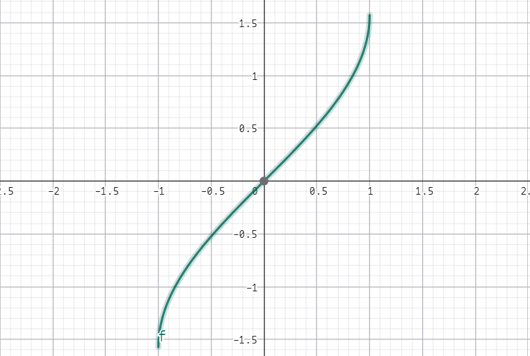
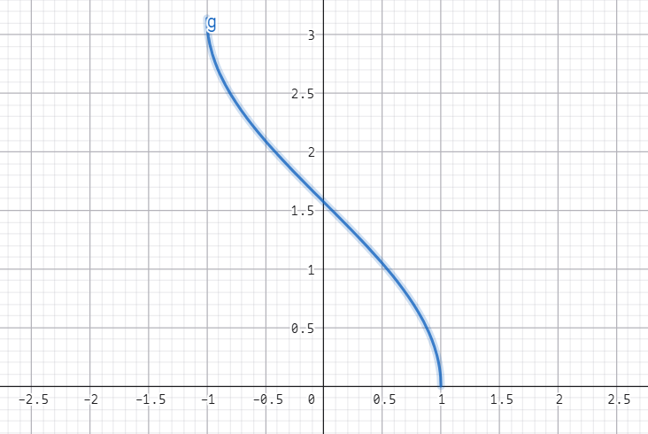
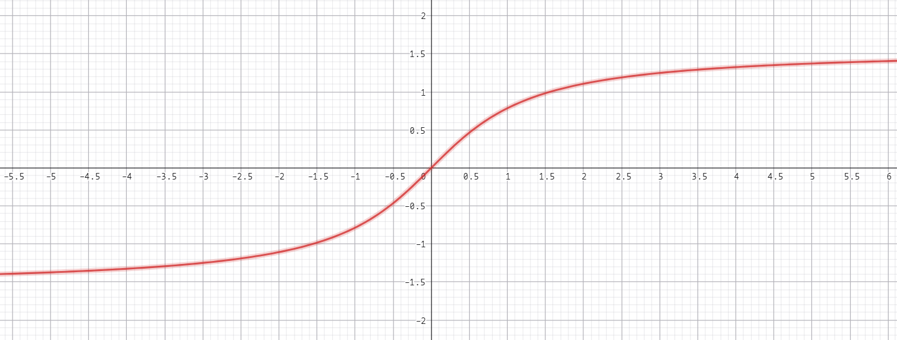

## 数学分析(I) Chapter 3 一元函数的微分学

### 微分和导数

#### 定义 3.1 可微 & 微分

> 对于函数 $y = f(x)$ 定义域中任何一点 $x_0$。
>
> 如果存在一个只与 $x_0$ 有关而与 $\Delta x$ （增量，可正可负）无关的数 $Ax_0$ 使得当 $\Delta x \to 0$ 时有 $\Delta y = A(x_0) \cdot \Delta x + o(\Delta x)$。
>
> 其中 $o(\Delta x)$ 表示 $\Delta x$ 的一个高阶无穷小量（$\lim\limits_{\Delta x \to 0} \dfrac{o(\Delta x)}{\Delta x} = 0$）
>
> 则称 $f$ 在 $x_0$ 处可微，$A(x_0)$ 称为 $f$ 在 $x_0$ 点的微分。
>
> 如果 $f$ 在区间 $I$ 上的每一点都是可微的，则称 $f$ 在 $I$ 上是可微的。
>
> 注记：$f$ 在 $x$ 点可微，且 $\Delta x \to 0$，把 $\Delta x$ 称为自变量的微分，记作 $\text{d} x$。将 $A(x) \cdot \Delta x = A(x) \cdot \text{d} x$ 称为因变量的微分，记作 $\text{d} y$。（因为 $\Delta x \to 0, o(\Delta x) \to 0$）

意义：函数的增量可以近似写作一个线性函数

#### 定义 3.2 可导

> 若函数 $y = f(x)$ 在定义域内的一点 $x_0$ 处，
>
> 极限：$\lim\limits_{\Delta x \to 0} \dfrac{f(x_0 + \Delta x) - f(x_0)}{\Delta x}$ 存在，则称 $f(x)$ 在 $x_0$ 处可导。
>
> 如果 $f$ 在区间 $I$ 上的每一点都可导，则称 $f$ 在 $I$ 上可导：
>
> 注记：上式可以写作 $\lim\limits_{x \to x_0} \dfrac{f(x) - f(x_0)}{x - x_0}$

#### 命题 3.1

> 对于一元函数，可微和可导互为充要条件。

证明：

$\Rightarrow$：

如果 $f$ 可微，则 $\Delta y = A(x_0) \Delta x + o(\Delta x) \iff f(x_0 + \Delta x) - f(x_0) = A(x_0) \Delta x + o(\Delta x)$

两边同时除以 $\Delta x \Rightarrow \lim\limits_{\Delta x \to 0} \dfrac{f(x_0 + \Delta x) - f(x_0)}{\Delta x} = \lim\limits_{\Delta x \to 0}(A(x_0) + \dfrac{o(\Delta x)}{\Delta x})$。

两边极限存在所以可导。

$\Leftarrow$：

如果 $f$ 可导，则 $\lim\limits_{\Delta x \to 0} \dfrac{f(x_0 + \Delta x) + f(x_0)}{\Delta x} = A \in \mathbb{R}$。

$\Rightarrow \lim\limits_{\Delta x \to 0} \dfrac{f(x_0 + \Delta x) - f(x_0) - A\Delta x}{\Delta x} = \lim\limits_{\Delta x} \dfrac{\Delta y - A\Delta x}{\Delta x} = 0$。

这说明当 $\Delta x \to 0 \Rightarrow \Delta y - A\Delta x = o(\Delta x)$。

所以存在 $A \text{ s.t. } \Delta y = A\Delta x + o(\Delta x)$。

□

注记：设 $y = f(x)$ 是平面上一条“光滑”连续的曲线 $\gamma; (x, f(x))$ 是曲线上一定点，$(x + \Delta x, f(x + \Delta x))$ 为曲线上一动点且位于 $(x, f(x))$ 附近；过这两点可以唯一确定一条割线。

当动点沿曲线 $\gamma$ 无限逼近 $(x, f(x))$ 时（即 $\Delta x \to 0$），这些变化的各县存在唯一的极限位置，那么位于这个极限位置的直线就称为曲线 $\gamma$ 在 $(x, f(x))$ 点的切线，斜率为 $\lim\limits_{\Delta x \to 0} \dfrac{f(x_0 + \Delta x) - f(x_0)}{\Delta x} \equiv f^\prime(x)$。

#### 定义 3.3 左右导数

> 将左极限 $\lim\limits_{\Delta x \to 0^-} \dfrac{f(x + \Delta x) - f(x)}{\Delta x}$ 称为 $f(x)$ 在 $x$ 处的左导数。
>
> 将右极限 $\lim\limits_{\Delta x \to 0^+} \dfrac{f(x + \Delta x) - f(x)}{\Delta x}$ 称为 $f(x)$ 在 $x$ 处的右导数。
>
> 注记：$f$ 在 $x$ 点可导的充要条件是其在 $x$ 点处左右导数存在且相等。
>
> 注记：左导数也可以写成 $\lim\limits_{x \to x_{0}^{-}} \dfrac{f(x) - f(x_0)}{x - x_0} \equiv f^\prime_{-}(x)$。
>
> 注记：右导数也可以写成 $\lim\limits_{x \to x_{0}^{+}} \dfrac{f(x) - f(x_0)}{x - x_0} \equiv f^\prime_{+}(x)$。

#### 例题 3.1

> 证明：$y = f(x) = |x|$ 在 $x = 0$ 处不可导。

证明：

$x = 0 \Rightarrow f^\prime_{-}(x) = -1 \not= f^\prime_{+}(x) = 1$。

故不可导，证毕。

### 导数的四则运算和反函数求导方法

#### 命题 3.2 三角函数的导数

> $f(x) = \sin x$ 的导数为 $\cos x$。

证明：

$\lim\limits_{\Delta x \to 0} \dfrac{\sin(x + \Delta x) - \sin x}{\Delta x} = \lim\limits_{\Delta x \to 0} \dfrac{\sin x\cos\Delta x + \sin \Delta x \cos x - \sin x}{\Delta x} = \lim\limits_{\Delta x \to 0} \sin x\dfrac{\cos \Delta x - 1}{\Delta x} + \cos x \dfrac{\sin \Delta x}{\Delta x}$。

根据重要极限 $\lim\limits_{x \to 0} \dfrac{\sin x}{x} = 1$。

原式 $= \cos x$。

**注**：$\tan x$ 的导数是 $\sec^2x$，其中 $\sec x = \dfrac{1}{\cos x}$；$\cot x$ 的导数是 $-\csc^2x$，其中 $\csc x = \dfrac{1}{\sin x}$

#### 命题 3.3 对数函数的导数

> $f(x) = \ln x$ 的导数为 $x^{-1}, (x > 0)$（此处不是说导函数而是导数）

证明：

$\lim\limits_{\Delta x \to 0} \dfrac{\ln(x + \Delta x) - \ln x}{\Delta x} = \lim\limits_{\Delta x \to 0} \dfrac{\ln\left(\dfrac{x}{x} + \dfrac{\Delta x}{x}\right)}{\Delta x} \equiv \lim\limits_{t \to 0}\dfrac{\ln(1 + t)}{xt}$

根据等价无穷小量代换 $\ln(1 + t) \approx t$：原式 $=\dfrac{1}{x}$

#### 命题 3.4 ex 的导数

> $f(x) = e^x$ 的导数为 $e^x,x\in\mathbb{R}$。

证明：

$\lim\limits_{\Delta x \to 0}\dfrac{e^{x + \Delta x} - e^x}{\Delta x} = \lim\limits_{\Delta x \to 0} \dfrac{e^x(e^{\Delta x} - 1)}{\Delta x}$

根据等价无穷小量代换 $e^x - 1 \approx x$，原式 $=e^x$。

#### 命题 3.5 导数的线性组合

> 假设 $f,g$ 在区间 $I$ 上可导，$a, b \in \mathbb{R}$。
>
> 则 $(af + bg)^\prime = (af)^\prime + (bg)^\prime$

只需要证明 $(f + g)^\prime = f^\prime + g^\prime$ 且 $(af)^\prime = af^\prime$。

根据定义直接展开就好，这是简单的：

$\lim\limits_{\Delta x \to 0} \dfrac{af(x+\Delta x) - af(x)}{\Delta x} = a\lim\limits_{\Delta x \to 0} \dfrac{f(x + \Delta x) - f(x)}{\Delta x}$

加法也一样，移一下项是显然的。

#### 命题 3.6 指数函数的导数

> $(a^x)^\prime = a^x\ln a, (\log_ax)^\prime = \dfrac{1}{x\ln a}, a > 0, \not=1$。

证明：

$a^x = e^{\ln a^x} = e^{x\ln a}$ 

利用命题 3.4 可得 $(a^x)^\prime = (e^{x\ln a})^\prime = \ln a\cdot e^{x\ln a} = a^x \ln a$

（这里没有使用复合函数求导?`TODO`）

#### 命题 3.7 幂函数的导数

> $(x^\alpha)^\prime = \alpha x ^{\alpha - 1}$

证明：

$\lim\limits_{\Delta x \to 0}\dfrac{(x + \Delta x)^\alpha - x^\alpha}{\Delta x}$。

用二项式定理展开：$(x + \Delta x)^\alpha = (0 + (\Delta x)^\alpha) + \dbinom{\alpha}{1}(x + (\Delta x)^{\alpha - 1}) + \dbinom{\alpha}{2}(x^2 + (\Delta x)^{\alpha - 2}) + \cdots$

我们只需要把二项式系数的 $\alpha$ 提出来就行了。

#### 命题 3.8 导数的乘和除法法则

> 设 $f, g$ 在区间 $I$ 上可导，则：
>
> 1) $fg$ 也在区间 $I$ 上可导，且 $(fg)^\prime = f^\prime g + fg^\prime$。
>
> 2) $\dfrac{f}{g}$ 也在区间 $I$ 上可导（$g$ 没有零点）$(\dfrac{f}{g})^\prime = \dfrac{f^\prime g - fg^\prime}{g^2}$

证明：

只证明 $\forall x_0 \in I$，令 $F(x) = f(x)g(x), x\in I$。

$(fg)^\prime(x_0) = F^\prime(x_0) = \lim\limits_{\Delta x \to 0} \dfrac{F(x_0 + \Delta x) - F(x_0)}{\Delta x}$。

$= \lim\limits_{\Delta x \to 0} \dfrac{f(x_0 + \Delta x)g(x_0 + \Delta x) - f(x_0)g(x_0)}{\Delta x}$。

现在想要分别写出 $f, g$ 导数的形式，考虑添加项：

$= \lim\limits_{\Delta x \to 0} \dfrac{f(x_0 + \Delta x)g(x_0 + \Delta x) - f(x_0)g(x_0) - f(x_0+\Delta x)g(x_0) + f(x_0 + \Delta x)g(x_0)}{\Delta x}$。

$= \lim\limits_{\Delta x \to 0} \dfrac{f(x_0 + \Delta x)[g(x_0 + \Delta x) - g(x_0)] - g(x_0)[f(x_0) - f(x_0 +\Delta x)]}{\Delta x}$

两边分开：

$= \lim\limits_{\Delta x \to 0} \left[f(x_0 + \Delta x)\dfrac{g(x_0 + \Delta x) - g(x_0)}{\Delta x} +  g(x_0)\dfrac{f(x_0 + \Delta x) - f(x_0)}{\Delta x}\right]$

$= f^\prime(x_0)g(x_0) + f(x_0)g^\prime(x_0)$

这里用到了引理：$f$ 在某处可导 $\Rightarrow$ 某处连续，某处连续可以有：$\lim\limits_{\Delta x \to 0} f(x + \Delta x) = f(x)$。

#### 引理 可导和连续的关系

设 $f(x)$ 在定义域内一点 $x_0$ 处可导，即：$\lim\limits_{\Delta x \to 0} \dfrac{f(x + \Delta x) - f(x)}{\Delta x} = A \in \mathbb{R}$。

即：$\lim\limits_{\Delta x \to 0} \dfrac{f(x_0 + \Delta x) - f(x_0) - A\Delta x}{\Delta x} = 0$。

现在我们想要用它推出 $f(x_0) = \lim\limits_{x \to x_0} f(x)$。

改写形式：

$\lim\limits_{x \to x_0} \dfrac{f(x) - f(x_0) - A(x - x_0)}{x - x_0} = 0 \iff \lim\limits_{x\to x_0}\left[f(x) - f(x_0) - A(x - x_0)\right] = 0$

可以得出：$f(x_0) = \lim\limits_{x\to x_0} f(x)$。

所以命题成立。

对于上面那步，由于连续性可以把极限拿进去，然后 $\Delta x$ 就没掉了。

#### 命题 3.9 反函数求导

> 若 $y = f(x)$ 在区间 $(a, b)$ 上单调（为双射，也就存在反射即反函数存在）。
>
> 且在 $I$ 上可导，且 $f^\prime(x) \not= 0$，不妨设为单增。
>
> 令 $\alpha = \lim\limits_{x \to a^+} f(x), \beta = \lim\limits_{x \to b^-}$。
>
> 则 $f$ 的反函数 $x = g(y)$ 在 $(\alpha, \beta)$ 上也可导。
>
> 且 $g^\prime(y) = \dfrac{1}{f^\prime (x)}$。

证明：

由于 $y = f(x)$ 在 $I$ 上可导，故在 $I$ 上连续。

由此其反函数 $x = g(y)$ 在 $(\alpha, \beta)$ 上连续。

下证：$\lim\limits_{\Delta y \to 0} \dfrac{g(y + \Delta y) - g(y)}{\Delta y}$ 存在。

对于 $y \in (\alpha, \beta)$，设 $y = f(x), x \in (a, b)$。

由 $\Delta y$ 的定义，$0 \not= \Delta y = f(x + \Delta x) - f(x) \Rightarrow y + \Delta y = f(x + \Delta x) \Rightarrow g(y + \Delta y) = x + \Delta x = g(y) + \Delta x$。

所以上面极限 $=\lim\limits_{\Delta y \to 0} \dfrac{\Delta x}{\Delta y} = \lim\limits_{\Delta y \to 0} \dfrac{1}{\dfrac{\Delta y}{\Delta x}} = \lim\limits_{\Delta x \to 0} \dfrac{1}{f^\prime(x)}$。

（注意 $\Delta y \to 0 \iff \Delta x \to 0$）

#### 命题 3.10 反三角函数

**反正弦函数**

$y = \sin x$ 在 $(-\dfrac{\pi}{2}, \dfrac{\pi}{2})$ 上单调，可导

（这个区间取法其实是任意的。）

所以在这上面存在反函数 $x = g(y) \equiv \arcsin y, y \in (-1, 1)$。

一般的，把 $f(x) = \arcsin x, (x \in (-1, 1))$ 称为反正弦函数。

其也是 $(-1, 1)$ 上的严格单调连续可导函数，值域为 $(-\dfrac{\pi}{2}, \dfrac{\pi}{2})$。

**反余弦函数**

$y = \cos x$ 在 $(0, \pi)$ 上单调，可导。

所以在这上面存在反函数 $x = g(y) \equiv \arccos y, y \in (-1, 1)$。

一般的，把 $f(x) = \arccos x, (x \in (-1, 1))$ 称为反余弦函数。

其也是 $(-1, 1)$ 上的严格单调连续可导函数，值域为 $(0, \pi)$。

**反正切函数**

$y = \tan x$ 在 $(-\dfrac{\pi}{2}, \dfrac{\pi}{2})$ 上单调可导。

所以在这上面存在反函数 $x = g(y) \equiv \arctan y, y \in (-\infty, +\infty)$

一般的，把 $f(x) = \arctan x, (x \in \mathbb{R})$ 称为反正切函数。

其也是 $\mathbb R$ 上的严格单调连续可导函数，值域为 $(-\dfrac{\pi}{2},  \dfrac{\pi}{2})$

**导数**

> $(\arcsin x)^\prime = \dfrac{1}{\sqrt{1 - x^2}}, (x \in (-1, 1))$
>
> $(\arccos x)^\prime = -\dfrac{1}{\sqrt{1 - x^2}}, (x\in (-1, 1))$
>
> $(\arctan x)^\prime = \dfrac{1}{1+x^2}, (x\in \mathbb{R})$

证明：

对于第一个，根据反函数求导法则：

$(\arcsin y)^\prime = \dfrac{1}{\sin^\prime x} = \dfrac{1}{\cos x} = \dfrac{1}{\sqrt{1 - \sin^2 x}} = \dfrac{1}{\sqrt{1 - y^2}}$

余弦差不多。

$\arctan x$ 也差不多，只是多了一两步，为了方便记住就好了。

### 复合函数求导和隐函数求导

#### 命题 3.11 复合函数求导

> 假设 $f(u)$ 在 $u_0$ 处可导，$u = g(x)$ 在 $x_0$ 处可导 
>
> 且 $u_0 = g(x_0)$。
>
> 那么 $(f \circ g)(x) = f(g(x))$ 在 $x_0$ 处可导。
>
> 且 $(f \circ g)^\prime(x_0) = f^\prime(u_0) \cdot g^\prime(x_0)$

证明：

注：其实也可以写作微分的形式：$\dfrac{\text{d} (f\circ g)}{\text{d} x} = \dfrac{\text{d} (f \circ g)}{\text{d}u} \cdot \dfrac{\text{d} u}{\text{d} x}$（链式法则）

当然也可以写作：$\text{d}[f(g(x))] = f^\prime(u)g^\prime(x)\text{d} x$

#### 例题 3.2

> 求 $y = e^{\sqrt{1 + \cos x}}$ 的导函数。

设 $f(x) = e^x, g(x) = \sqrt{x},  h(x) = 1 + \cos x$。

即求 $(f\circ g \circ h)^\prime(x)$。

$y^\prime = f^\prime(g(h(x))) \cdot g^\prime(h(x)) \cdot h^\prime(x) = e^{\sqrt{1 + \cos x}} \cdot \dfrac{1}{2\sqrt{1 + \cos x}} \cdot (-\sin x)$

#### 技巧 对数求导法

> 形如 $y = f(x) = u(x)^{v(x)}$ 的函数一般先对两边取对数再分别求导，最后通过一次复合变回来。

例子：

$\text{let } z(x) = \ln y = v(x) \ln u(x)$。

$z^\prime(x) = v^\prime(x) \ln u(x) + v(x)\dfrac{u^\prime(x)}{u(x)}$

由于 $y = e^{z(x)} \Rightarrow y^\prime = z^\prime(x) e^{z(x)}$

所以 $\dfrac{y^\prime}{y} = v^\prime(x)\ln u(x) + v(x) \dfrac{u^\prime(x)}{u(x)}$。

也就是 $y^\prime = u(x)^{v(x)}[v^\prime(x)\ln u(x) + v(x) \dfrac{u^\prime(x)}{u(x)}]$

#### 技巧 隐函数求导

> 如果方程 $F(x, y) = 0$ 可以确定为 $y, x$ 的一个函数关系，但是又不能写出 $x, y$ 之间的函数关系式，则称 $y$ 是 $x$ 的隐函数。

例子：

$x + e^{\sin y} + \ln (1 + y) = 0$。

两端同时对 $x$ 求导：

$1 + e^{\sin y} \cdot \cos y \cdot y^\prime + \dfrac{1}{1 + y} \cdot y^\prime = 0$

然后解出 $y$ 就行了。

### 高阶导数和微分

#### 定义 3.4 高阶导数

> 假设 $y = f(x)$ 可导。
>
> 如果其导函数 $f^\prime (x)$ 仍是一个可导函数，则 $[f^\prime(x)]^\prime \text{ or } \dfrac{\text{d}}{\text{d} x}\left(\dfrac{\text{d} f}{\text{d} x}\right)$ 称为 $x$ 的二阶导数，记作 $f^{\prime\prime} (x) \text{ or } \dfrac{\text{d}^2 f}{\text{d}x^2}$，称 $f$ 为二阶可导。
>
> 更高阶同理（$f^{\prime\prime\prime}(x), f^{(3)}(x), \dfrac{\text{d}^3 f}{\text{d}x^3}$）。
>
> $n$ 阶：$f^{(n)}(x) \text{ or } \dfrac{\text{d}^n f}{\text{d} x^n}$

例子：

+ $\sin^{(n)} = \sin(x + n\dfrac{\pi}{2})$
+ $f(x) = \dfrac{1}{x^2 - 1}; \text{ calculate } f^{(n)}(x)$。
    + $f(x) = \dfrac{1}{2}(\dfrac{1}{x - 1} - \dfrac{1}{x+1})$
    + $f^{(n)} (x)= \dfrac{1}{2}[(-1)^n \times n! \times (x - 1)^{-(n + 1)} - (-1)^{n} \times n! \times (x + 1)^{-(n + 1)}]$
+ $f(x) = \arctan (x), x \in (-1, 1); \text{ calculate } f^{(n)}(x)$。
    + $f^\prime(x) = \dfrac{1}{1 + x^2} = \dfrac{1}{1 - (-x^2)}$
    + 注意到等式：$\dfrac{1}{1 - t} = \sum\limits_{i = 0}^{\infty} t^i$
    + 所以 $f^\prime(x) = \sum\limits_{i = 0}^{\infty} (-1)^i x^{2i}, |x| < 1$
    + $g^\prime(x) = \left[\sum\limits_{i = 0}^{\infty}(-1)^i x^{2i}\right]^\prime = \sum\limits_{i = 0}^{\infty} (-1)^i(x^{2i})^\prime = \sum\limits_{i = 0}^{\infty}(-1)^i 2i(x^{2i - 1})$（这里使用了逐项求导定理）
    + $g^{\prime\prime}(x) = \sum\limits_{i = 1}^{\infty}(-1)^i (2i)(2i+1)x^{2i-2}$
    + ……
    + $g^{(n)}(x) = \sum\limits_{i \ge \frac{n}{2}}^{\infty}(-1)^i(2i)(2i-1)(2i-2)\dots(2i - n + 1)x^{2i - n}$

`TODO`

例子：设有参数方程：$\begin{cases}x = \varphi(t) \\ y = \psi(t)\end{cases}, t\in [a,b]$ 其中 $\varphi, \psi$ 具有二阶连续的导函数。求 $\dfrac{\text{d}y}{\text{d}x}, \dfrac{\text{d}^2y}{\text{d}x^2}$。

求导：$\dfrac{\text{d}x}{\text{d}t} = \varphi^\prime(t); \dfrac{\text{d}y}{\text{d}t} = \psi^\prime(t)$。

这里能直接除吗？其实是没有定义过的。

来用微分定义写一下：$\Delta x = \varphi^\prime(t)\Delta t + o_1(\Delta t); \Delta y = \psi^\prime(t)\Delta t + o_2(\Delta t)$

所以 $\dfrac{\Delta y}{\Delta x} =\dfrac{\psi^\prime(t)\Delta t + o_2(\Delta t)}{\varphi^\prime(t)\Delta t + o_1(\Delta t);}$

上下同除 $\Delta t$，同时取极限：

$\lim\limits_{\Delta t \to 0}\dfrac{\psi^\prime(t) + \dfrac{o_2(\Delta t)}{\Delta t}}{\varphi^\prime(t) + \dfrac{o_1(\Delta t)}{\Delta t}} = \lim\limits_{\Delta t \to 0} \dfrac{\psi^\prime(t)}{\varphi^\prime(t)}  = \dfrac{\psi^\prime(t)}{\varphi^\prime(t)}= \lim\limits_{\Delta x \to 0} \dfrac{\Delta y}{\Delta x} = \dfrac{\text{d} y}{\text{d}x}$

对于二阶导：由定义：

$\dfrac{\text{d}^2 y}{\text{d} x^2} = \dfrac{\text{d}}{\text{d} x} \left(\dfrac{\text{d} y}{\text{d} x}\right) = \dfrac{\text{d} h(t)}{\text{d} x}$

令 $h(x) = \dfrac{\psi^\prime(t)}{\varphi^\prime(t)}$

上式 $=\dfrac{\text{d}h(t)}{\text{d} x} = \dfrac{\text{d} h(t)}{\text{d}t}\dfrac{\text{d} t}{\text{d} x} = \dfrac{\psi^{\prime\prime}\varphi^\prime - \varphi^{\prime\prime}\psi^\prime}{(\varphi^\prime)^2}$
