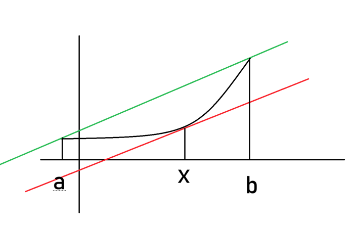
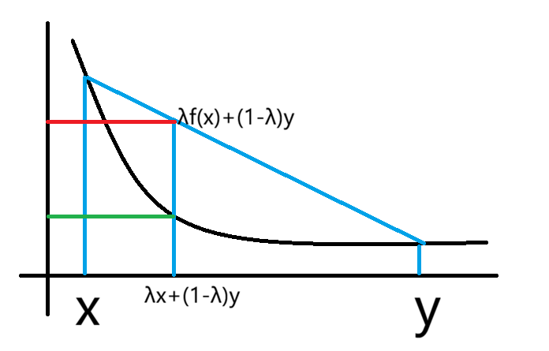
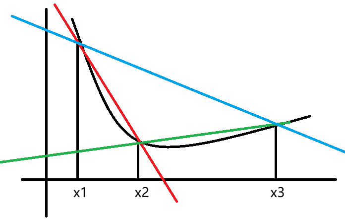

## 数学分析笔记 Chapter 4 微分中值定理及其应用

### 微分中值定理

#### 定义 4.1 极值

> 假设 $f$ 在开区间 $(a, b)$ 上有定义，$x_0 \in (a, b)$。
>
> 如果存在 $x_0$ 的某个邻域 $o(x_0, \delta)$ 内，使得 $f(x) \le f(x_0), x\in o(x_0, \delta)$
>
> 则称 $x_0$ 为 $f(x)$ 的一个极大值点，此时 $f(x_0)$ 称为 $f(x)$ 的极大值。
>
> 类似的，可以定义极小值。

#### 定理 4.1 Fermat 定理

> 如果 $x_0$ 为 $f$ 的一个极值点，并且 $f$ 在 $x_0$ 这一点是可导的。
>
> 则：这一点的导数一定是零

证明：

不妨认为其为极大值点，所以 $\exists \delta > 0 \text{ s.t. when } 0 < |x - x_0| < \delta : f(x) \le f(x_0)$（保证在定义域内）

所以 $x \in o(x_0, \delta)$ 时：

当 $x > x_0$ 时，$\dfrac{f(x) - f(x_0)}{x - x_0} \ge 0$。

当 $x < x_0$ 时，$\dfrac{f(x) - f(x_0)}{x - x_0} \le 0$。

利用极限的保序性，这两个都取极限可以知道：

$\lim\limits_{x \to x_0^+} \dfrac{f(x) - f(x_0)}{x - x_0} \ge 0; \lim\limits_{x \to x_0^-} \dfrac{f(x) - f(x_0)}{x - x_0} \le 0$。

换句话说 $f(x)$ 在 $x_0$ 处的右导数大于等于零，左导数小于等于零

因为 $f(x)$ 在 $x_0$ 处可导所以左右导数一定相等，等于 $0$。

证毕。

#### 定理 4.2 Roll 中值定理

> 假设 $f$ 在闭区间 $[a, b]$ 上连续，从而一致连续。
>
> 在开区间 $(a, b)$ 上是可导的且 $f(a) = f(b)$。
>
> 则存在一点 $\xi \in (a, b)$ 使得 $f^\prime(\xi) = 0$

证明：

假设 $f$ 在 $[a, b]$ 上的最大最小值分别为 $M, m$（根据命题 3.x 一定可以取到）

1. $M = m$，$f \equiv f(a) = f(b)$，这样的 $\xi$ 一定存在
2. $M \not= m \Rightarrow m < M$，则 $m, M$ 中至少有一个 $\not= f(a)$。不妨认为是 $M \not= f(a)$。

    所以 $M > f(a) = f(b)$

    设 $\xi$ 为 $f$ 的最大值点，那么 $\xi \not=a, \xi \not=b \Rightarrow \xi \in (a, b)$。

    因为开区间上，最大值点一定是极大值点，由 Fermat 定理可以说明：$f^\prime(\xi) = 0$

#### 定理 4.3 Lagrange 中值定理

> 设 $f$ 在 $[a, b]$ 上连续，在 $(a, b)$ 上可导，则 $\exists \xi \in (a, b) \text{ s.t. } f^\prime(\xi) = \dfrac{f(b) - f(a)}{b - a}$。

证明：

只需要证明：$\exists \xi \in (a, b) \text{ s.t. } f(b) - f(a) = (b - a) f^\prime(\xi)$

构造函数 $F(x) = f(b) - f(a) - (b - a)f(x)$。

想用 Roll 证明（把这个图转一下转平就是 Roll 的形式）：

$F(b)= f(b) - f(a) - (b-a)f(b)$

$F(a) = f(b) - f(a) - (b - a)f(a)$

它们不等，没法使用 Roll 中值定理

为什么要用 Roll，其实就是想要 $F^\prime$ 能构造出所需的项，这里 $f^\prime(x)$ 其实已经能造出来了，但前面还不行。

于是我们在 $f(b) - f(a)$ 上再乘一个 $x$。

所以

$F(b)= [f(b) - f(a)]x - (b-a)f(b)$

$F(a)= [f(b) - f(a)]x - (b-a)f(a)$

$F(a) = F(b)$ 且 $F$ 在 $(a, b)$ 上可导，$[a, b]$ 上连续。

由 Roll 中值定理，$\exists \xi \in (a, b) \text{ s.t. } F^\prime(\xi) = 0 = f(b) - f(a) - (b - a)f^\prime(\xi)$。

所以就证明了 Lagrange 中值定理。

#### 定理 4.4 Cauchy 中值定理

> 假设 $f, g$ 在 $[a, b]$ 连续，在 $(a, b)$ 上可导。
>
> $g^\prime(x) \not=0;\forall x \in (a, b)$。
>
> 则：$\exists \xi \in (a, b) \text{ s.t. } \dfrac{f(b) - f(a)}{g(b) - g(a)} = \dfrac{f^\prime(\xi)}{g^\prime(\xi)}$

证明：

用两次 Lagrange 中值定理就行吗？注意到这两个的 $\xi$ 可能不等。

继续构造函数。

即证：$\exists \xi \in (a, b) \text{ s.t. } [f(b) - f(a)]g^\prime(\xi) = [g(b) - g(a)]f^\prime(\xi)$。

构造函数：$F(x) = [f(b) - f(a)]g(x) - [g(b) - g(a)]f(x), x\in (a, b)$。

$F$ 在闭区间上连续，在开区间上可导。

还是想用 Roll，考虑 $F(a), F(b)$。

$F(a) = f(b)g(a) - f(a)g(a) - g(b)f(a) + g(a)f(a)$

$F(b) = f(b)g(b) - f(a)g(b) - g(b)f(b) + g(a)f(b)$

$F(b) - F(a) = [f(b) - f(a)]\cdot[g(b) - g(a)] - [g(b) - g(a)] \cdot [f(b) - f(a)] = 0$

（**这个轮换式看起来不等但实际上是等的，感觉还比较重要**）

$F(a) = F(b)$，由 Roll 中值定理，$\exists \xi \in (a, b) \text{ s.t. } F^\prime(\xi) = 0$ 即所证式。

#### 命题 4.1

> 如果 $f$ 在 $[a, b]$ 上连续，在 $(a, b)$ 上可导且 $f^\prime(x)= 0, \forall x\in (a, b)$ 则 $f$ 为常数。

证明：

$\forall x \in [a, b]$，考虑 $[a, x] \subset [a, b]$

由 Lagrange 中值定理：$f(x) - f(a) = f^\prime(\xi)(x - a)$。

由于每一点都是 $f^\prime = 0$，所以 $f(x) = f(a)$。

恒等。

#### 例题 4.1

> 证明 $|\sin x - \sin y| \le |x - y|, \forall x, y\in\mathbb{R}$

证明：

考虑函数：$f(t) = \in t, t \in [x, y]$

由 Lagrange 中值定理：$\exists \xi \in [x, y] \text{ s.t. } f(x) - f(y) = f^\prime(\xi)(x - y)$ 

所以就是 $|\cos \xi| \cdot |x - y| \le |x - y|$。

#### 例题 4.2 又一个判定一致连续的方法

> 假设 $f$ 在开区间上可导，且导数有界，且 $\exists M > 0 \text{ s.t. } |f^\prime(x)| \le M. x \in (a, b)$。
>
> 则 $f$ 在开区间上是一致连续的，其中 $a, b$ 可以为无穷。

证明：

任取 $x< y \in (a, b)$，所以 $f(x)$ 在 $[x, y]$ 上连续，在 $(a, b)$ 上可导。

由 Lagrange 中值定理，存在 $\xi \in [x, y] \text{ s.t. } f(x) - f(y) = f^\prime(\xi)(x - y)$。

两边同时取绝对值：$|f(x) - f(y)| = |f^\prime(\xi)||x - y|$

所以：$|f(x) - f(y)| \le M |x - y|$。

所以 $\forall \epsilon > 0, \text{ let }\delta = \dfrac{\epsilon}{M}, \text{ s.t. when } |x - y| < \delta : |f(x) - f(y)| \le M|x- y| < \epsilon$

所以 $f$ 是一致连续的。

### 函数的单调性和凸性

#### 命题 4.2 单调性

> 设 $f$ 在 $I$ 上是可导的，则 $f$ 在 $I$ 上单调递增（减）的充分必要条件是其导数 $f^\prime(x) \ge 0 (\le 0)$

证明，先推必要性 $\Rightarrow$：

$f$ 在 $I$ 上是单调递增的，即 $\dfrac{f(x) - f(y)}{x - y} \ge 0, y \not= x \Rightarrow \dfrac{f(y) - f(x)}{y - x} \ge 0$。

固定 $x, \text{ let }y \to x$，所以 $f^\prime(x) > 0$。

证明充分性 $\Leftarrow$：

下证，$f$ 是单调递增的。

任取 $x, y\in I, x > y$。

下证：$f(x) > f(y)$。

由于 $f$ 在 $[y, x]$ 上连续且在 $(y, x)$ 上可导，根据 Lagrange 中值定理：$\exists \xi \in (y, x) \text{ s.t. } f(x) - f(y) = f^\prime(\xi)(x - y) \ge 0$。

证毕。

#### 定义 4.2 凸性

> 假设 $f$ 在区间 $I$ 上有定义，对于 $\forall x, y \in I, \forall \lambda \in [0, 1], f[\lambda x + (1 - \lambda y)] \le \lambda f(x) + (1 - \lambda)f(y)$，则称 $f(x)$ 在 $I$ 上是下凸的。
>
> 类似，可以定义上凸函数。

（称 $\lambda t + (1 - \lambda) s$ 为 $s, t$ 的凸组合）

这里用一下相似很容易画出图。

#### 定理 4.5

> 假设 $f$ 在区间 $I$ 上二阶可导。
>
> 则 $f$ 在 $I$ 上是下凸的 $\iff$ $f^{\prime\prime} \ge 0, \forall x \in I$

证明：$\Rightarrow$

假设 $f$ 是下凸的，$\forall x \in I, \forall \Delta x > 0$，只要 $x +- \Delta x \in I$，那么：

$\dfrac{f(x + \Delta x) + f(x - \Delta x)}{2} \ge f(\dfrac{x + \Delta x + x - \Delta x}{2}) = f(x)$（$\lambda = \dfrac{1}{2}$）

所以 $f(x + \Delta x) + f(x - \Delta x) \ge 2f(x)$

所以 $f(x + \Delta x) - f(x) \ge f(x) - f(x - \Delta x) \cdots (@)$

为什么要这么做，因为二阶导大于零就是一阶导单调递增。

任取 $x, y \in I$，不妨设 $x < y$。

令 $\Delta x_n = \dfrac{y - x}{n}$ 则 $n \to \infty, \Delta x_n \to 0$

有 $f(y) - f(y - \Delta x_n) \ge f(y - \Delta x_n) - f(y - 2\Delta x_n)$

（用了 $@$ 这个式子）

重复这样的操作可以得到： 

$f(y) - f(y - \Delta x_n) \ge f[y - (n - 1)\Delta x_n] - f(y - \Delta x)$

所以 $\ge f(x + \Delta x_n) - f(x)$

两边同除 $\Delta x_n$：

$\dfrac{f(y) - f(y - \Delta x_n)}{\Delta x_n} \ge \dfrac{f(x + \Delta x_n) - f(x)}{\Delta x_n}$

同时让 $n\to \infty$。

由于 $f$ 可导，所以 $f^\prime(y) \ge f^\prime(x)$。

所以 $f^{\prime\prime} \ge 0$

证明 $\Leftarrow$：假设 $f^{\prime\prime} \ge 0$。

所以 $f^\prime$ 在 $I$ 上递增。

$\forall x, y \in I, x < y$，再取 $\lambda \in [0, 1]$。

令 $t = \lambda x + (1- \lambda) y$

根据凸组合的性质，$t \in [x, y]$。

边界情况其实不用证所以就是 $x < t < y$。

所以 $x - t = (1 - \lambda)(x - y); y - t = \lambda (y - x)$。

由 Lagrange 中值定理：

因为 $f$ 在 $[x, y]$ 上连续，且 $(x, y)$ 上可导。

所以 

$\begin{cases}f(x) - f(t) = f^\prime(\xi)(x - t) = f^\prime(\xi)(1 - \lambda)(x - y), &\xi \in (x, t) \\ f(y) - f(t) = f^\prime(\eta) \lambda(y - x), &\eta \in (t, y)\end{cases}$

所以 $f(x) = f(t) + f^\prime(\xi)(1 - \lambda)(x - y)$。

由于 $f^\prime$ 单调递增，所以 $f(x) \ge f^\prime(t)(1 - \lambda)(x - y) + f(t) \cdots (1)$

对于 $y$ 同理：

$f(y) \ge f(t) + f^\prime(t) \lambda (y - x) \cdots(2)$

两个式子做凸组合：

$\lambda f(x) + (1 - \lambda)f(y) \ge f(t) + f^\prime(t)\lambda(1-\lambda)(x - y) + f^\prime(t)\lambda(1-\lambda)(y - x)$

#### 定义 4.3 拐点

> 称 $f$ 图像上，曲线上凸与下凸的分界点为 $f$ 图像的拐点。

#### 定理 4.6

> 设 $f$ 在区间 $I$ 上连续，$(x_0 + \delta, x_0 + \delta) \subset I$，其中 $\delta > 0$。
>
> 1) 设 $f$ 在 $(x_0 - \delta, x_0), (x_0, x_0 + \delta)$ 上二阶可导，若 $f^{\prime\prime}(x)$ 在 $(x_0 - \delta, x_0), (x_0, x_0 + \delta)$ 上符号相反，则 $(x_0, f(x_0))$ 是曲线 $y = f(x)$ 的拐点。
>
> 2) 若 $f$ 在 $(x_0 - \delta, x_0 + \delta)$ 二阶可导，且 $(x_0, f(x_0))$ 是 $y = f(x)$ 的拐点，则 $f^{\prime\prime}(x) = 0$

证明：

例子：

> (0, 0) 是 $f(x) = x^3$ 的拐点，不是 $g(x) = x^4$ 的拐点。

#### 定理 4.7 Jenson 不等式

> 若 $f$ 在区间 $I$ 上是下凸的（或上凸）
>
> 则 $\forall x_k \in I$ 和满足 $\lambda_1 + \lambda_2 + \cdots + \lambda_n = 1$ 的 $\lambda_k > 0, k = 1,2,3,4,\dots n$。
>
> 都有 $f(\sum\limits_{k = 1}^{n} \lambda_k x_k) \le \sum\limits_{k = 1}^{n}\lambda_k f(x_k)$。
>
> 上凸则改为 $\ge$

证明：

只考虑 $f$ 是下凸的：

$n = 2$ 的时候显然成立。

假设 $n = m > 2$ 时不等式成立：

$f(\lambda_1 x_1 + \lambda_2 x_2 + \dots + \lambda_n x_n) \le \lambda_1f(x_1) + \lambda_2f(x_2) + \dots + \lambda_nf(x_n)$

其中 $\lambda k > 0$ 且 $\sum\limits_{}^{}\lambda_k = 1$。

当 $n = m + 1$ 时

要证：$\sum\limits_{k = 1}^{m + 1} \lambda_k = 1$ 且 $\lambda_k > 0$ 时：

$f(\sum\limits_{k = 1}^{m + 1}\lambda_k x_k) \le \sum\limits_{k = 1}^{m + 1}\lambda_k f(x_k)$。

由于：$\sum\limits_{k = 1}^{m+1}\lambda_k x_k = \sum\limits_{k - 1}^{m}\lambda_k \cdot \sum\limits_{k = 1}^{m}\dfrac{\lambda_k x_k}{\sum\limits_{k = 1}^{m}\lambda_k} + \lambda_{m + 1}x_{m + 1}$

记 $\mu = \sum\limits_{k = 1}^{m}\lambda_k, x = \sum\limits_{k = 1}^{m} \dfrac{\lambda_k x_k}{\mu}$。

由于 $\mu + \lambda_{m + 1} = 1, \mu > 0, \lambda_{m + 1} > 0$，由 $f$ 下凸的定义：

$f(\sum\limits_{k = 1}^{m + 1}\lambda_k x_k) = f(\mu x + \lambda_{m + 1}k_{m + 1}) \le \mu f(x) + \lambda_{m + 1}f(x_{m + 1})$

由 $m$ 个数的归纳假设：

$f(x) = f(\sum\limits_{k = 1}^{m}\dfrac{\lambda_k x_k}{\mu})$。

记 $\mu_k = \dfrac{\lambda_k}{\mu}$。

那么$f(x) = f(\sum\limits_{k = 1}^{m + 1}\mu_k x_k) \le \sum\limits_{k = 1}^{m}\mu_k f(x_k)$

所以 $\mu f(x) \le \sum\limits_{k = 1}^{m}\lambda_k f(x_k) \Rightarrow \sum\limits_{k = 1}^{m + 1}f(\lambda_k x_k) \le \sum\limits_{k = 1}^{m + 1}\lambda_k f(x_k)$

#### 定理 4.8

> 设 $f$ 在区间 $I$ 上连续，则下列等价（T.F.A.E）
>
> 1) $f$ 在 $I$ 上是下凸的。
>
> 2) $\forall x, y \in I$，有 $f(\dfrac{x + y}{2}) \le \dfrac{f(x) + f(y)}{2}$
>
> 3) $\forall x_1, x_2, \dots, x_n, x_n \in I$，$f(\dfrac{x_1 + x_2 + \dots x_n}{n}) \le \dfrac{f(x_1) + f(x_2) + f(x_3) + \dots + f(x_n)}{n}$

证明：1 推 2：

只需要在下凸函数的定义中取 $\lambda = \dfrac{1}{2}$。

2 推 3：

设 $x_1, x_2, x_3, x_4 \in I$ 有：

$f(\dfrac{x_1 + x_2 + x_3 + x_4}{4}) = f(\dfrac{\dfrac{x_1 + x_2}{2} + \dfrac{x_3 + x_4}{2}}{2}) \le \dfrac{f(\dfrac{x_1 + x_2}{2}) + f(\dfrac{x_3 + x_4}{2})}{2}$

继续用 (2)：

$\dfrac{\dfrac{1}{2}[f(x_1) + f(x_2)] + \dfrac{1}{2}[f(x_3) + f(x_4)]}{2} = \dfrac{f(x_1) + f(x_2) + f(x_3) + f(x_4)}{2^2}$

一般的，可以知道 $n = 2^k$ 都成立。

即:

$f(\dfrac{x_1 + x_2 + \dots + x_{2^k}}{2^k}) \le \dfrac{f(x_1) + f(x_2) + \dots + f(x_{2^k})}{2^k}$

由于 $\forall n \in \mathbb{N_+}, \exists k \in \mathbb{N_+} \text{ s.t. } 2^k \ge n$

令 $a_n = \dfrac{x_1 + x_2 + \dots x_n}{n}$

令 $x_{n + 1} = x_{n + 2} = \dots = x_{2^k} = a_n$，

所以 $f(\dfrac{x_1 + x_2 + \dots + x_n}{n}) = f(a_n) = f[\dfrac{n a_n + (2^k - n)a_n}{2^k}]$

$= f(\dfrac{x_1 + x_2 + x_3 + \dots x_n + x_{n + 1} + \dots + x_{2^k}}{2^k}) \le \dfrac{1}{2^k} [f(x_1) + f(x_2) + \dots f(x_n) + f(x_n + 1) + \dots + f(x_{2^k})]$

$= \dfrac{1}{2^k} [f(x_1) + f(x_2) + \dots + f(x_n) + (2^k - n)f(a_n)]$

两边同乘 $2^k$

$\Rightarrow 2^k f(a_n) \le \sum\limits_{k = 1}^{n} f(x_k) + (2^k - n)f(a_n)$

$\Rightarrow n f(a_n) \le \sum\limits_{k = 1}^{n}f(x_k) \Rightarrow f(\dfrac{x_1 + x_2 + x_3 + \dots x_n}{n} \le \dfrac{f(x_1) + f(x_2) + \dots + f(x_n)}{n})$

证明 3 推 1

要整：$\forall \lambda \in (0, 1); x, y \in I$ 有 $f(\lambda x + (1 - \lambda) y) \le \lambda f(x) + (1 - \lambda) f(y)$

先证明 $\lambda \in \mathbb{Q}$ 时是正确的：

设 $\lambda = \dfrac{n}{m}$，其中 $m > n, m,n \in \mathbb{N_+}$。

那么 $f(\lambda x + (1 - \lambda)y) = f(\dfrac{n}{m} x + \dfrac{m - n}{m}y) = f(\dfrac{x + \dots + x + y + \dots y}{m})$

$\le \dfrac{1}{m}[nf(x) + (m - n)f(y)] = \lambda f(x) + (1 - \lambda) f(y)\cdots(@)$。

对于一般的 $\lambda$，则存在一列有理数 $\{\lambda_k\} \to \lambda (k \to \infty)$。

由于 $f$ 连续：$f(\lambda_k) \to f(\lambda)$

由 $@$ 式：$f(\lambda_k x + (1 - \lambda_k)y) \le \lambda_k f(x) + (1 - \lambda_k)f(y)$。

两边 $k \to \infty$ 可以得到原式。

#### 定理 4.9

> 假设 $f$ 在区间 $I$ 上有定义。
>
> $\forall x_1, x_2, x_3 \in I$ 且 $x_1 < x_2 < x_3$。
>
> 那么下列说法等价：
>
> 1) $f$ 在 $I$ 上是下凸的。
>
> 2) $\dfrac{f(x_2) - f(x_1)}{x_2 - x_1} \le \dfrac{f(x_3) - f(x_1)}{x_3 - x_1}$
>
> 3) $\dfrac{f(x_3) - f(x_1)}{x_3 - x_1} \le \dfrac{f(x_3) - f(x_2)}{x_3 - x_2}$
> 
> 4) $\dfrac{f(x_2) - f(x_1)}{x_2 - x_1} \le \dfrac{f(x_3) - f(x_2)}{x_3 - x_2}$。

#### 定理 4.10

> 假设 $f$ 在区间 $I$ 上可导，则 $f$ 在区间 $I$ 上是下凸的，当且仅当
>
> $y = f(x)$ 的函数图像的切线总是位于 $y = f(x)$ 的下方

证明 $\Rightarrow$：

要证明：$\forall x_0 \in I: f(x) > f(x_0) + f^\prime(x_0)(x- x_0)$

任取 $x \in I; x < x_0$。

取割线 $AB: A(x_0, f(x_0)), B(x, f(x))$。

$k_{AB} = \dfrac{f(x_0) - f(x)}{x_0 - x} < f^\prime(x_0)$（切线是割线的极限）

所以 $f(x) - f(x_0) < f^\prime(x_0)(x - x_0)$，就证完了。

在另外一边 $(x > x_0)$ 也是一样的。

$\Leftarrow$：

已知 $\forall f(x) > f(x_0) + f^\prime(x_0)(x - x_0)$。

假设 $\exists \lambda \in (0, 1), x_1, x_2 \in I \text{ s.t. } \lambda x_1 + (1 - \lambda) x_2 = x_0$。

令 $x = x_1$，带入已知条件：

$f(x_1) > f(x_0) + f^\prime(x_0)(x_1 - x_0) \iff f(x_1) > f(x_0) + f^\prime(x_0)(1 - \lambda)(x_1 - x_2)$。

同理令 $x = x_2$：

$f(x_2) > f(x_0) + f^\prime(x_0)(x_2 - x_0) \iff f(x_2) > f(x_0) + f^\prime(x_0)\lambda(x_2 - x_1)$

对一式二式做凸组合：

$\lambda f(x_1) + (1 - \lambda)f(x_2) > f(x_0) = f[\lambda x_1 + (1 - \lambda)x_2]$

证毕。

#### 定理 4.11 导函数不存在第一类不连续点

> 设 $f$ 在区间 $(a, b)$ 上可导，那么，对于 $(a, b)$ 中的每个点，定要么是 $f^\prime$ 的连续点，要么是 $f^\prime$ 的第二类不连续点。

证明：

任取 $x_0 \in (a, b)$，由导数的定义：$f^\prime(x_0) = f^\prime_{+}(x_0) = \lim\limits_{x \to x_0^+} \dfrac{f(x) - f(x_0)}{x - x_0}$。

由于 $f(x)$ 在 $[x_0, x]$ 上连续可导：由 Lagrange 中值定理：$= \lim\limits_{x \to x_0^+}\dfrac{f^\prime(\xi)(x - x_0)}{x - x_0}, \xi \in (x_0, x)$。

然后上式 $= \lim\limits_{x \to x_0^+}f^\prime(\xi) = \lim\limits_{\xi \to x_0^+} f^\prime(\xi)$

如果极限 $\lim\limits_{t \to x_0^+}f^\prime(t)$ 存在，那么 $\lim\limits_{x \to x_0^+} f^\prime(x) = \lim\limits_{\xi \to x_0^+}f^\prime(\xi) = f^\prime(x_0)$

同理，如果 $\lim\limits_{t \to x_0^-}f^\prime(t)$ 存在也可以推出 $\lim\limits_{t \to x_0^-} f^\prime(t) = f^\prime(x_0)$

所以只要左右极限存在那它们一定相等且都等于函数值。

若至少有一个不存在那就是第二类不连续点。

#### 定理 4.12 Darboux 定理（导函数介值性）

> 设 $f$ 在闭区间 $[a, b]$ 上可导，端点考虑单侧导数。
>
> $\forall c \in (f^\prime(a), f^\prime(b))$（不妨假设 $f^\prime(a) < f^\prime(b)$），$\exists \xi \in [a, b] \text{ s.t. } f^\prime(\xi) = c$ 

证明：$F(x) \equiv f(x) - cx, x \in [a, b]$。

显然 $F(x)$ 在 $a, b$ 上也可导。

那么 $F^\prime_+(a) = \lim\limits_{x \to a^+} \dfrac{F(x) - F(a)}{x-a} = \lim\limits_{x \to a^+} [\dfrac{f(x) - f(a)}{x - a} - c] = f^\prime_+(a) - c = f^\prime(a) - c < 0$

同样可以知道 $F^\prime_-(b) = f^\prime_-(b) - c = f^\prime(b) - c > 0$。

所以：当 $x$ 与 $a$ 靠的足够近时，$F(x) < F(a)$；$x$ 与 $b$ 靠的足够近时，$F(x) < F(b)$。

所以 $F$ 不在 $a, b$ 两点取最小值。

注意到 $f$ 在闭区间上可导 -> 连续 -> $F$ 在 $[a, b]$ 上连续。

所以 $F$ 的最小值 $F(\xi)$ 必然在 $(a, b)$ 内取到。

且 $F$ 在 $[a, b]$ 上可导，由 Fermat 定理，$F^\prime(\xi) = 0 \iff f^\prime(\xi) = c$ 

### 应用

#### 例 1

> 设 $a > 0$，函数 $f$ 在 $[a, b]$ 上是连续的，在 $(a, b)$ 上可导。 
>
> 证明：$\exists \xi \in (a, b) \text{ s.t. } \dfrac{af(b) - bf(a)}{a - b} = f(\xi) - \xi f^\prime(\xi)$

证明：

其实就是要证明：$\dfrac{\dfrac{f(b)}{b} - \dfrac{f(a)}{a}}{\dfrac{1}{b} - \dfrac{1}{a}} = f(\xi) - \xi f^\prime(\xi)$

取 $F(x) = \dfrac{f(x)}{x}, G(x) = \dfrac{1}{x}$，显然他们在 $[a, b]$ 上连续，$(a, b)$ 上可导。

由 Cauchy 中值定理：

$\exists \xi \in(a, b)\text{ s.t. } \dfrac{F(b) - F(a)}{G(b) - G(a)} = \dfrac{F^\prime(\xi)}{G^\prime(\xi)}$

$\dfrac{F^\prime(\xi)}{G^\prime(\xi)} = \dfrac{\dfrac{\xi f^\prime(\xi) - f(\xi)}{\xi^2}}{-\dfrac{1}{\xi^2}} =f(\xi) - \xi f^\prime(\xi)$。

这就是我们想要的。

#### 例 2

> 设 $f$ 在 $[a, b]$ 上连续，$(a, b)$ 上可导。
>
> 其中 $0 < a < b, f(a) \not= f(b)$。
>
> 证明：$\exists \xi, \eta \in (a, b), f^\prime(\xi) = \dfrac{a + b}{2\eta}f^\prime(\eta)$。

证明：（观察到 $2\eta = (\eta^2)^\prime$，但是想用中值定理需要类似 $b^2 - a^2$ 的形式，所以构造）

即证：$(b - a)f^\prime(\xi) = \dfrac{b^2 - a^2}{2\eta} f^\prime(\eta)$

即：

$2\eta f^\prime(\xi) = \dfrac{b^2 - a^2}{b - a} f^\prime(\eta)$

令 $g(x) = x^2, x\in [a, b]$，先用 Cauchy 中值定理：

$\exists \eta \in (a, b) \text{ s.t. } \dfrac{g(b) - g(a)}{f(b) - f(a)} = \dfrac{g^\prime(\eta)}{f^\prime(\eta)} = \dfrac{2\eta}{f^\prime(\eta)} = \dfrac{b^2 - a^2}{f(b) - f(a)}$

对比一下式子，现在就只需要要证明：$\dfrac{b^2 - a^2}{f(b) - f(a)} = \dfrac{b+a}{f^\prime(\xi)}$

消掉 $b + a: \dfrac{b - a}{f(b) - f(a)} = \dfrac{1}{f^\prime(\xi)}$。

再用一次 Lagrange 中值定理：$\exists \xi \in (a,b) \text{ s.t. } f^\prime(\xi) = \dfrac{f(b) - f(a)}{b - a}$。

#### 例 3

> 比较大小：$e^\pi, \pi^e$。

取对数：$\pi\ln e, e\ln \pi$

比较 $\pi, e \ln \pi$ 就行，然后除过去比较 $\dfrac{\pi}{\ln \pi}, e \iff \dfrac{\ln \pi}{\pi}, \dfrac{1}{e}$ 就行。

可以构造函数 $f(x) = \dfrac{\ln x}{x}$。

$f^\prime(x) = \dfrac{1 - \ln x}{x^2}$。

当 $x \ge e$ 时，单调递减，所以 $f(e) > f(\pi)$

进而 $\pi^e > e^\pi$

#### 例 4

> 证明：$x \ge \sin x \ge x - \dfrac{1}{6}x^3$

其实 Taylor 展开就行。

当然也可以构造函数 $f(x) = x - \sin x, g(x) = \sin x - x + \dfrac{x^3}{6}$。

第一个求一次导就行。

第二个：求两次导就行。

#### 例 5 

> 证明 Young 不等式：
>
> 设 $a, b \ge 0$，正数 $p, q \text{ s.t. } \dfrac{1}{p} + \dfrac{1}{q} = 1$
>
> $ab < \dfrac{a^p}{p} + \dfrac{b^q}{q}$

其实只需要证明 $a, b \not=0$。

由于 $q = \dfrac{p}{p - 1} = 1 + \dfrac{1}{p - 1}$。

所以等价于 $ab \le \dfrac{a^p}{p} + \dfrac{b \cdot b^{\frac{1}{p - 1}}}{q} \iff 1 \le \dfrac{a^{p - 1}b^{-1}}{p} + \dfrac{a^{-1}b^{b^{\frac{1}{p - 1}}}}{q}$

令 $x = \dfrac{1}{a} b ^{\frac{1}{p - 1}} \Rightarrow (\dfrac{1}{x})^{p - 1} = a^{p - 1}b^{-1}$。

要证的就是 $1 \le \dfrac{1}{q}x + \dfrac{1}{p} x^{1 - p}; x > 0$

构造函数：$f(x) = \dfrac{x}{q} + \dfrac{x^{1 - p}}{p}$
