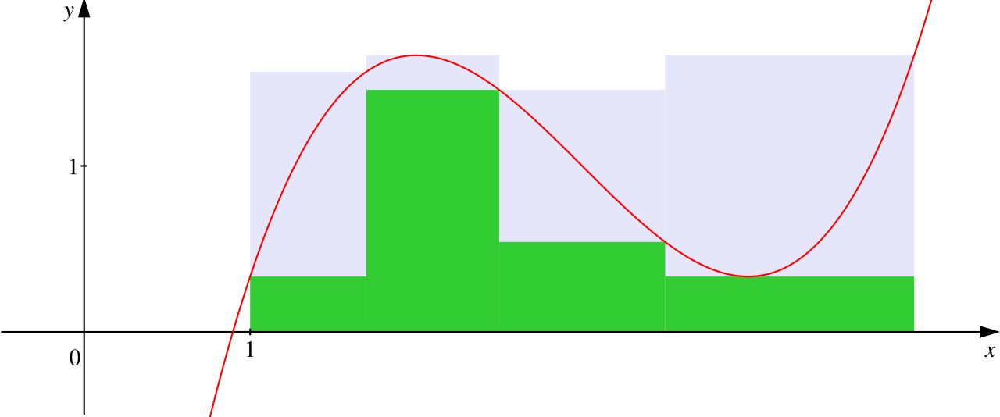

## 数学分析(I) Chapter 6 定积分

### 定义 定积分

> 设函数 $f$ 在闭区间 $[a, b]$ 上是有界的，在 $[a, b]$ 上任取分点 $x_0, x_1, x_2, \cdots, x_n$ 并作划分：
>
> $P: a = x_0 < x_1 < x_2 < \cdots < x_n = b$。
>
> 并在每个小区间 $x_{k - 1}, x_k$ 中取一点 $\xi_k$，记每个小区间长度为 $\Delta x_k = x_{k} - x_{k - 1}$。
>
> 令 $||P|| = \max\{\Delta x_k : k = 1,2,\cdots, n\}$，称为划分 $P$ 的范数
>
> 做和式 $\sum\limits_{k = 1}^{n}f(\xi_k)\Delta x_k$，当 $||P|| \to 0$，若极限 $\lim\limits_{||P|| \to 0}\sum\limits_{k = 1}^{n}f(xi_k)\Delta x_k$ 存在且与划分的方式 $\xi_k$ 有关，则称 $f$ 在 $[a, b]$ 上黎曼可积，其极限称 $f$ 在 $[a, b]$ 上的 Riemann 积分（定积分），记作 $I = \displaystyle\int_{a}^{b}f(x)\text{d}x$

注1：$||P|| \to 0$ 而不是 $n \to \infty$ 的原因是可能出现某一部分完全没有动，其它部分趋近无穷小的情况。

注2：$\displaystyle\int f(x)\text{d}x$ 和 $\displaystyle\int_{a}^{b}f(x)\text{d}x$ 一开始并没有直接关系，一个是逆运算一个是取极限，是牛顿莱布尼茨说明了二者的关联性。

注3：该和式称为划分 $P$ 的 Riemann 和。

注4：要求 $b \ge a$，若 $b < a$ 则 $\displaystyle\int_{a}^{b}f(x)\text{d}x$ 定义为 $-\displaystyle\int_{b}^{a}f(x)\text{d}(x)$

#### 例

> 判断 Dirichlet 函数 $D(x) = \begin{cases}1, x\in\mathbb Q \\ 0, x \in \mathbb Q\end{cases}$ 是否是 Riemann 可积的

取划分 $P: 0 = x_0 < x_1 < x_2 < \cdots < x_n = 1$。

作和式：$\sum\limits_{k = 1}^{n}D(\xi_k)\Delta x_k$。

若 $\xi_k$ 全部取有理数则 $\lim\limits_{||P|| \to 0} \sum\limits_{k = 1}^{n}D(\xi_k)\Delta x_k = 0$。

如果取无理数则 $=1$。

这说明和划分有关系，故 Dirichlet 函数不是 Riemann 可积的

### 定义 Darboux 和

> 设 $f$ 在 $[a, b]$ 上有界，设 $f$ 在 $[a,b]$ 上的上下确界分别为 $M, m$。
>
> 取 $[a,b]$ 的一个划分 $P : a = x_0 < x_1 < x_2 \cdots < x_n = b$
>
> 设 $f$ 在每一个小区间上的上下确界分别为 $M_k, m_k$.
>
> 即 $M_k = \sup\{f(x) : x \in [x_{k - 1}, x_k]\}, m_k = \inf \{f(x) : x \in [x_{k - 1}, x_{k}]\}$。
>
> 定义两个与 $P$ 相关的和式：
>
> $\overline{S}(P) = \sum\limits_{k = 1}^{n}M_k \Delta x_k, \underline{S}(P) = \sum\limits_{k = 1}^{n}m_k \Delta x_k$。
>
> 对于 $\forall \xi_k \in [x_{k - 1}, x_k]$ 有：
>
> $\underline{S}(P) = \sum\limits_{k = 1}^{n}m_k\Delta x_k \le \sum\limits_{k = 1}^{n}f(\xi_k)\Delta x_k \le \sum\limits_{k = 1}^{n}M_k \Delta x_k = \overline{S}(P)$
>
> 其中 $\overline{S}(P), \underline{S}(P)$ 分别称为 $f$ 关于划分 $P$ 的 Darboux 上和与下和。

Darboux 上和就是用几个“高估”的矩形面积逼近积分。

Darboux 下和就是用几个“低估”的矩形面积逼近积分。

可以看这张图：

灰色部分是上和，绿色部分是下和。

### 引理

> 在 $[a,b]$ 原有的分点中加入新的分点，则 Darboux 上和不增，下和不减。

证明：

Darboux 上和：$\sum\limits_{k = 1}^{n}M_k\Delta x_k$

在 $[x_{k - 1}, x_k]$ 中新加入一个分点 $d$，左右区间分别记为 $[l, d], [d, r]$

$\overline S(P)^{\prime} = \overline S(P) - M_k\Delta x_k + \sup\{f(x), x \in [l, d]\}(d - l) + \sup\{f(x), x \in [d, r]\}(r - d)$。

由于 $M_k \ge \sup\{f(x), x \in [l, d]\} + \sup\{f(x), x \in [d, r]\}, \Delta x_k = (d - l) + (r - d)$ 所以：

$\overline S(P)^{\prime} \le \overline S(P)$ 恒成立。

下和同理。

### 引理

> 对 $[a, b]$ 的所有划分，Darboux 上和作成的集合 $\{\overline{S}(P) | P 是 [a, b] 的划分\}$ 有下界 $m(b - a)$ 从而有下确界 $l$。
>
> 同样，下和作成的集合有上界 $M(b - a)$，从而有上确界 $L$。
>
> 其中 $M, m$ 为 $f$ 在 $[a, b]$ 上的上确界下确界。

$\sum\limits_{k = 1}^{n}M_k\Delta x_k \ge \sum\limits_{k = 1}^{n}m x_k = m(b - a)$。

### 引理

> 固定 $[a,b]$ 的两个划分 $P, Q$，总是会有 $\underline{S}(P) \le \overline{S}(Q)$ 从而：
>
> $\underline{S}(P) \le L \le l \le \overline{S}(Q)$
>
> 其中：$l = \inf\{\overline{S}(\Omega) | \Omega 是 [a,b] 的一个划分\}$
>
> $L = \sup \{\underline{S}(\Omega) | \Omega 是 [a,b] 的一个划分\}$

证明：

利用增加分点的引理将 $P, Q$ 合并为一个新的划分 $K$。可以知道：

$\begin{cases}\overline S(K) \le \overline S(Q), \overline S(K) \le \overline S(P) \\ \underline S(K) \ge \underline S(P), \underline S(K) \ge \underline S(Q)\end{cases}$

那么 $\underline S(P) \le \underline S(K) \le \overline S(Q)$。

接下来证明 $L \le l$：

固定 $Q$，让 $P$ 取 $[a, b]$ 的所有划分，因为任意划分 $P$ 的 Darboux 下和一定小于 $Q$ 的 Darboux 上和所以：

$L = \sup\{\underline S(P) : P 是 [a, b] 的划分\} \le \overline S(Q)$。

然后再让 $Q$ 取所有的划分，可以知道：$L \le l$
 
### 定理 Darboux 定理

> 对任意在 $[a, b]$ 上有界的函数 $f(x)$ 恒有：
>
> $\lim\limits_{||P|| \to 0}\underline{S}(P) = L, \lim\limits_{||P|| \to 0} \overline{S}(P) = l$
>
> 其中：
>
> $L = \sup \{\underline{S}(P) | P 是 [a,b] 的一个划分\}$
>
> $l = \inf\{\overline{S}(P) | P 是 [a,b] 的一个划分\}$

只讨论上和下确界和下和上确界的原因是上和上确界还有下和下确界是平凡的没有必要讨论。

这里的 $l$ 也可以写作 $I^{\star}$ 称为上积分，$L$ 也可以写作 $I_{\star}$ 称为下积分。

证明：

就是要证明 $\forall \epsilon > 0, \exists \delta \text{ s.t. } ||P|| < \delta : |\overline S(P) - l| < \epsilon$

设 $P$ 为 $[a, b]$ 的一个划分。

根据下确界的定义，$\exists P_\epsilon \text{ s.t. } P_{\epsilon} - \epsilon < l$。

设 $P_\epsilon$ 有 $N$ 个分点。

将 $P, P_\epsilon$ 合并得到新的划分 $Q$。

根据引理：$\begin{cases}\overline S(Q) \le \overline S(P) \\ \overline S(Q) \le \overline S(P_\epsilon)\end{cases}$

由于多一个分点，上和至多减少 $(M - m)||P||$，那么：$\overline S(Q) - \overline S(P) \le N(M - m)||P||$。

当 $||P|| \to 0$，不妨认为其 $< \delta$，取 $\delta = \dfrac{\epsilon}{N(M - m)}$

于是 $\overline S(P) - \overline S(Q) \le N(M - m)||P|| < \epsilon$。

因为 $\overline S(Q) \le \overline S(P_\epsilon) \le l + \epsilon$

所以 $\overline S(P) < \overline S(Q) + \epsilon \le l + 2\epsilon$

又因为 $l$ 是所有 $\overline S$ 的下确界所以有：

$l - \epsilon < l < \overline S(P) < l + \epsilon$，证毕。

证明思路大概就是，增加分点对上和的减少量在划分的范数很小的时候也很小，是可以被控制到不大于一个常数的，那么我随便找一个距离 $l$ 很近的划分 $P_\epsilon$，把它和 $P$ 合并起来，此时新的划分 $Q$ 就可以建立起 $P \to Q \to P_\epsilon \to l$ 这样的桥梁然后进行放缩得到结果。

### 定理 Riemann 可积的第一充分必要条件

> 设 $f$ 在 $[a,b]$ 上有界, $l, L$ 定义如上。
>
> 则 $f$ 在 $[a,b]$ 上 Riemann 可积（记作 $f \in R([a, b])$）的充分必要条件是：
>
> $L = l$，等价于 $\lim\limits_{||P|| \to 0} (\overline{S}(P) - \underline{S}(P)) = 0 \iff \lim\limits_{||P|| \to 0} \left[\sum\limits_{k = 1}^{n}(M_k - m_k)\Delta x_k\right] = 0$

证明：

必要性 $\Rightarrow$：

假设 $f$ 在 $[a, b]$ 上 Riemann 可积，那么：

对于 $[a, b]$ 的任意一个划分 $P: a = x_0 < x_1 < x_2 < \cdots < x_n = b$

以及任意一个点 $\xi_k \in [x_{k - 1}, x_k]$，

极限：$\lim\limits_{||P||\to 0}\sum\limits_{k = 1}^{n}(f(\xi_k))\Delta x_k = A$ 存在，且 $A$ 与 $[a, b]$ 的划分 $P$ 无关，也与 $\xi_k$ 的选择无关。

这个条件等价于：$\forall \epsilon > 0, \exists \delta > 0 \text{ s.t. } ||P|| < \delta : |\sum\limits_{k = 1}^{n}f(\xi_k)\Delta x_k - A| < \epsilon$

设 $M_k = \sup\{f(x): x \in [x_{k - 1}, x_k]\}, k = 1,2,3,\cdots,n$

根据上确界的定义，对前面的 $\epsilon > 0, \exists \eta_k \in [x_{k - 1}, x_k] \text{ s.t. } M_k - \epsilon < f(\eta_k) \le M_k$

即 $0 \le M_k - f(\eta_k) < \epsilon$

那么 $|\overline{S}(P) - \sum\limits_{k = 1}^{n} f(\eta_k)\Delta x_k|=|\sum\limits_{k = 1}^{n}\left[M_k - f(\eta_k)\right]\Delta x_k| \le (b-a)\epsilon$

上面的等价条件当然可以写作：$|\sum\limits_{k = 1}^{n}f(\eta_k)\Delta x_k - A| < \epsilon$

根据三角不等式：$|\overline{S}(P) - A| \le |\overline{S}(P) - \sum\limits_{k = 1}^{n}f(\eta_k)\Delta x_k| + |\sum\limits_{k = 1}^{n}f(\eta_k)\Delta x_k - A| < c \epsilon$。

当然，条件是 $||P|| < \delta$。

根据 $\epsilon \delta$ 语言，可以写出原式。

下和同理。

充分性 $\Leftarrow$：$\lim\limits_{||P|| \to 0} \overline{S}(P) = \lim\limits_{||P|| \to 0} \underline{S}(P) = A$

对于 $[a, b]$ 的任意一个划分 $P: a = x_0 < x_1 < x_2 < \cdots < x_n = b$，任取 $\xi_k \in [x_{k - 1}, x_k]$

显然可以得知：

和式：$\sum\limits_{k = 1}^{n}m_k\Delta x_k \le \sum\limits_{k = 1}^{n}f(\xi_k)\Delta x_k \le \sum\limits_{k = 1}^{n}M_k\Delta x_k$

前者就是下和，后者就是上和。

令 $||P|| \to 0$，只需要用两边夹法则就可以得到。

### 定理  Riemann 可积的第二充分必要条件

> 设 $f$ 在 $[a, b]$ 上有界。 
>
> 则：
>
> $f \in R([a, b]) \iff \forall \sigma, \epsilon > 0, \exists \delta > 0 \text{ s.t. when } P: a = x_0 < x_1 < x_2 < \cdots < x_n = b \text { satisify } ||P|| < \delta: \forall \text{ range s.t. }w_j \ge \epsilon, \text{the sum of length of these range} \le \sigma, w_j = M_j - m_j, j = 1,2,3,\cdots,n$
>
> 容易验证：$w_j = \sup \{|f(x) - f(y)| : x, y \in [x_{k - 1}, x_k]\}$

一个理解就是，这个函数如果要是 Riemann 可积，它大幅度震荡的地方非常小，变化相对来说比较平缓。

由此也可以看出连续函数一定是 Riemann 可积的。

中间的这个条件就是：$\sum\limits_{w_j \ge \epsilon}^{}\Delta x_j < \sigma$

它是从几何意义上给出了一个 Riemann 可积的描述。

必要性：$\Rightarrow$

假设 $f$ 是 Riemann 可积的，可以用第一充分必要条件：

$\forall \sigma, \epsilon > 0, \exists \delta > 0 \text{ s.t. } ||P|| < \delta : \sum\limits_{k = 1}^{n}(M_k - m_k)\Delta x_k < \epsilon$

可以发现这就是 $w_j\Delta x_k$

假设 $w_j \ge \epsilon$ 的这些区间为 $[x_{j_t - 1}, x_{j_t}], t = 1,2,3,\cdots s$

那么：

$\sum\limits_{w_j \ge \epsilon}^{}\Delta x_j = \sum\limits_{t = 1}^{s}\Delta x_{j_t}$

两边同乘 $\epsilon$：

$\epsilon \sum\limits_{w_j \ge \epsilon}^{}\Delta x_j = \epsilon\sum\limits_{t = 1}^{s}\Delta x_{j_t} \le \sum\limits_{t = 1}^{s}w_{j_t} \Delta x_{j_t}$

正数的部分求和一定小于整体：

$\le \sum\limits_{k = 1}^{n}w_k \Delta x_k < \epsilon$

然后发现会被消掉，希望后面能有 $\sigma$。

因为$\delta-\epsilon$ 语言的任意性，$\sigma$ 又是一个常数。

所以后面的 $\epsilon$ 改写为 $\sigma \epsilon$ 就可以证明。

充分性 $\Leftarrow$：

当 $\sum\limits_{w_j \ge \epsilon}^{}\Delta x_j < \sigma$ 时：

下证 $f$ 是 Riemann 可积的。

设这些小区间有：$[x_{j_t - 1}, x_{j_t}], t = 1,2,3,\cdots, s$

满足：$\sum\limits_{t = 1}^{s}\Delta x_{j_t} < \sigma$

只需要想办法写成第一充要条件的形式。

$= \sum\limits_{k = 1}^{n}w_k\Delta x_k = \sum\limits_{t = 1}^{s}w_{j_t}\Delta x_{j_t} + \sum\limits_{k \in\{1,2,3,\cdots n\} /\{j_1, j_2, \cdots j_s\}} w_k \Delta x_k < \sum\limits_{t = 1}^{s}(M - m)\Delta x_{j_t} + \epsilon\sum\limits_{k = 1}^{n}\Delta x_k$

这里放缩了两步，前者用了 $w_j \le M - m$，后者用了 $w_j < \epsilon$ 的条件再二次放大。

上面: $< (M - m)\sigma + (b - a)\epsilon$

也就是 $\forall \sigma, \epsilon > 0, \exists \delta > 0, ||P|| < \delta : \sum\limits_{k = 1}^{n}w_k\Delta x_k < (M - m)\sigma + (b - a)\epsilon$。

由于 $\sigma, \epsilon$ 的任意性，

可以知道 $\lim\limits_{||P|| \to 0} \sum\limits_{k = 1}^{n} w_k \Delta x_k = 0$。

### 定理  Riemann 可积的第三充分必要条件

> 假设 $f$ 在闭区间 $[a, b]$ 上有界
>
> 则: $f\in R([a, b])\iff$ 对于任意 $\eta > 0$，都能够找到一个 $[a, b]$ 的划分 $P: a = x_0 < x_1 < x_2 < \cdots < x_n = b$ 使得与之对应的振幅满足：
>
> $\sum\limits_{k = 1}^{n} w_k \Delta x_k < \eta$

证明：

$\Rightarrow$ 是显然的。

$\Leftarrow$：

$\forall \epsilon, \sigma > 0$，这里想要使用第二充要条件。

令 $\eta = \sigma \epsilon$。

由假设：存在划分 $P: a = x_0 < x_1 < x_2 < \cdots < x_n = b$ 使得：$\sum\limits_{k = 1}^{n} w_k\Delta x_k < \eta$

用第二充要条件，拿出来振幅比较大的：

$\sum\limits_{w_k \ge \epsilon}^{}\Delta \epsilon w_j \le \sum\limits_{k = 1}^{n}w_k\Delta x_k < \sigma \epsilon$

那么 $f$ 就是 Riemann 可积的。

---

实际使用的时候一般是：

$\forall \eta > 0, \exists \delta > 0, \text{ s.t. when } ||P|| < \delta : \sum\limits_{k = 1}^{n}w_k\Delta x_k < \eta$

当然这个也是有几何意义的：

### 命题

注意到谈论 Riemann 可积的时候都有“有界”这个前提。

是否能够去掉这个前提？

> 若 $f$ 在 $[a,b]$ 上 Riemann 可积，（即：存在一个常量 $A\in \mathbb R$，使得 $\forall \epsilon > 0, \exists \delta \text{ s.t. } \forall P: a=x_0 < x_1 < x_2 <\cdots < x_n = b, \text{ if } ||P|| < \delta \text{ then } |\sum\limits_{k = 1}^{n}f(\xi_k)\Delta x_k - A| < \epsilon$，其中 $\xi_k \in [x_{k - 1}, x_k], k = 1,2,\cdots, n$ 是任取的）
>
> 那么 $f$ 在 $[a, b]$ 上一定有界。
>
> 但是反之不然（反例：Dirichlet 函数）

只能考虑反证法：

假设 $f$ 在 $[a,b]$ 上是无界的。

想要证明 $f$ 不是 Riemann 可积的，那么就是证明 Riemann 可积的否命题：

$\forall B \in \mathbb R, \exists \epsilon_0 > 0, \text{ s.t. } \forall \delta > 0, \exists Q: a = x_0 < x_1 < x_2 < \cdots < x_n= b \text { and } \xi_k \in [x_{k - 1}, x_k], \text{ though } ||Q|| < \delta, |\sum\limits_{k = 1}^{n}f(\xi_k)\Delta x_k - B| \ge \epsilon_0$

由于 $f$ 无界，则必定存在某个小区间 $[x_{j -1}, x_{j}]$ 使得 $f$ 无界。

在这个小区间中，可以挑出一点 $\xi_j \in [x_{j - 1}, x_j] \text{ s.t. } |f(\xi_j)| > ?$（目前这里是随便取的，因为无界所以之后再来调也行） 

在其余的每个小区间，各取一点 $\xi_k \in [x_{k - 1}, x_k], k \not= j$。

$|\sum\limits_{k = 1}^{n} f(\xi_k)\Delta x_k - B|=|\sum\limits_{k \not= j}^{}f(\xi_k)\Delta x_k + f(\xi_j)\Delta x_j - B|$

$\ge |f(\xi_j)|\Delta x_j - |B| - |\sum\limits_{k \not=j}^{}f(\xi_k)\Delta x_k|$

因为这里是存在一个 $Q$，故划分是固定的，第三项是个常数 $C$。

那么上面的 $?$ 取 $\dfrac{|B| + 2|C|}{\Delta x_j}$。

这样对于这个 $\xi_j$，上式：

$> \dfrac{|B| + 2|C|}{\Delta x_j}\Delta x_j - |B| - |C| = |C|$。

由于 $|C|$ 是一个常数，那么就找到了 $\epsilon_0$。

### 可积函数类

#### 定理 闭区间连续函数

> 闭区间连续函数总是 Riemann 可积
>
> 即：$C([a, b]) \subset R([a, b])$

证明：

利用 Cantor 定理，闭区间上连续函数一定是一致连续的。

从而：$\forall \epsilon > 0, \exists \delta=\delta(\epsilon) \text{ s.t. } x, y\in[a, b], |x - y| < \delta : |f(x) - f(y)| < \epsilon$

很容易想到使用第一充要条件来判定

任取 $[a, b]$ 的一个划分 $P$，当 $||P|| = \max\{\Delta x_k : k = 1,2,3,\cdots n\} < \delta$ 时：

根据一致连续：一定会有 $|f(x) - f(y)| < \epsilon, \forall x, y \in [x_{k-1}, x_{k}]$

那么 $\sum\limits_{k = 1}^{n}(M_k - m_k)\Delta x_k \le \epsilon\sum\limits_{k = 1}^{n}\Delta x_k = \epsilon(b - a)$。

那么就证完了。

#### 定理 有限间断点

> 在 $[a, b]$ 上仅有有限个间断点的有界函数也是 Riemann 可积的。

证明：

考虑归纳法：

只需要证明 $[a, b]$ 上仅有一个间断点。

分三种情况：

$c = a, c \in (a, b), c = b$。

其实本质没有任何区别，考虑 $c = b$。

想用第三充要条件来做。

任取 $0 < \epsilon < b - a$，取 $\eta$ 满足 $\eta < \epsilon < b - a$。

设 $m < f(x) < M$。

由：$f$ 在 $[a, b - \eta]$ 在 $[a, b]$ 上 Riemann 可积。

所以存在 $[a, b]$ 的一种划分 $P: a=x_0 < x_1 < x_2 < \cdots < x_n = b - \eta \text{ s.t. } \sum\limits_{k = 1}^{n}w_k\Delta x_k < \epsilon$

设 $f$ 在 $[b - \eta, b]$ 上的振幅为 $w$，则 $w(b - (b - \eta)) = w\eta < b$

有：

$\sum\limits_{k = 1}^{n}w_k\Delta x_k + w\eta < \epsilon + (M - m)\eta$

于是证完了。

#### 定理 闭区间单调函数

> 闭区间 $[a, b]$ 上的单调函数是 Riemann 可积的。

证明，不妨认为 $f$ 在 $[a, b]$ 上单调递增。

$\forall \epsilon > 0$，任取 $[a, b]$ 的一个划分 $P: a= x_0 < x_1 < x_2 < \cdots < x_n = b$。

$\sum\limits_{k = 1}^{n}w_k \Delta x_k = \sum\limits_{k = 1}^{n}(f(x_k) - f(x_{k - 1}))\Delta x_k \le \sum\limits_{k = 1}^{n}[f(b) - f(a)]\Delta x_k = \left[f(b) - f(a)\right]\left(b - a\right)$

然后发现这个放缩不够彻底：

$\le \sum\limits_{k = 1}^{n}[f(x_k) - f(x_{k - 1})]\cdot ||P|| < \delta \sum\limits_{k = 1}^{n}[f(x_k) - f(x_{k - 1})] = [f(b) - f(a)]\delta < \epsilon$

#### 定理 Riemann 函数

> $\zeta(x) =\begin{cases}\dfrac{1}{p},x = \dfrac{p}{q} \\ 1, x = 0 \\ 0, x \in \mathbb R / \mathbb Q\end{cases}$ 是 Riemann 可积的

证明：

由于 $\zeta(x)$ 在 $\mathbb R$ 上是以 $1$ 为周期的函数。

由于 $\forall \epsilon > 0$ 在 $[0, 1]$ 上，使得 $\zeta(x) \ge \epsilon$ 的$x$ 只有有限个，设为 $y_1, y_2, \cdots y_N$，$N$ 和 $\epsilon$ 有关。

这里用第二充要条件。

任取 $\sigma > 0$，对于 $[0, 1]$ 的任意一个划分 $P: 0 = x_0 < x_1 < x_2 < \cdots < x_n = 1$。

当 $||P|| < \delta = \dfrac{\sigma}{2N}$ 时：根据 $\ge \epsilon$ 的那些小区间就是包含 $y_1, y_2,\cdots y_n$ 的那些区间。

这些小区间最多有 $2N$ 个，所以

$\sum\limits_{w_k \ge \epsilon}^{} \Delta x_k \le \sum\limits_{w_k \ge \epsilon}^{}||P|| \le 2N ||P|| < \sigma$

证毕。

#### 定理 复合函数

> 若 $f \in R([a, b]), g \in R([\alpha, \beta])$ 且 $g$ 的值域包含在 $f$ 中，那么 $f(g(x)) \in R([\alpha, \beta])$。

### Riemann 积分的性质

#### 命题

> 若 $f\in R([a, b]), \forall c \in \mathbb R, cf \in R([a, b])$，且 $\displaystyle\int\limits_{a}^{b} cf(x)\text{d}x = c\displaystyle\int_{a}^{b}\text{d}x$。

设划分 $P: a=x_0 < x_1 < x_2 < \cdots < x_n=b$，

在第 $k$ 个小区间 $[x_{k-1},x_k]$ 上：$M_k = \sup f$，$m_k = \inf f$，$w_k = M_k - m_k$。

先看 $c\ge 0$：

对 $cf$：$\sup (cf) = cM_k$，$\inf (cf) = cm_k$，

振幅 $w_k(cf) = cM_k - cm_k = c w_k$。

Darboux 上和、下和：

$\overline{S}_{cf}(P) = \sum cM_k\Delta x_k = c\sum M_k\Delta x_k = c\overline{S}_f(P)$

$\underline{S}_{cf}(P) = \sum cm_k\Delta x_k = c\sum m_k\Delta x_k = c\underline{S}_f(P)$

因为 $f$ 可积，对任意 $\epsilon > 0$，存在划分 $P$ 使得 $\overline{S}_f(P) - \underline{S}_f(P) < \frac{\epsilon}{|c| + 1}$，

于是 $\overline{S}_{cf}(P) - \underline{S}_{cf}(P)
= c\big(\overline{S}_f(P) - \underline{S}_f(P)\big) < \epsilon$，

所以 $cf$ 可积。

$c < 0$：

此时 $\sup (cf) = c m_k$，$\inf (cf) = c M_k$，

振幅仍然满足：$w_k(cf) = |c| w_k$，

$\overline{S}_{cf}(P) - \underline{S}_{cf}(P)
= |c|\big(\overline{S}_f(P) - \underline{S}_f(P)\big) < \epsilon$，

依然可积。

#### 命题

> 若 $f, g \in R([a, b])$，则 $(f+-g) \in R([a, b])$ 且 $\displaystyle\int_{a}^{b}(f(x) +- g(x))\text{d}x = \displaystyle\int_{a}^{b}f(x)\text{d}x + \displaystyle\int_{a}^{b}g(x)\text{d}x$

显然。

#### 命题

> 若 $f, g \in R([a,b])$，则 $fg\in R([a, b])$。

可积函数必有界，设 $|f|\le M,\quad |g|\le M$

取划分：$P: a= x_0 < x_1 < x_2 < \cdots < x_n=b$

在 $[x_{k-1},x_k]$ 上任取两点 $x\prime,x\prime\prime$：

$|f(x\prime)g(x\prime)-f(x\prime\prime)g(x\prime\prime)| \le |f(x\prime)||g(x\prime)-g(x\prime\prime)| + |g(x\prime\prime)||f(x\prime)-f(x\prime\prime)|\le M w_k(g) + M w_k(f)$

因此 $w_k(fg) \le M\big(w_k(f)+w_k(g)\big)$

于是 $\sum w_k(fg)\Delta x_k
\le M\left( \sum w_k(f)\Delta x_k + \sum w_k(g)\Delta x_k \right)$

因为 $f,g$ 可积，对任意 $\epsilon>0$，可取同一划分 $P$，使得

$\sum w_k(f)\Delta x_k < \frac{\epsilon}{2M},\quad\sum w_k(g)\Delta x_k < \frac{\epsilon}{2M}$

代入得

$\sum w_k(fg)\Delta x_k < \epsilon$

所以 $fg$ 可积。

#### 命题

> 若 $f\in R([a, b])$，则 $|f| \in R([a, b])$，反之不然。

由绝对值不等式：
$\big|\,|f(x^\prime)| - |f(x^{\prime\prime})|\,\big| \le |f(x^\prime) - f(x^{\prime\prime})|$，

所以 $w_k(|f|) \le w_k(f)$。

于是 $\sum w_k(|f|)\Delta x_k \le \sum w_k(f)\Delta x_k$。

因为 $f$ 可积，对任意 $\epsilon>0$，存在 $P$ 使得 $\sum w_k(f)\Delta x_k < \epsilon$，

从而 $\sum w_k(|f|)\Delta x_k < \epsilon$，

故 $|f|$ 可积。

反例：$f(x) = \begin{cases}1, x \in \mathbb Q \\ 0, x \not\in \mathbb Q\end{cases}$

#### 命题

> 若 $a < c < b, f\in R([a,c]), f\in R([c, b])$，则 $f \in R([a, b])$ 且 $\displaystyle\int_{a}^{c}f(x)\text{d}x + \displaystyle\int_{c}^{b}f(x)\text{d}x = \displaystyle\int_{a}^{b}f(x)\text{d}x$，反之亦然。

先证明 $\Rightarrow$：

设 $f\in R([a,b])$。

对 $[a,c]$ 的任意划分 $P_1$，可扩充为 $[a,b]$ 的划分 $P$。

由 $f$ 在 $[a,b]$ 可积，对任意 $\epsilon>0$，存在 $P$ 使得

$\overline{S}(P) - \underline{S}(P) < \epsilon$，

限制在 $[a,c]$ 上的和自然更小，故 $f\in R([a,c])$。

同理 $f\in R([c,b])$。

然后 $\Leftarrow$：

设 $P_1: a=x_0 < x_1 < x_2 <\cdots < x_m=c; P_2: c=x_0 < x_1 < x_2 <\cdots < x_n=b$，令 $P=P_1\cup P_2$，则 $P$ 是 $[a,b]$ 的划分：

$P: a=x_0 < x_1 < x_2 <\dots < x_m = c < \cdots < x_{m+n}=b$。

因为 $f\in R[a,c],R[c,b]$，对任意 $\epsilon>0$，可取 $P_1,P_2$ 使得

$\overline{S}(P_1)-\underline{S}(P_1) < \frac{\epsilon}{2}$，$\overline{S}(P_2)-\underline{S}(P_2) < \frac{\epsilon}{2}$。

对整个区间：
$\overline{S}(P) = \overline{S}(P_1)+\overline{S}(P_2)$，

$\underline{S}(P) = \underline{S}(P_1)+\underline{S}(P_2)$，

所以 $\overline{S}(P) - \underline{S}(P) < \epsilon$ 证毕。

由 Darboux 定理，令 $||P|| \to 0$：

$\overline{S}(P)\to \displaystyle\int_{a}^{b} f$，$\overline{S}(P_1)\to \displaystyle\int_{a}^{c} f$，$\overline{S}(P_2)\to \displaystyle\int_{c}^{b} f$，

而 $\overline{S}(P) = \overline{S}(P_1) + \overline{S}(P_2)$，所以

$\displaystyle\int_{a}^{b} f = \displaystyle\int_{a}^{c} f + \displaystyle\int_{c}^{b} f$。

#### 命题

> 设 $f\in R([a, b])$ 且非负，则 $\displaystyle\int_{a}^{b} f(x)\text{d}x$ 也非负。
>
> 推论：如果 $[a, b]$ 上，$f(x)$ 总是 $\ge g(x)$，则一定会有 $\displaystyle\int_{a}^{b}f(x)\text{d}x \ge \displaystyle\int_{a}^{b}g(x)\text{d}x$

利用 Riemann 积分的定义：

$\displaystyle\int_{a}^{b}f(x)\text{d}x = \lim\limits_{||P|| \to 0}\sum\limits_{k = 1}^{n}f(\xi_k)\Delta x_k$

由于 $f(\xi_k) \ge 0$ 所以 $\displaystyle\int_{a}^{b}f(x)\text{d}x \ge 0$

推论只要写成 $f(x) - g(x)$ 就是命题。

#### 命题

> 如果 $f \in R([a,b])$，那么一定会有：
>
> $\left|\displaystyle\int_{a}^{b}f(x)\text{d}x\right| \le \displaystyle\int_{a}^{b}|f(x)|\text{d}x$

这就是三角不等式，因为积分本质上是求和。

证明：

不论什么函数，总有：$-|f(x)| \le f(x) \le |f(x)|$

那么 $\displaystyle\int_{a}^{b}-|f(x)| \text{d}x \le \displaystyle\int_{a}^{b}f(x)\text{d}x \le \displaystyle\int_{a}^{b}|f(x)|$

这就是上式。

#### 命题

> 如果 $f$ 在 $[a,b]$ 上是连续的且非负，$x \in [a,b]$。
>
> 如果 $\displaystyle\int_{a}^{b}f(x)\text{d}x = 0$ 那么 $f(x)\equiv 0$

如果去掉连续的条件显然是不正确的。

比如任意一个点不是 $0$ 其它是 $0$，它的 Riemann 积分一定是 $0$。

反正：若 $f$ 不恒等于 $0$。

即 $\exists x_0 \in [a, b] \text{ s.t. } f(x_0)\not=0$

根据连续函数的局部保号性，其在 $x_0$ 的一个邻域 $(x_0 - \delta, x_0 + \delta)$内都不等于 $0$。

那么 $\displaystyle\int_{x_0 - \delta}^{x + \delta}f(x)\text{d}x \not = 0$ 进而矛盾。

(为什么不能直接说明？)

更精确一点的写：

$\displaystyle\int_{a}^{b}f(x)\text{d}x = \displaystyle\int_{a}^{x_0 - \delta}f(x)\text{d}x + \displaystyle\int_{x_0 - \delta}^{x_0 + \delta}f(x)\text{d}x + \displaystyle\int_{x_0 + \delta}^{b}f(x)\text{d}x \ge \displaystyle\int_{x_0 - \delta}^{x_0 + \delta}f(x)\text{d}x \ge \displaystyle\int_{x_0 - d}^{x_0 + d}\dfrac{f(x_0)}{2}\text{d}x = \dfrac{f(x_0)}{2}\displaystyle\int_{x_0 \ delta}^{x_0 + \delta} 1 \text{d}x = \dfrac{f(x_0)}{2}2\delta = \delta f(x_0) > 0$

#### 定理 积分第一中值定理

C 是连续的意思

> 设函数 $f(x) \in C([a, b]), g(x) \in R([a, b])$ 并且 $g$ 在 $[a, b]$ 上不变号，则一定存在 $\xi \in [a, b] \text{ s.t. } \displaystyle\int_{a}^{b}f(x)g(x)\text{d}x = f(\xi)\displaystyle\int_{a}^{b}g(x)\text{d}x$
>
> 特别的，当 $g(x) = 1$ 时有等式：$\displaystyle\int_{a}^{b}f(x)\text{d}x = f(\xi)(b - a) \iff \dfrac{1}{b - a}\displaystyle\int_{a}^{b}f(x)\text{d}x = f(\xi)$
>
> 几何意义就是，$f$ 在 $[a ,b]$ 上的平均值一定能在区间内某一点取到

证明：根据闭区间上连续函数的性质，可以知道 $f$ 在 $[a,b]$ 上最大最小值 $M, m$ 都可以取到。

不妨假设 $g(x)$ 非负，于是 $mg(x) \le f(x)g(x) \le Mg(x)$。

也就是 $m\displaystyle\int_{a}^{b}g(x)\text{d}x \le \displaystyle\int_{a}^{b}f(x)g(x)\text{d}x \le M\displaystyle\int_{a}^{b}g(x)\text{d}x$

1. 若 $\displaystyle\int_{a}^{b}g(x)\text{d}x = 0$，结论永远成立。

2. 若 $\displaystyle\int_{a}^{b}g(x) > 0$

$\dfrac{\displaystyle\int_{a}^{b}f(x)g(x)\text{d}x}{\displaystyle\int_{a}^{b}g(x)\text{d}x} \in [m, M]$

利用连续函数 $f$ 的介值定理，一定存在 $\xi \in [a, b] \text{ s.t. } f(\xi)= \dfrac{\displaystyle\int_{a}^{b}f(x)g(x)\text{d}x}{\displaystyle\int_{a}^{b}g(x)\text{d}x}$

### 微积分基本定理

#### 定理 微积分基本定理

> 设 $f\in R([a, b])$，定义函数 $F(x) = \displaystyle\int_{a}^{x}f(t)\text{d}t, x\in [a, b]$
>
> 1. $F(x)$ 总是一个连续函数，$F \in C([a, b])$。
>
> 2. 如果 $f$ 在 $[a, b]$ 上连续，则 $F$ 在 $[a, b]$ 可导且 $F^{\prime}(x) = f(x), x \in [a, b]$。

证明(1)：任取 $x_0 \in [a,b]$，取充分小的 $\Delta x$ 使得 $x_0 + \Delta x \in [a,b]$

那么 $F(x_0 + \Delta x) - F(x_0) = \displaystyle\int_{a}^{x + \Delta x}f(t)\text{d}t - \displaystyle\int_{a}^{x_0} f(t)\text{d}t = \displaystyle\int_{x_0}^{x_0 + \Delta x}f(t)\text{d}t$

要证明的就是 $\Delta x \to 0$ 时上式趋近于 $0$。

那么 $|F(x_0 + \Delta x) - F(x_0)| = |\displaystyle\int_{x_0}^{x_0 + \Delta x}f(t)\text{d}t| \le \left|\displaystyle\int_{x_0}^{x_0 + \Delta x_0} |f(t)|\text{d}t\right|$

最后这个加绝对值是为了避免 $\Delta x$ 为负数时带来的影响。

由于 $f \in R([a, b])$，故其有界，$\exists M > 0, |f(t)| \le M, \forall x \in [a, b]$。

那么$|F(x_0 + \Delta x) - F(x_0)| \le M|\Delta x_0|$

正负本质同理，不妨就假设 $\Delta x_0 > 0$ 那么取 $\delta = \dfrac{\epsilon}{M}$ 就有：

$\forall \epsilon > 0, \exists\delta \text{ s.t. } \Delta x_0 < \delta : |F(x_0 + \Delta x) - F(x_0)| < \epsilon$

于是就证明了 $F$ 在 $x_0$ 点连续.

(2) 证明过程和上面差不多，只需要接着写：

由于 $\displaystyle\int_{x_0}^{x_0 + \Delta x}f(t)\text{d}t = \displaystyle\int_{x_0}^{x_0 + \Delta x} f(t)\cdot 1 \text{d}t$

根据积分第一中值定理：

$\exists \xi \in [x_0, x_0 + \Delta] \text{ s.t. } F(x_0 + \Delta x) - F(x_0) = f(\xi)\displaystyle\int_{x_0}^{x_0 + \Delta x}1\text{d}t = f(\xi)\Delta x$

那么 $\dfrac{F(x_0 + \Delta x) - F(x_0)}{\Delta x} = f(\xi)$

那么 $\lim\limits_{\Delta x \to 0} \dfrac{F(x_0 + \Delta x) - F(x_0)}{\Delta x} = \lim\limits_{\Delta x \to 0}f(\xi) = f(x_0)$。

也就是 $F^{\prime}(x) = f$

#### 推论 Newton-Leibniz 公式

> 设 $f \in C([a, b]), F(x)= \displaystyle\int f(x)\text{d}x + C$。
>
> 那么 $\displaystyle\int_{a}^{b}f(x) = F(b) - F(a) = F(x)\large|_{x = a}^{x = b}$

直接根据微积分基本定理就可以得出

由于 $F_1(x)$ 是 $f$ 的一个原函数所以存在 $c \in \mathbb R$ 使得：

$F(x) = F_1(x) + c$，那么 $F(x) = \displaystyle\int_{a}^{x}f(t)\text{d}t + c$。

取 $x = a$，可以知道 $F(a) = c$，那么 $F(x) = \displaystyle\int_{a}^{x}f(t)\text{d}t + F(a)$

再取 $x = b$ 可以得到：

$F(b) - F(a) = \displaystyle\int_{a}^{b}f(t)\text{d}t$

#### 定理 积分第二中值定理

> 设 $f \in R([a, b])$。
>
> 1. 若 $g(x)$ 在 $[a, b]$ 上单调递减且非负，则 $\exists \xi \in [a, b] \text{ s.t. } \displaystyle\int_{a}^{b}f(x)g(x)\text{d}x = g(a)\displaystyle\int_{a}^{\xi}f(x)\text{d}x$
>
> 2. 如果 $g(x)$ 在 $[a, b]$ 上单调递增且非负，则 $\exists \xi \in [a, b] \text{ s.t. } \displaystyle\int_{a}^{b}f(x)g(x)\text{d}x = g(b)\displaystyle\int_{\xi}^{b}f(x)\text{d}x$
>
> 3. 如果 $g(x)$ 在 $[a, b]$ 上单调，则 $\exists \xi \in [a, b] \text{ s.t. } \displaystyle\int_{a}^{b}f(x)g(x)\text{d}x = g(a)\displaystyle\int_{a}^{\xi}f(x)\text{d}x + g(b)\displaystyle\int_{\xi}^{b}f(x)\text{d}x$

其作用是将两个乘积积分变成一个

证明 (1)：

令 $F(x) = \displaystyle\int_{a}^{x}f(t)\text{d}t, x \in [a,b]$。

由微积分基本定理知道 $F\in C([a, b])$，那么它在 $[a, b]$ 上具有最大最小值 $M, m$ 且都可以取到。

实际上只需要考虑 $g(a) > 0$ 的情况，$g(a) = 0$ 肯定成立。

所以现在要证明的就是：$F(\xi) = \displaystyle\int_{a}^{\xi}f(x)\text{d}x = \dfrac{1}{g(a)}\displaystyle\int_{a}^{b}f(x)g(x)\text{d}x$

由于 $F$ 是连续函数，所以只需要证明后者 $\in [m, M]$

也就是证明 $m \le \dfrac{1}{g(a)}\displaystyle\int_{a}^{b}f(x)g(x)\text{d}x \le M$

考虑用 Riemann 积分的定义来看这个不等式

由于 $f, g$ 都是 Riemann 可积的。

$f$ 有上界：$|f(x)| \le L, x \in [a,b]$。

$g$ 满足：$\forall \epsilon > 0, \exists P: a =x_0 < x_1 < x_2 < \cdots < x_n =b \text{ s.t. } \sum\limits_{k = 1}^{n}w^g_k\Delta x_k < \epsilon$

将积分分成多个小区间：$\displaystyle\int_{a}^{b}f(x)g(x)\text{d}x = \sum\limits_{k = 1}^{n}\displaystyle\int_{x_{k - 1}}^{x_k}f(x)g(x)\text{d}x$

用积分的线性性插一项：$=\sum\limits_{k = 1}^{n}\displaystyle\int_{x_{k - 1}}^{x_k}f(x)[g(x) - g(x_{k - 1})]\text{d}x + \sum\limits_{k = 1}^{n}\displaystyle\int_{x_{k - 1}}^{x_k}f(x)g(x_{k - 1})\text{d}x$

$\equiv I + II$

对于 $I$：$|I| \le \sum\limits_{k = 1}^{n}\displaystyle\int_{x_{k - 1}}^{x_k}|f(x)|\cdot|g(x) - g(x_{k - 1})|\text{d}x \le \sum\limits_{k = 1}^{n}\displaystyle\int_{x_{k - 1}}^{x_k}|f(x)|\cdot|w^g_k|\text{d}x \le \sum\limits_{k = 1}^{n}\displaystyle\int_{x_{k - 1}}^{x_k}L\cdot w^g_k\text{d}x = L\sum\limits_{k = 1}^{n}w^g_k\Delta x_k < L\epsilon$

所以用 Riemann 积分的定义的想法就是说明 $I$ 其实是很小的可以忽略的一部分

对于 $II$：

由于 $\displaystyle\int_{x_{k - 1}}^{x_k}f(x)\text{d}x = \displaystyle\int_{a}^{x_k}f(x)\text{d}x - \displaystyle\int_{a}^{x_{k - 1}}f(x)\text{d}x = F(x_k) - F(x_{k - 1})$

那么 $\sum\limits_{k = 1}^{n}g(x_{k - 1})\displaystyle\int_{x_{k - 1}}^{x_k}f(x)\text{d}x = \sum\limits_{k = 1}^{n}g(x_{k - 1})[F(x_k) - F(x_{k - 1})]$

$= g(x_0)[F(x_1) - F(x_0)] + g(x_1)[F(x_2) - F(x_1)] + g(x_2)[F(x_3) - F(x_2)] + \cdots + g(x_{n - 1})[F(x_n) - F(x_{n - 1})]$

重新组合，想要提出 $g$ 用单调条件，不然不好做。

注意 $F(x_0) = 0$

$=F(x_1)[g(x_0) - g(x_1)] + F(x_2)[g(x_1) - g(x_2)] + \cdots + F(x_{n - 1})[g(x_{n - 2}) - g(x_{n - 1})] + g(x_{n - 1})F(x_n)$

$=\sum\limits_{k = 1}^{n - 1}F(x_k)[g(x_{k - 1}) - g(x_k)] + F(b)g(x_{n - 1})$

显然 $g(x_{k - 1}) - g(x_{k}) \ge 0$，又因为 $F(x) \in [m, M]$

所以 $II \le \sum\limits_{k = 1}^{n - 1}M[g(x_{k - 1}) - g(x_{k})] + F(b)g(x_{n - 1}) = M[g(a) - g(x_{n - 1})] + F(b)g(x_{n - 1}) = g(x_{n - 1})[F(b) - M] + Mg(a)$

$F(b) - M \le 0$，所以 $II \le Mg(a)$

同理可证明 $II \ge mg(a)$。

由于 $-L\epsilon \le I \le L \epsilon$。

那么就有办法得到：

$m - \dfrac{L}{g(a)}\epsilon \le \dfrac{1}{g(a)}\displaystyle\int_{a}^{b}f(x)g(x)\text{d}x \le M - \dfrac{L}{g(a)}\epsilon$

令 $\epsilon \to 0^+$，就证明了想要的式子。

再用介值定理可以证明 (1)

`TODO`：不看这个证明 (2)

证明 (3)：若 $g$ 在 $[a, b]$ 单调，则 $\exists \theta \in [a, b] \text{ s.t. } \displaystyle\int_{a}^{b}f(x)g(x)\text{d}x = g(a)\displaystyle\int_{a}^{\theta}f(x)\text{d}x + g(b)\displaystyle\int_{\theta}^{b}f(x)\text{d}x$

不妨认为 $g$ 是单调递减的，可以利用 (1)。

但是没法保证非负，不妨假设 $h(x) = g(x) - g(b)$，显然 $h(x)$ 是单调递减且非负的。

根据 (1) 可以有：

$\exists\theta \in [a, b] \text{ s.t. } \displaystyle\int_{a}^{b}f(x)h(x)\text{d}x = h(a)\displaystyle\int_{a}^{\theta}f(x)\text{d}x = g(a)\displaystyle\int_{a}^{\theta}f(x)\text{d}x - g(b)\displaystyle\int_{a}^{\theta}f(x)\text{d}x$

然后左边 $\displaystyle\int_{a}^{b}[f(x)g(x) - f(x)g(b)]\text{d}x$

于是移项就得到了原式。

### Riemann 积分的计算

#### 命题 换元公式

> 如果 $f\in C([a, b]), \varphi \in [\alpha, \beta]$ 上具有连续的导数。
> 
> 令 $x = \varphi(t), \text{ when } t$ 的取值从 $\alpha$ 到 $\beta$ 时，$\varphi(t)$ 连续地从 $a$ 变化到 $b$，$\varphi(t) \in [a, b]$。
>
> 有公式：$\displaystyle\int_{a}^{b}f(x)\text{d}x = \displaystyle\int_{\alpha}^{\beta}f(\varphi(t)) \text{d}[\varphi(t)] = \displaystyle\int_{\alpha}^{\beta}f(\varphi(t)) \varphi^\prime(t)\text{d}t$。

左边 $= \displaystyle\int_{\varphi(\alpha)}^{\varphi(\beta)}f(x)\text{d}x$

设 $F$ 为 $f$ 的一个原函数，由 Newton-Leibniz 公式：

左边 $F(\varphi(\beta)) - F(\varphi(\alpha))$

右边：$[F(\varphi(x))]^{\prime} = F^{\prime}(\varphi(x))\cdot \varphi^{\prime}(x) = f(\varphi(x))\cdot \varphi^{\prime}(x)$

所以 $F(\varphi(x))$ 是 $f(\varphi(x))\cdot \varphi^{\prime}(x)$ 的一个原函数

所以右边也 $= F(\varphi(\beta)) - F(\varphi(\alpha))$

**注：**

称将 $x$ 换元为 $\varphi(t)$ 为正向换元，反过来，将 $f(x)$ 换元为 $t$ 则是逆向换元

公式本身其实不要求换元的函数为单调函数，但问题出在对 $\text{d}x$ 的处理上，正向换元直接算 $\varphi^{\prime}(t)$ 就行，逆向换元需要反解出 $x = f^{-1}(t)$，如果 $f(x)$ 并不是单调的那么它不存在反函数就会有问题

e.g. $\displaystyle\int_{0}^{\pi}f(\sin x)\text{d}x$。

尝试直接换元成 $t = \sin x$ 会有问题（$0 \to \pi$ 导致的），因为 $\text{d}t$ 就难以解出，这里实际上 $x = \sin^{-1}t$，但是 $[0, \pi]$ 上 $\sin x$ 并不单调，没有办法将 $x$ 表示成关于 $t$ 的单值函数。

一般拆成两段，就可以换元了。

于是这里给出一个相对一般的使用情况：

1) $f\in C([a, b]), \varphi$ 在 $[\alpha, \beta]$ 上有连续导数，当 $t: \alpha \to \beta$ 时，$\varphi(t)$ 从 $\varphi(\alpha)$ **单调递增地** 到 $\varphi(\beta)$，此时会有：$\displaystyle\int_{\alpha}^{\beta}f(\varphi(t))\varphi^{\prime}(t)\text{d}t = \displaystyle\int_{\varphi(\alpha)}^{\varphi(\beta)}f(x)\text{d}x$
2) 单调递减也可以（不过注意负号）
3) 不单调的时候一般拆成单调的再做。

#### 例

> $\displaystyle\int_{0}^{a}\sqrt{a^2 - x^2}\text{d}x, a > 0$。

令 $x = a\sin t, t \in [0, \dfrac{\pi}{2}]$（注意范围和端点值）

那么 $=\displaystyle\int_{0}^{\frac{\pi}{2}}a\sqrt{1-\sin^2t}a\cos t\text{d}t =\displaystyle\int_{0}^{\frac{\pi}{2}}a^2\cos^2t\text{d}t$

$=a^2\displaystyle\int_{0}^{\frac{\pi}{2}}\dfrac{1 + \cos(2t)}{2}\text{d}t = \dfrac{a^2}{2}\displaystyle\int_{0}^{\frac{\pi}{2}}1 + \cos(2t)\text{d}t = \dfrac{\pi a^2}{4}$

其实这个东西是在证明圆的面积公式

#### 例

> $\displaystyle\int_{0}^{\pi}\dfrac{x\sin x}{1 + \cos^2 x}\text{d}x$

可以尝试分成两个：

$=\displaystyle\int_{0}^{\frac{\pi}{2}} + \displaystyle\int_{\frac{\pi}{2}}^{\pi} = I_1 + I_2$

$I_2 = \displaystyle\int_{\frac{\pi}{2}}^{\pi}\dfrac{x\sin x}{1 + \cos^2 x}\text{d}x$

令 $t = x - \dfrac{\pi}{2}$

然后 $I_2 = \displaystyle\int_{0}^{\frac{\pi}{2}} \dfrac{xxx}{xxx}\text{d}t$

这一坨并不好和 $I_1$ 合并

所以不妨考虑直接换元，令 $t = \pi - x, x : 0 \to \pi \Rightarrow t : \pi \to 0$。

$I = \displaystyle\int_{\pi}^{0}\dfrac{(\pi - t)\sin(\pi - t)}{1 + \cos^2(\pi - t)}\text{d}t = -\displaystyle\int_{\pi}^{0}\dfrac{(\pi - t)\sin t}{1 + \cos^2 t} \text{d}t= \displaystyle\int_{0}^{\pi}\dfrac{\pi \sin t - t \sin t}{1 + \cos^2 t}\text{d}t = \displaystyle\int_{0}^{\pi}\dfrac{\pi \sin t}{1 + \cos^2 t}\text{d}t$

（TODO，倒数第二步是啥）

于是 $I = \dfrac{\pi}{2}\displaystyle\int_{0}^{\pi}\dfrac{\sin t}{1 + \cos^2 t}\text{d}t$，这个是好算的

### 分部积分公式

> 设 $f^{\prime}, g^{\prime} \in C([a, b])$ 则：
> 
> $\displaystyle\int_{a}^{b}f(x)g^{\prime}(x)\text{d}x = f(x)g(x)|_{a}^{b} - \displaystyle\int_{a}^{b}f^{\prime}(x)g(x)\text{d}x$

和不定积分同理。

#### 例

> $I_n = \displaystyle\int_{0}^{\frac{\pi}{2}}(\sin x)^n\text{d}x, n \in \mathbb N^\star$

$I_n = \displaystyle\int_{0}^{\frac{\pi}{2}}(\sin x)^{n - 1}\sin x\text{d}x = -\displaystyle\int_{0}^{\frac{\pi}{2}}(\sin x)^{n - 1}\text{d}(\cos x) = -\cos x \cdot (\sin x)^{n - 1}|_{0}^{\frac{\pi}{2}} + \displaystyle\int_{0}^{\frac{\pi}{2}} \cos^2x\cdot(n - 1)(\sin)^{n - 2}\text{d}x$

$=(n - 1)\displaystyle\int_{0}^{\frac{\pi}{2}}(1 - \sin^2 x)(\sin x)^{n - 2}\text{d}x = (n - 1)I_{n - 1} - (n - 1)I_{n}$

所以 $I_n = \dfrac{n - 1}{n}I_{n - 2}$

1. $n \equiv 0\mod 2$ 时：$I_n = \dfrac{(n - 1)(n - 3)(n - 5)\cdots 3}{n(n - 2)(n - 4)\cdots 4}I_2$，其中 $I_2 = \dfrac{\pi}{4}$
2. $\text{otherwise.}$：$I_n = \dfrac{(n - 1)(n - 3)(n - 5)\cdots 2}{n(n - 2)(n - 4)\cdots 3}I_1$，其中 $I_1 = 1$

#### 例

> 计算数列极限：
>
> $\lim\limits_{n \to \infty}\left(\dfrac{1}{n + 1} + \dfrac{1}{n + 2}\cdots + \dfrac{1}{2n}\right)$

分子分母除 $n$：

$= \lim\limits_{n \to \infty}\left(\dfrac{\dfrac{1}{n}}{1 + \dfrac{1}{n}} + \dfrac{\dfrac{1}{n}}{1 + \dfrac{2}{n}} + \cdots + \dfrac{\dfrac{1}{n}}{1 + \dfrac{1}{n}}\right) = \lim\limits_{n \to \infty}\left(\displaystyle\sum\limits_{k = 1}^{n}\dfrac{1}{1 + \dfrac{k}{n}}\cdot \dfrac{1}{n}\right)$

这符合 Riemann 积分的定义。

设 $f(x) = \dfrac{1}{1 + x}, x \in [0, 1]$，其在 $[0, 1]$ 上连续，故其是 Riemann 可积的，上式收敛于：

$\displaystyle\int_{0}^{1}\dfrac{1}{1 + x}\text{d}x =\ln2$

#### 例

> $\lim\limits_{n \to \infty}\dfrac{\sqrt[n]{n!}}{n}$

$\dfrac{\sqrt[n]{n!}}{n}= \sqrt[n]{\dfrac{n!}{n^n}} = \sqrt[n]{\dfrac{1\cdot2\cdot3\cdot4\cdots n}{n^n}}$

为了找出求和的形式取对数。

$A = \ln\sqrt[n]{\dfrac{n!}{n^n}} = \dfrac{1}{n}[\ln(\dfrac{1}{n}) + \ln(\dfrac{2}{n}) + \cdots + \ln(\dfrac{n}{n})]$

$A = \displaystyle\sum\limits_{k = 1}^{n}\ln(\dfrac{k}{n})\cdot \dfrac{1}{n}$

希望 $\ln x$ 在 $[0, 1]$ 上是 Riemann 可积的（这里先承认）

$\lim\limits_{n \to \infty}A = \displaystyle\int_{0}^{1}\ln(x)\text{d}x = \lim\limits_{\epsilon \to 0^+}\displaystyle\int_{\epsilon}^{1}\ln(x)\text{d}x = -1 - \lim\limits_{\epsilon \to 0^+}(\epsilon \ln \epsilon - \epsilon) = -1$

原式 $e^{A} = \dfrac{1}{e}$

#### 命题

> 设 $f$ 在 $[-a, a]$ 上连续， $a > 0$。
> 
> 1) 若 $f$ 是奇函数，则 $\displaystyle\int_{-a}^{a}f(x)\text{d}x = \displaystyle\int_{-a}^{0}f(x)\text{d}x + \displaystyle\int_{0}^{a}f(x)\text{d} = I + II$

 $I = \displaystyle\int_{a}^{0}-f(-t)\text{d}t = \displaystyle\int_{a}^{0}f(t)\text{d}t = -\displaystyle\int_{0}^{a}f(t)\text{d}t = -II$。

 所以 $\displaystyle\int_{-a}^{a}f(x)\text{d}x = 0$

> 2) 若 $f$ 是偶函数，则 $\displaystyle\int_{-a}^{a}f(x)\text{d}x = 2\displaystyle\int_{0}^{a}f(x)\text{d}x$。

这两个命题在计算的时候可以起到简化的作用。

> 3) 设 $f$ 是以 $T > 0$ 为周期的连续函数，那么 $\displaystyle\int_{a}^{a + T}f(x)\text{d}x = \displaystyle\int_{0}^{T}f(x)\text{d}x$

### Riemann-Lebesgue 引理

#### 定义 特征函数、简单函数、阶梯函数

> 设 $E \subset \mathbb R$ 为一非空集，定义函数 $\chi_E(x) = \begin{cases}1, x \in E \\ 0, x \not\in E\end{cases}$ 为 $E$ 上的特征函数。
>
> 特征函数的有限线性组合（$a_1\chi_{E_1}(x) + a_2\chi_{E_2}(x) + \cdots + a_3\chi_{E_3}(x) + \cdots + a_n\chi_{E_n}(x), E_i \cap E_j = \empty$）称为简单函数
>
> 特别的，当每个 $E$ 都是直线区间的时候，则称 $f$ 为阶梯函数。

#### 定义 区间上的阶梯函数

> 设闭区间 $[a, b]$ 可以分解为 $[a, b] = \bigcup\limits_{k = 1}^{N}I_k$，其中 $I_k \subset [a, b], I_k \cap I_j = \empty, (k \not= j)$。
>
> 称 $\varphi(x) = \sum\limits_{k = 1}^{N}C_k\chi_{I_k}(x)$ 为 $[a, b]$ 上的阶梯函数，其中 $C_k$ 为一常数。

#### 定理 Riemann-Lebesgue

> 设 $f$ 在闭区间 $[a, b]$ 上 Riemann 可积，则：
>
> $\lim\limits_{p \to +\infty}\displaystyle\int_{a}^{b}f(x)\sin(px)\text{d}x = \lim\limits_{p \to +\infty}\displaystyle\int_{a}^{b}f(x)\cos(px)\text{d}x = 0$

证明：

先证明一个引理：

> 若 $f \in R([a, b])$，则 $\forall \epsilon > 0, \exists [a, b]$ 上的阶梯函数 $\varphi(x), \psi(x) \text{ s.t. } \varphi(x) \le f(x) \le \psi(x)$ 且 $\displaystyle\int_{a}^{b}|f(x) - \varphi(x)|\text{d}x < \epsilon$ 且 $\displaystyle\int_{a}^{b}|f(x) - \psi(x)|\text{d}x < \epsilon$ 

由于 $f$ Riemann 可积，所以 $\forall \epsilon > 0, \exists P: a = x_0 < x_1 < x_2 < \cdots < x_n = b \text{ s.t. } \sum\limits_{k = 1}^{n}w_k\Delta x_k < \epsilon$

不妨令 $\varphi(x) = m_k = \inf\{f(x) | x \in [x_{k - 1}, x_k]\}, x \in [x_{k - 1}, x_k]$。同理 $\psi(x) = M_k$。

显然 $\varphi(x), \psi(x)$ 都为 $[a, b]$ 上的阶梯函数，且满足 $\varphi(x) \le f(x) \le \psi(x)$。

那么原式 $=\displaystyle\int_{a}^{b}|f(x) - \varphi(x)|\text{d}x = \sum\limits_{k = 1}^{n}\displaystyle\int_{x_{k - 1}}^{x_{k}}|f(x) - \varphi(x)|\text{d}x = \sum\limits_{k = 1}^{n}\displaystyle\int_{x_{k - 1}}^{x_k}|f(x) - m_k|\text{d}x \le \sum\limits_{k = 1}^{n}\displaystyle\int_{x_{k - 1}}^{x_k}|M_k - m_k|\text{d}x = \sum\limits_{k = 1}^{n}w_k \Delta x_k < \epsilon$，对于 $\psi(x)$ 同理，引理得证。

为什么要使用这个引理，其实就是做一个转化，可以把原式中的 $f$ 换为更特殊的阶梯函数。

也就是将 $f$ 拆成 $f - \varphi(x) + \varphi(x)$。

于是我们只需要证明：$\lim\limits_{p \to +\infty}\displaystyle\int_{a}^{b}\varphi(x)\sin(px)\text{d}x = 0$。

而 $\varphi(x)$ 是一个阶梯函数，可以写作 $\sum\limits_{k = 1}^{n}m_k\chi_{I_k}$

所以就是证明：$\lim\limits_{p \to +\infty}\displaystyle\int_{a}^{b}\sum\limits_{k = 1}^{n}m_k\chi_{I_k}\sin(px)\text{d}x = 0$

$=\lim\limits_{p \to +\infty}\sum\limits_{k = 1}^{n}m_k\displaystyle\int_{a}^{b}\chi_{I_k}\sin(px)\text{d}x$

$=\lim\limits_{p \to +\infty}\sum\limits_{k = 1}^{n}m_k\left[\displaystyle\int_{a}^{x_{k - 1}}\chi_{I_k}\sin(px)\text{d}x + \displaystyle\int_{x_{k - 1}}^{x_k}\chi_{I_k}\sin(px)\text{d}x + \displaystyle\int_{a}^{b}\chi_{I_k}\sin(px)\text{d}x\right]$

根据 $\chi$ 的定义：

$=\lim\limits_{p \to +\infty}\sum\limits_{k = 1}^{n}m_k\displaystyle\int_{x_{k - 1}}^{x_{k}}\sin(px)\text{d}x = \lim\limits_{p \to +\infty}\sum\limits_{k = 1}^{n}m_k \dfrac{\cos(px_{k - 1}) - \cos(px_{k})}{p} = 0$

代回去用一次三角不等式就行了。

$\psi$ 同理。证毕。

### 积分不等式

#### 定理 Hölder 不等式

> 假设函数 $f, g \in C([a, b])$。
>
> 设 $1 < p < \infty, \dfrac{1}{p} + \dfrac{1}{q} = 1$，则：
>
> $\displaystyle\int_{a}^{b}|f(x)g(x)|\text{d}x \le (\displaystyle\int_{a}^{b}|f(x)|^p \text{d}x)^{\frac{1}{p}} + (\displaystyle\int_{a}^{b}|g(x)|^q\text{d}x)^{\frac{1}{q}}$
>
> 特别的，当 $p = q = 2$ 时，该不等式为 Cauchy-Schwarz 不等式

证明：

这个形式有点像：Young 不等式：$\forall a, b > 0, \dfrac{1}{p} + \dfrac{1}{q} = 1, p \in [1, +\infty) \Rightarrow a^{\frac{1}{p}}b^{\frac{1}{q}} \le \dfrac{a}{p} + \dfrac{b}{q}$

记 $||f||_{p} = (\displaystyle\int_{a}^{b}|f(x)|^p\text{d}x)^{\frac{1}{p}}$

令 $a^{\frac{1}{p}}= \dfrac{|f(x)|}{||f||_p}$，如果 $||f||_p = 0$，那么不等式是显然成立的，故不考虑 p,q-范数为零的情况。

然后 $b^{\frac{1}{q}} = \dfrac{|g(x)|}{||g||_q}$

（因为本身 Riemann 积分在 $f, g$ 确定的情况下也就是一个数）

于是代回去就行了。

进一步考虑：何时取等？

对于 Cauchy-Schwarz 不等式，从向量的角度来看其实就是两向量线性相关 $\Rightarrow$ 两向量内积小于等于两向量模长成绩的不等式取等

所以其实取等条件扩展过来就是 $f, g$ 两函数线性相关

#### 定理 Young 不等式（积分形式）

> 设 $f \in C([0, +\infty))$ 且严格单调递增，且 $f(0) = 0$
>
> 记 $f^{-1} = g$，显然 $g$ 存在
>
> 则对任意常数 $a, b > 0$，有：
>
> $\displaystyle\int_{0}^{a}f(x)\text{d}x + \displaystyle\int_{0}^{b}g(y)\text{d}y \ge a \cdot b$
>
> 该不等式取等当且仅当 $b = f(a)$

先考虑特殊情况，从几何意义考虑

于是可以先证明取等的情况是正确的，之后剩下的情况全部是显然的

类比几何的这个样式就能证明

假设已经证明了 $\displaystyle\int_{a}^{b}f(x)\text{d}x + \displaystyle\int_{a}^{f(a)}g(y)\text{d}y = af(a)$

那么当 $b < f(a)$ 时，$\exists x_0 \in (0, a) \text{ s.t. } b = f(x_0)$ 

所以 $\displaystyle\int_{0}^{a}f(x)\text{d}x + \displaystyle\int_{0}^{b}g(y)\text{d}y = \displaystyle\int_{0}^{a}f(x)\text{d}x + \displaystyle\int_{0}^{f(x_0)}g(y)\text{d}y$

左边第一项拆成 $\displaystyle\int_{0}^{x_0}f(x)\text{d}x + \displaystyle\int_{x_0}^{a}f(x)\text{d}x$

所以左边 $=x_0f(x_0) + \displaystyle\int_{x_0}^{a}f(x)\text{d}x$

由于 $f$ 严格单增，放缩一下 $f(x) \ge f(x_0), x \in [x_0, a]$

$\ge bx_0 + \displaystyle\int_{x_0}^{a}f(x_0)\text{d}x = bx_0 +b(a - x_0) = ab$

$b > f(a)$：

$\displaystyle\int_{0}^{a}f(x)\text{d}x + \displaystyle\int_{0}^{b}g(y)\text{d}y$。

还是根据几何的来，拆后面的一项：$\displaystyle\int_{0}^{f(a)}g(y)\text{d}y + \displaystyle\int_{f(a)}^{b}g(y)\text{d}y$

然后合并放缩上式 $\ge af(a) + \displaystyle\int_{f(a)}^{b}g(f(a))\text{d}y = af(a) + a(b - f(a)) = ab$

那么现在只需要证明 $b = f(a)$ 的情况成立即可。

我们是从几何的方式来说明的，所以就用定义来书写。

现在已经知道 $f$ 是 Riemann 可积的，划分可以任意取

所以 $n$ 等分

设 $P : 0 = x_0 < x_1 < x_2 < \cdots < x_n = a$

与之对应的划分 $Q : 0 = y_0 < y_1 < y_2 < \cdots < y_n = f(a)$（这个不一定是等分）

当 $n \to \infty, ||P|| = \max\limits\{x_k - x_{k - 1}\} = \dfrac{a}{n} \to 0$

由于 $f$ 是一致连续的，所以 $||Q|| = \max\{f(x_{k}) - f(x_{k - 1})\} \to 0$

用了一致连续的一个充要条件：任意两个数列对应项之差趋于 $0$ 等价于其分别被 $f$ 作用之后趋于 $0$

所以其实原式变成：

$\lim\limits_{n \to 0} \sum\limits_{k = 1}^{n}f(x_{k})\Delta x_k +\lim\limits_{n \to 0}\sum\limits_{k = 1}^{n}g(y_{k - 1})\Delta y_k$

注意这里的两个 $\xi$ 错开了一位

$y_{k - 1} = f(x_{k - 1})$

那么：

$=\displaystyle\lim\limits_{n \to 0}\{\sum\limits_{k = 1}^{n} f(x_k)(x_k - x_{k - 1}) + \sum\limits_{k = 1}^{n}g(f(x_{k - 1}))(f(x_{k}) - f(x_{k - 1}))\}$

$=\displaystyle\lim\limits_{n \to 0}\{\sum\limits_{k = 1}^{n}[y_k(x_k - x_{k - 1}) + x_{k - 1}(y_k - y_{k - 1})]\}$

$=\displaystyle\lim\limits_{n \to 0}\{-x_0 y_0 + x_n y_n\} = af(a)$

#### 例题

> 设 $f$ 在 $[0, a]$ 上连续可微（导数连续）
>
> $|f(0)| \le \dfrac{1}{a}\displaystyle\int_{0}^{a}|f(x)|\text{d}x + \displaystyle\int_{0}^{a}|f^{\prime}(x)|\text{d}x$

$|f^{\prime}(x)|$ 这个玩意儿一看就没法算的，所以用不等式拿到外面然后用 N-L 发现就拆出 $f(0)$ 了。

证明：

利用积分第一中值定理中 $g(x) = 1$ 的情况，$\exists \xi\in[0, a] \text{ s.t. } \dfrac{1}{a}\displaystyle\int_{0}^{a}f(x)\text{d}x = f(\xi)$

那么 $\displaystyle\int_{0}^{a}|f^{\prime}(x)|\text{d}x \ge |\displaystyle\int_{0}^{a}f^{\prime}(x)\text{d}x|\ge |\displaystyle\int_{0}^{\xi}f^{\prime}(x)\text{d}x| = |f(\xi) - f(0)|$

$\ge |f(0)| - |f(\xi)|$

那么 $|f(0)| \le \displaystyle\int_{0}^{a}|f^{\prime}(x)|\text{d}x + |f(\xi)|$，然后用积分第一中值定理的条件就能写出原式。

#### 例题

> 假设 $f$ 在 $[a, b]$ 上连续可微
>
> 1) 证明：$\forall x \in [a, b] \Rightarrow |f(x)| \le \dfrac{1}{1 - a}\displaystyle\int_{a}^{b}|f(t)|\text{d}t + \displaystyle\int_{a}^{b}|f^{\prime}(t)|\text{d}t$
>
> 2) 证明：$|f(\dfrac{a + b}{2})| \le \dfrac{1}{b - a}\displaystyle\int_{a}^{b}|f(t)|\text{d}t + \dfrac{1}{2}\displaystyle\int_{a}^{b}|f^{\prime}(t)|\text{d}t$

(1) 证明同上一个例题

(2) 就是想办法把 $\dfrac{a + b}{2}$ 换进去

在 $[a, \dfrac{a + b}{2}]$ 上用积分第一中值定理

$\displaystyle\int_{a}^{\frac{a + b}{2}}f(t)\text{d} = f(\xi_1)\dfrac{b - a}{2} \iff f(\xi_1) = \dfrac{2}{b - a}\displaystyle\int_{a}^{\frac{a + b}{2}}f(t)\text{d}t$

又因为 $\displaystyle\int_{a}^{\frac{a + b}{2}}|f^{\prime}(t)|\text{d}t \ge \displaystyle\int^{\frac{a + b}{2}}_{\xi_1}|f^{\prime}(t)|\text{d}t \ge |\displaystyle\int_{\xi_1}^{\frac{a + b}{2}}f^{\prime}(t)\text{d}t|$

根据 N-L 可以得到 $= -|f(\xi_1)| + |f(\dfrac{a + b}{2})|$。

所以 $|f(\dfrac{a + b}{2})| \le |f(\xi_1)| + \displaystyle\int_{a}^{\frac{a + b}{2}}|f^{\prime}(t)|\text{d}t \le \dfrac{2}{b - a}\displaystyle\int_{a}^{\frac{a + b}{2}}|f(t)|\text{d}t + \displaystyle\int_{a}^{\frac{a + b}{2}}|f^{\prime}(t)|\text{d}t$

再在 $[\dfrac{a + b}{2}, b]$ 上也用一次

同理：

$|f(\dfrac{a + b}{2})| \le \dfrac{2}{b - a}\displaystyle\int_{\frac{a +b}{2}}^{b}|f(t)|\text{d}t + \displaystyle\int_{\frac{a + b}{2}}^{b}|f^{\prime}(t)|\text{d}t$

两个合并就可以得到原式。
